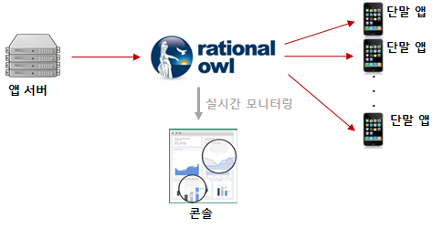
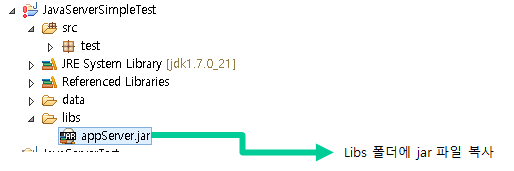
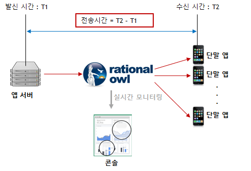

# 래셔널아울 JAVA 앱서버 개발 가이드

>## Introduction

> 앱서버는 앱서버 라이브러리가 제공하는 API를 통해 단말 앱들과 실시간 데이터 통신을 할 수 있다. 


앱서버 라이브러가 앱서버에 제공하는 주요 기능은 다음과 같다.

1. 실시간 다운스트림 데이터 발신
현재 상용으로 서비스되는 푸시 메시지들은 다운스트림 데이터의 전송 속도, 전송률, 전송 순서 보장로 대표되는 데이터 품질의 보장이 어려워 알림용도로만 이용된다. 래셔널아울 서비스는 다운스트림 데이터의 품질을 보장함으로써 다운스트림 데이터를 단순히 알림용도뿐 아니라 서비스 내 실시간 데이터 전달의 용도로 활용이 가능하다.

앱서버 라이브러리가 앱서버에 제공하는 다운스트림 발신 API는 다음과 같다.
- 멀티캐스트
- 브로드캐스트
- 그룹메시지



2. 업스트림 데이터 수신시 콜백
단말앱으로부터 업스트림 데이터 수신시 콜백을 제공한다.


3. 단말 그룹 관리
단말 그룹은 단말을 그룹으로 묶는다. 단말 그룹에 포함되는 최대 단말 수는 백만이다. 즉, 1회의 그룹 메시지 발신으로 최대 백만 단말앱에 데이터를 전달 할 수 있다. 

앱서버 라이브러리에서 제공하는 단말 그룹 관리 API는 다음과 같다.
  - 단말 그룹 생성
  - 단말 그룹에 단말 추가
  - 단말 그룹에서 단말 삭제
  - 단말 그룹 삭제

4. 멀티캐스트 VS 그룹 메시지

그룹 메시지는 전통적인 통신방식인 멀티캐스트와 기능적으로 동일하다. 하지만 효율성, 속도, 대상 단말수 제한 등에서 그룹메시지가 훨씬 유리하다. 그룹메시지 내부 구현은 pub/sub모델로 확장성을 가지면서도 개발자에게는 전통적인 멀티캐스트의 장점인 명확한 대상 타게팅을 보장한다. 따라서 1회성 또는 단발성 통신을 제외하고는  멀티캐스트 API보다는 그룹메시지 API의 사용을 권고한다.

앱서버 라이브러리가 제공하는 전통적인 멀티캐스트API와 그룹메시지 API의 차이를 정리하면 다음과 같다.

-        | 그룹메시지 | 멀티캐스트
------------- | ------------- | ------
최대 대상 단말수  | 1,000,000  | 2,000
평균 데이터 전송속도  | 0.4초  | 0.5초
1회성/단발성 통신 | X | 권고
1회성이 아닌 모든 통신| 권고 | X


>##  앱 서버 라이브러리 적용

JAVA 앱서버 개발을 위한 설정은 JAVA 앱서버 라이브러리를 개발 환경에 포함하는 것이 전부다.
본 문서는 이클립스 개발환경을 기준으로 설명한다.


1. [JAVA 앱서버 라이브러리를 다운](https://guide.rationalowl.com/library){:target="_blank"} 받는다.


2. 이클립스 프로젝트를 생성하고 다운받은 라이브러리를 libs 폴더내에 복사한다.



3. 이클립스 프로젝트에 라이브러리를 추가한다.


>## 앱서버 등록(구동)
앱서버가 래셔널아울 API를 통해 단말앱과 실시간 데이터를 전달하기 위해서는 먼저 앱 서버를 등록해야 한다. 참고로 하나의 래셔널아울 고객 서비스 내에서 다수의 앱 서버 등록이 가능하다. 무료 평가판의 경우 최대 10개까지 고객 앱 서버 등록이 가능하다.

앱서버 등록 API는 앱서버를 구동시키는 역할도 한다. 따라서 앱서버가 구동시마다 앱서버 등록 API는 호출되어야 한다. 앱서버는 앱서버 등록 API 인자로 들어가는 단말 등록 이름을 기억하고 있어야 하고 앱서버 등록 API호출시 동일한 단말 등록 이름으로 호출해야 한다.

래셔널아울 관리자 콘솔은 앱서버 등록 결과에 대해 실시간 모니터링을 제공한다.


### 앱서버 등록 요청

registerAppServer() API를 통해 앱서버를 원하는 서비스의 서버로 등록 요청한다.
주의할 점은 API호출시 전달하는 앱서버 등록이름과 등록결과 발급받은 앱서버 등록 아이디를 반드시 저장/관리해야 한다. 앱서버 등록 요청시 앱서버 등록 이름이 바뀌면 래셔널아울 서비스에서는 다른 앱서버가 등록요청하는 것으로 인식한다. registerAppServer()는 최초 앱서버 등록시 뿐 아니라 이후 서버 재가동 시 마다 해당 API를 호출해야 하는데 등록이름을 관리하지 않고 다른 이름으로 바뀌면 서버 재가동시마다 앱 서버가 추가 등록되고 새로운 단말 등록 아이디가 발급되기 때문이다. 기존 앱서버와 통신하던 단말앱에서 업스트림을 보내려 해도 앱서버 등록 아이디가 다르면 업스트림을 전달할 수 없다.


```java
AppServerManager serverMgr = AppServerManager.getInstance();
serverMgr.registerAppServer("myServiceId", "app server1", "gate.rationalowl.com", 9080);
```

### 앱서버 등록 결과
앱서버 등록 결과는 AppServerRegisterResultListener 인터페이스의 onRegisterResult()를 통해 알 수 있다. 
앱서버는 등록 성공시 다음의 두 가지를 반드시 저장/관리해야 한다.
 1. 발급되는 앱서버 등록 아이디
    - 앱 서버를 구분하는 구분자
    - 앱 서버 API호출시 인자로 이용
    - 단말앱에서 업스트림 메시지 발신시 대상 앱서버 지정하는데 이용
        - 단말앱 개발자는 관리자 콘솔의 앱서버 현황 화면에서 앱서버 등록 아이디를 확인할 수 있다.
    - 
 2. 앱서버 등록 요청시 입력한 앱 서버 등록 이름

```java
public void onRegisterResult(int resultCode, String resultMsg, String appServerRegId, String appServerRegName) {
    output("RegisterResult:" + resultMsg + "  reg server id = " + appServerRegId + " reg server name = " + appServerRegName);

    if (resultCode == Result.RESULT_OK || resultCode == Result.RESULT_SERVER_REGNAME_ALREADY_REGISTERED) {
        // should save and manage mServerRegName and mServerRegId to the file or db.
    }
}
```


## 앱서버 등록 해제
고객 서비스 내에서 사용하지 않는 앱 서버를 등록 해제한다. 
래셔널아울 관리자 콘솔은 앱서버 등록해제 결과에 대해 실시간 모니터링을 제공한다.

### 앱서버 등록 해제 요청

unregisterAppServer() API를 등록해제 요청한다.

```java
AppServerManager serverMgr = AppServerManager.getInstance();
serverMgr.unregisterAppServer("myServiceId", "app server1", "gate.rationalowl.com", 9080);
```

### 앱서버 등록 해제 결과
앱서버 등록 결과는 AppServerRegisterResultListener 인터페이스의 onUnregisterResult()를 통해 알 수 있다. 

```java
public void onUnregisterResult(int resultCode, String resultMsg) {
    output("UnregisterResult:" + resultMsg);
}

```

>## 단말그룹


>앱서버는 실시간 메시지를 주고 받기 위해 단말 앱 등록 아이디를 관리해야 한다. 즉, 단말앱도 앱스토어에서 앱을 다운받아 설치 후 최초 1회 단말 등록을 하고, 등록 결과 단말 등록 아이디를 발급받는다. 단말앱은 발급받은 단말 등록 아이디를 앱서버에게 upstream API를 통해 전달해주어야 하고 앱서버는 해당 단말 등록 아이디를 저장/관리해야 한다. 이후 단말로 다운스트림을 보낼때나 단말그룹을 관리할 때 단말 등록 아이디를 통해 관리하게 된다.


단말그룹은 그룹 메시지를 지원하기 위해서 생겨난 논리적인 단말들의 집합이다. 래셔널아울 서비스에서 제공하는 단말그룹의 특성은 다음과 같다.
  - 단말그룹은 앱서버에서 생성/단말 추가/단말 삭제/그룹 삭제가 가능하다.
  - 현재 그룹메시지는 다운스트림만 지원한다. (2018년 상반기 P2P 지원 예정)
  - 단말그룹에 추가될 수 있는 최대 단말수는 1,000,000이다.
  - 단말그룹 생성시 지정할 수 있는 그룹내 단말 수는 2,000대이다.
  - 단말그룹에 단말 추가시 한번에 추가할 수 있는 최대 단말 수는 2,000대이다.
  - 래셔널아울 서비스에서 실시간 그룹메시지를 지원하는 최대 단말수는 2,000대이다.
  - 실시간 메시지전달용으로 생성한 단말그룹내 단말 수는 2,000대가 넘지 않도록 해야한다.


앱서버 라이브러리에서 제공하는 단말 그룹 관리 API는 다음과 같다.
  - 단말 그룹 생성
  - 단말 그룹에 단말 추가
  - 단말 그룹에서 단말 삭제
  - 단말 그룹 삭제

단말 그룹 관리 API호출을 연속적으로 호출할 경우 이전 호출 결과 콜백 이후 다음 호출을 진행해야 한다.
래셔널아울 관리자 콘솔은 단말그룹 관리 API 호출 결과에 대해 실시간 모니터링을 제공한다.


## 단말그룹 생성
단말 그룹은 앱 서버가 생성 및 관리한다.
단말 그룹 생성시 그룹 내 단말 지정 대수는 최대 2000대이다.

### 단말그룹 생성 요청

registerAppServer() API를 통해 단말그룹 생성을 요청한다.

```java
AppServerManager serverMgr = AppServerManager.getInstance();
ArrayList<String> devices = new ArrayList<String>();
devices.add("device registration id1");
devices.add("device registration id2");
serverMgr.createDeviceGroup("myDeviceGroup", "my first device group", devices);
```

### 단말그룹 생성 결과
단말그룹 생성 결과는 DeviceGroupListener 인터페이스의 onDeviceGroupCreateResult()를 통해 알 수 있다. 
앱서버는 등록 성공시 발급되는 단말그룹아이디를 반드시 저장/관리해야 한다. 이후 그룹메시지 발신시 그룹아이디를 통해 그룹메시지를 발신한다.

```java
public void onDeviceGroupCreateResult(int resultCode, String resultMsg, String deviceGrpId, String deviceGrpName, int deviceSize, String desc, ArrayList<String> failedDevices, String requestId) {
       
    System.out.println("onUpstreamMsgReceived deviceGrpId " + deviceGrpId + "msg = " + resultMsg);
    
    if(resultCode == Result.RESULT_OK) {     
        // should save deviceGrpId and manager it.           
    }
}
```

## 단말그룹 내 단말 추가
생성된 단말 그룹에 단말을 추가한다.
한번에 추가할 수 있는 최대 단말 수는 2000개이다.
단말 그룹 추가 API를 연속적으로 호출할 경우 이전 호출 결과 콜백 이후 다음 호출을 진행해야 한다.

### 단말그룹 내 단말 추가 요청

addDeviceGroup() API를 통해 단말그룹에 단말 추가 요청한다.

```java
AppServerManager serverMgr = AppServerManager.getInstance();           
ArrayList<String> devices = new ArrayList<String>();
devices.add("device registration id3");
devices.add("device registration id4");
serverMgr.addDeviceGroup("deviceGroupId1", devices);
```

### 단말그룹 내 단말 추가 결과
단말그룹 내 단말 추가 결과는 DeviceGroupListener 인터페이스의 onDeviceGroupAddResult()를 통해 알 수 있다. 

```java
public void onDeviceGroupAddResult(int resultCode, String resultMsg, String deviceGrpId, int totalDeviceSize, int addedDeviceSize, ArrayList<String> failedDevices, String requestId) {
    System.out.println("onDeviceGroupAddResult deviceGrpId " + deviceGrpId + "msg = " + resultMsg);
    
    if(resultCode == Result.RESULT_OK) {
        // devices has added to device group successfuly.
        // do something you want here
    }
}
```

## 단말그룹 내 단말 제거
생성된 단말 그룹에서 단말을 제거한다.
한번에 제거할 수 있는 최대 단말 수는 2000개이다.
단말 그룹 관리 API를 연속적으로 호출할 경우 이전 호출 결과 콜백 이후 다음 호출을 진행해야 한다.

### 단말그룹 내 단말 제거 요청

subtractDeviceGroup() API를 통해 단말그룹에서 단말 제거 요청한다.

```java
AppServerManager serverMgr = AppServerManager.getInstance();           
ArrayList<String> devices = new ArrayList<String>();
devices.add("device registration id3");
devices.add("device registration id4");
serverMgr.subtractDeviceGroup("deviceGroupId1", devices);
```

### 단말그룹 내 단말 제거 결과
단말그룹 내 단말 제거 결과는 DeviceGroupListener 인터페이스의 onDeviceGroupSubtractResult()를 통해 알 수 있다. 

```java
 public void onDeviceGroupSubtractResult(int resultCode, String resultMsg, String deviceGrpId, int totalDeviceSize, int subtractDeviceSize, ArrayList<String> failedDevices, String requestId) {
    System.out.println("onDeviceGroupSubtractResult deviceGrpId " + deviceGrpId + "msg = " + resultMsg);
    
    if(resultCode == Result.RESULT_OK) {
       // devices has removed from device group successfuly.
       // do something you want here
    }
}
```


## 단말그룹 삭제
단말그룹을 삭제한다.
단말그룹을 삭제하더라도 단말그룹 내 단말이 등록해제되는 것은 아니다.
단말 그룹 관리 API를 연속적으로 호출할 경우 이전 호출 결과 콜백 이후 다음 호출을 진행해야 한다.

### 단말그룹 삭제 요청

deleteDeviceGroup() API를 통해 단말그룹 삭제 요청한다.

```java
AppServerManager serverMgr = AppServerManager.getInstance();           
serverMgr.deleteDeviceGroup("deviceGroupId1");
```

### 단말그룹 삭제 결과
단말그룹 내 단말 추가 결과는 DeviceGroupListener 인터페이스의 onDeviceGroupDeleteResult()를 통해 알 수 있다. 

```java
public void onDeviceGroupDeleteResult(int resultCode, String resultMsg, String deviceGrpId, String requestId) {
    System.out.println("onDeviceGroupDeleteResult deviceGrpId " + deviceGrpId + "msg = " + resultMsg);
    
    if(resultCode == Result.RESULT_OK) {
       // devices group has removed successfully.
       // do something you want here
    }      
}
```


>## 다운스트림 메시지
래셔널아울에서 앱서버에서 단말앱으로의 다운스트림 메시지는 기존 푸시 서비스의 단순 알림 용도가 실시간 데이터 전달의 용도로 이용한다. 그리고 래셔널아울 관리자 콘솔에서 제공하는 데이터 전달 현황 실시간 모니터링은 고객 서비스 개발시에는 개발의 용이함을 제공하고 서비스 운영시에는 서비스 대응력을 높이고 예측 가능성을 향상시킨다.

래셔널아울에서 지원하는 다운스트림 메시지의 특성은 다음과 같다.
  - 기존 푸시 서비스에서 사용하던 단순한 알림 용도가 아니라 실시간 데이터 전달의 용도로 이용 가능하다.
  - 0.5초 이내의 실시간 푸시 알림 용도로도 이용 가능하다.
  - 지원하는 데이터 포맷은 스트링으로 일반 스트링문자나 json 포맷등 고객 서비스 특성에 맞게 설정하면 된다.
  - 단말앱이 네트워크에 연결되지 않을 경우 큐잉 후 단말이 네트워크 접속시 전달하는 큐잉을 지원한다.
  - 기본 큐잉 기간은 3일이고 엔터프라이즈 에디션에서는 최대 30일까지 설정 가능하다.
  - 큐잉 기능을 이용할지 말지는 앱서버 라이브러리에서 제공하는 다운스트림 API에서 제공한다.
  - 다운스트림 API에서 단말앱이 네트워크에 연결되지 않을 경우 전달 데이터외에 알림 타이틀과 알림 문자를 별도로 지정할 수 있다.  
  - 래셔널아울 콘솔은 데이터 전달 현황에 대해 실시간 모니터링을 제공한다.


### 메시지 전송시간
래셔널아울 서비스는 0.5초 이내 메시지 전송속도를 제공한다. 이는 다운스트림 메시지뿐 아니라 업스트림과 P2P 메시지 모두에 해당된다. 메시지 전송속도는 발신주체에서 메시지를 발신하여 수신주체가 메시지를 수신할 때까지 소요된 시간을 의미한다.  



## 멀티캐스트
  - 한대 이상의 단말앱에 메시지를 발신한다.  
  - 한번에 보낼 수 있는 최대 대상 단말 수는 2000대이다.
  
### 멀티캐스트 메시지 발신
sendMulticastMsg() API를 통해 멀티캐스트 메시지를 발신한다.

```java
AppServerManager serverMgr = AppServerManager.getInstance();
String data = "multicast message test";
ArrayList<String> devices = new ArrayList<String>();
devices.add("device registration id1");
devices.add("device registration id2");
boolean supportMsgQ = true;
String notiTitle = null;
String notiBody = null;
serverMgr.sendMulticastMsg(data, regIDs, supportMsgQ, notiTitle, notiBody);
// same as serverMgr.sendMulticastMsg(data, regIDs);
```

### 멀티캐스트 메시지 발신 결과
메시지 발신 결과는 MessageListener 인터페이스의 onSendMulticastMsgResult()를 통해 알 수 있다.
해당 콜백은 메시지 발신 성공 여부에 대해서만 알려준다. 실제 앱서버 개발시 본 콜백은 개발시에만 사용하기를 권고한다. 이보다는 래셔널아울 관리자 콘솔의 메시지 현황 모니터링은 개발 단계 뿐 아니라 서비스 운영단계에서 훨씬 유용하다.

```java
public void onSendMulticastMsgResult(int resultCode, String resultMsg, String requestId) {
    System.out.println("onSendMulticastMsgResult resultCode " + resultCode);
    
    if(resultCode == Result.RESULT_OK) {
       // multicast message has sent successfully
    }      
}
```


## 브로드캐스트
  - 고객 서비스내에 등록된 모든 단말앱들에게 메시지를 발신한다.
  - 브로드캐스트 메시지는 실시간 데이터 전달의 용도로 이용되어서는 안된다.
  - 브로드캐스트 메시지는 전체 서비스내 단말앱에 푸시 알림 용도로만 사용해야 한다.
  
### 브로드캐스트 메시지 발신
sendBroadcastMsg() API를 통해 브로드캐스트 메시지를 발신한다.

```java
AppServerManager serverMgr = AppServerManager.getInstance();
String data = "broadcast message test";
boolean supportMsgQ = true;
String notiTitle = null;
String notiBody = null;
serverMgr.sendBroadcastMsg(data, supportMsgQ, notiTitle, notiBody);
// same as serverMgr.sendBroadcastMsg(data);
```

### 브로드캐스트 메시지 발신 결과
메시지 발신 결과는 MessageListener 인터페이스의 onSendBroadcastMsgResult()를 통해 알 수 있다.
해당 콜백은 메시지 발신 성공 여부에 대해서만 알려준다. 실제 앱서버 개발시 본 콜백은 개발시에만 사용하기를 권고한다. 이보다는 래셔널아울 관리자 콘솔의 메시지 현황 모니터링은 개발 단계 뿐 아니라 서비스 운영단계에서 훨씬 유용하다.

```java
public void onSendBroadcastMsgResult(int resultCode, String resultMsg, String requestId) {
    System.out.println("onSendBroadcastMsgResult resultCode " + resultCode);
    
    if(resultCode == Result.RESULT_OK) {
       // broadcast message has sent successfully
    }      
}
```


## 그룹메시지
그룹메시지는 단말그룹에게 메시지를 발신하는 방식으로 기능적으로 전통적인 통신방식인 멀티캐스트와 동일하다.
그룹 메시지 방식은 효율적이고 확장성이 높은 pub/sub 메시지 모델로 구현되었으며 동일한 대상 단말수일 경우 그룹 메시지 방식이 약 20% 전송속도가 빠르다. 따라서 1회성 또는 단발성 통신을 제외하고는  멀티캐스트 API보다는 그룹메시지 API의 사용을 권고한다.
  
### 그룹메시지 발신
sendBroadcastMsg() API를 통해 브로드캐스트 메시지를 발신한다.

```java
String data = "group message test";
String grpId = grp.mDeviceGrpId;       
boolean supportMsgQ = true;
String notiTitle = null;
String notiBody = null;
serverMgr.sendGroupMsg(data, grpId, supportMsgQ, notiTitle, notiBody);
// same as serverMgr.sendGroupMsg(data, grpId);
```

### 그룹메시지 발신 결과
메시지 발신 결과는 MessageListener 인터페이스의 onSendGroupMsgResult()를 통해 알 수 있다.
해당 콜백은 메시지 발신 성공 여부에 대해서만 알려준다. 실제 앱서버 개발시 본 콜백은 개발시에만 사용하기를 권고한다. 이보다는 래셔널아울 관리자 콘솔의 메시지 현황 모니터링이 개발 단계 뿐 아니라 서비스 운영단계에서 훨씬 유용하다.

```java
public void onSendGroupMsgResult(int resultCode, String resultMsg, String requestId) {
    System.out.println("onSendGroupMsgResult resultCode " + resultCode);
    
    if(resultCode == Result.RESULT_OK) {
       // group message has sent successfully
    }      
}
```

>## 업스트림 메시지 수신

앱서버가 업스트림 메시지를 수신하면 onUpstreamMsgReceived() 콜백이 호출된다.


```java
class SimpleMessageListener implements MessageListener {

    @Override
    public void onUpstreamMsgReceived(String sender, long sendTime, String msg) {
        output("onUpstreamMsgReceived sender device reg id : " + sender + "send time:" + sendTime + " msg : " + msg);
    }
}
```


