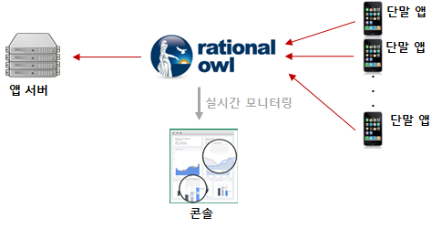
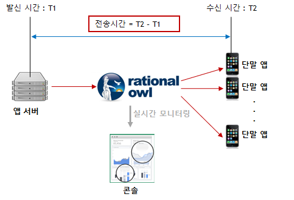

# REST API 개발 가이드

- [Introduction](#introduction)
- [앱서버 등록](#앱서버-등록)
  - [앱서버 등록 요청](#앱서버-등록-요청)
  - [앱서버 등록 결과](#앱서버-등록-결과)
- [앱서버 등록 해제](#앱서버-등록-해제)
  - [앱서버 등록 해제 요청](#앱서버-등록-해제-요청)
  - [앱서버 등록 해제 결과](#앱서버-등록-해제-결과)
- [다운스트림 메시지](#다운스트림-메시지)
  - [메시지 전송시간](#메시지-전송시간)
- [멀티캐스트](#멀티캐스트)
  - [멀티캐스트 메시지 발신](#멀티캐스트-메시지-발신)
  - [멀티캐스트 메시지 발신 결과](#멀티캐스트-메시지-발신-결과)
- [브로드캐스트](#브로드캐스트)
  - [브로드캐스트 메시지 발신](#브로드캐스트-메시지-발신)
  - [브로드캐스트 메시지 발신 결과](#브로드캐스트-메시지-발신-결과)
- [단말그룹](#단말그룹)
- [단말그룹 생성](#단말그룹-생성)
  - [단말그룹 생성 요청](#단말그룹-생성-요청)
  - [단말그룹 생성 결과](#단말그룹-생성-결과)
- [단말그룹 내 단말 추가](#단말그룹-내-단말-추가)
  - [단말그룹 내 단말 추가 요청](#단말그룹-내-단말-추가-요청)
  - [단말그룹 내 단말 추가 결과](#단말그룹-내-단말-추가-결과)
- [단말그룹 내 단말 제거](#단말그룹-내-단말-제거)
  - [단말그룹 내 단말 제거 요청](#단말그룹-내-단말-제거-요청)
  - [단말그룹 내 단말 제거 결과](#단말그룹-내-단말-제거-결과)
- [단말그룹 삭제](#단말그룹-삭제)
  - [단말그룹 삭제 요청](#단말그룹-삭제-요청)
  - [단말그룹 삭제 결과](#단말그룹-삭제-결과)
- [그룹메시지](#그룹메시지)
  - [그룹메시지 발신](#그룹메시지-발신)
  - [그룹메시지 발신 결과](#그룹메시지-발신-결과)

## Introduction

> 래셔널아울 서비스를 이용하여 앱서버 개발하는 방법은 두가지가 있다. 래셔널아울 앱 서버 라이브러리를 이용하여 개발하는 방법과 REST API를 이용하는 방법이 그것이다.

앱서버 라이브러가 앱서버에 제공하는 주요 기능은 다음과 같다.

1. 실시간 다운스트림 데이터 발신

현재 상용으로 서비스되는 푸시 메시지들은 다운스트림 데이터의 전송 속도, 전송률, 전송 순서 등 데이터 품질의 보장이 어려워 알림용도로만 이용된다. 래셔널아울 서비스는 다운스트림 데이터의 품질을 보장함으로써 다운스트림 데이터를 단순히 알림용도뿐 아니라 서비스 내 실시간 데이터 전달의 용도로 활용이 가능하다.

앱서버 라이브러리가 앱서버에 제공하는 다운스트림 발신 API는 다음과 같다.

- 멀티캐스트
- 브로드캐스트
- 그룹메시지


2. 업스트림 데이터 수신

단말앱으로부터 업스트림 데이터 수신시 콜백을 제공한다.



3. 단말 그룹 관리

단말 그룹은 단말을 그룹으로 묶는다. 단말 그룹에 포함되는 최대 단말 수는 백만이다. 즉, 1회의 그룹 메시지 발신으로 최대 백만 단말앱에 데이터를 전달 할 수 있다. 

앱서버 라이브러리에서 제공하는 단말 그룹 관리 API는 다음과 같다.

- 단말 그룹 생성
- 단말 그룹에 단말 추가
- 단말 그룹에서 단말 삭제
- 단말 그룹 삭제

REST API를 이용한 앱서버는 앱서버 라이브러리를 이용한 앱서버에 비해 아래와 같이 몇 가지 제한이 있다.

-        | 앱서버 라이브러리 이용 | REST API 이용
------------- | ------------- | ------
다운스트림 메시지 평균 전송 시간  | 0.5초  | 1초 내외
업스트림 메시지 수신  | O  | X
콘솔에서 앱서버 상태 모니터링 지원 | O | X

따라서 REST API는 앱 서버 라이브러리를 제공하지 않는 서버 개발 환경에 앱서버를 개발할 수 방안을 제공하는데 의의가 있다.

## 앱서버 등록

REST API를 이용하기 위해서 먼저 앱 서버를 등록한다. 하나의 모바일 서비스 내에서는 다수의 앱 서버 등록이 가능하다.
앱 서버가 등록되면 관리자 콘솔에 등록된 앱 서버가 나타난다. 다만 REST API로 등록된 앱 서버의 실시간 상태 모니터링은 지원되지 않는다.


### 앱서버 등록 요청

주의할 점은 API호출시 전달하는 앱서버 등록이름과 등록결과 발급받은 앱서버 등록 아이디와 채널서버 URL을 반드시 저장/관리해야 한다. REST API를 통해 앱서버 등록이 성공했으면 해당 앱서버는 다시 등록 요청할 필요가 없다. 기등록한 앱서버가 다시 등록 요청할 경우 앱서버 등록 이름이 이전에 등록할 때와 다르면 래셔널아울 서비스에서는 다른 앱서버가 등록 요청하는 것으로 인식하여 앱서버를 새로 등록하게 된다.

통신 방식 : HTTP POST
url :   http://gate.rationalowl.com:8006/server/register/   
data format

```java
{
  "serviceId":"service id here",
  "registerName":"displayed app server name"
}
```

#### 필수 필드

- serviceId
  - 앱 서버가 등록할 서비스의 아이디 
  - service 등록 시 발급받는 아이디로 '관리자 콘솔 > 서비스 정보'에서 확인 가능
- registerName
  - 앱 서버를 콘솔에서 표시할 이름
  - 콘솔에서 앱서버를 확인하는 용도로 이용

### 앱서버 등록 결과

```java
{
  "serverRegId":"asdfkjkjlasfdasfd",
  "channelServer":"211.211.223.44:9090"
}
```

#### 필수 필드

- serverRegId
  - 등록한 앱 서버의 아이디 
  - 이 후 REST API 호출시 이용되므로 앱 서버는 이를 저장해야 한다.
- channelServer
  - downstream 메시지 발신 시 이용할 채널서버
  - REST API URL의 (channelServer)에 입력해야 한다.

#### 선택 필드

- error
  - REST API 실패 시 반환
  - 실패 원인 메시지

## 앱서버 등록 해제

고객 서비스 내에서 사용하지 않는 앱 서버를 등록 해제한다.
등록 해제가 되면 앱 서버는 콘솔에서 사라진다.

### 앱서버 등록 해제 요청

통신 방식 : HTTP POST
url :   http://gate.rationalowl.com:8006/server/unregister/   
data format

```java
{
  "serviceId":"service id here",
  "serverRegId":"your app server registration ID"
}
```

#### 필수 필드

- serviceId
  - 앱 서버가 등록할 서비스의 아이디 
  - service 등록 시 발급받는 아이디로 콘솔 서비스 정보에서 확인 가능
- serverRegId
  - 등록 시 발급받은 앱 서버 등록 아이디

### 앱서버 등록 해제 결과

```java
{
}
```

#### 필수 필드

없음

#### 선택 필드

- error
  - REST API 실패 시 반환
  - 실패 원인 메시지

## 다운스트림 메시지

래셔널아울에서 앱서버에서 단말앱으로의 다운스트림 메시지는 기존 푸시 서비스의 단순 알림 용도가 실시간 데이터 전달의 용도로 이용한다. 그리고 래셔널아울 관리자 콘솔에서 제공하는 데이터 전달 현황 실시간 모니터링은 고객 서비스 개발시에는 개발의 용이함을 제공하고 서비스 운영시에는 서비스 대응력을 높이고 예측 가능성을 향상시킨다.

래셔널아울에서 지원하는 다운스트림 메시지의 특성은 다음과 같다.

- 기존 푸시 서비스에서 사용하던 단순한 알림 용도가 아니라 실시간 데이터 전달의 용도로 이용한다.
- 0.5초 이내의 실시간 푸시 알림 용도로 이용한다.
- 지원하는 데이터 포맷은 스트링으로 일반 스트링문자나 json 포맷등 고객 서비스 특성에 맞게 설정하면 된다.
- 단말앱이 네트워크에 연결되지 않을 경우 큐잉 후 단말이 네트워크 접속시 전달하는 큐잉을 지원한다.
- 기본 큐잉 기간은 3일이고 전용 에디션에서는 최대 30일까지 설정 가능하다.
- 큐잉 기능을 이용할지 말지는 앱서버 라이브러리에서 제공하는 다운스트림 API에서 설정한다.
- 다운스트림 API에서 단말앱이 네트워크에 연결되지 않을 경우 전달 데이터외에 알림 타이틀과 알림 문자를 별도로 지정할 수 있다.
- 래셔널아울 콘솔은 데이터 전달 현황에 대해 실시간 모니터링을 제공한다.

### 메시지 전송시간

래셔널아울 서비스는 0.5초 이내 메시지 전송속도를 제공한다. 이는 다운스트림 메시지뿐 아니라 업스트림과 P2P 메시지 모두에 해당된다. 메시지 전송속도는 발신주체에서 메시지를 발신하여 수신주체가 메시지를 수신할 때까지 소요된 시간을 의미한다.



## 멀티캐스트

- 한대 이상의 단말앱에 메시지를 발신한다.
- 한번에 보낼 수 있는 최대 대상 단말 수는 2000대이다.

### 멀티캐스트 메시지 발신

통신 방식 : HTTP POST
url :   http://221.221.22.11:8006(channelServer)/downstream/multicast/   
data format

```java
{
  //mandatory fields
  "serviceId":"service id here",
  "serverRegId":"app server registration id",
  "deviceRegIds":["regId1","regId2",….,"regIdN],
  "queuing":1,
  "data":"{
    "numberData":11111,
    "stringData":"what you want",
     ...
  }",
  //optional fields
 "notiTitle":"notification title here",
 "notiBody":"notification body here"

}
```

#### 필수 필드

- serviceId
  - service 등록 시 발급받는 아이디로 콘솔 서비스 정보에서 확인 가능
- serverRegId
  - 등록 시 발급받은 앱 서버 등록 아이디
- deviceRegIds
  - 메시지를 전달할 대상 단말의 단말 등록 아이디 목록
  - 단말앱이 최초 설치시 단말 앱 등록 시 발급받는 아이디로 발급 후
    앱 서버로 전달해 줘야 한다.
  - 앱 서버는 전달 받은 단말 등록 아이디를 저장/관리해야 한다.
  - 최대 2000대까지 제한
- queuing
  - 메시지 큐잉 지원 여부로 단말이 비 활성시 큐잉기간(기본 3일)동안 메시지를 래셔널아울서버에서 보관하고 있다가 단말이 활성 시 전달할지 여부
  - 1 : 지원
  - 0 : 미지원
- data
  - 단말앱에 전달할 데이터
  - 스트링으로 포맷은 json, 일반 스트링 고객 서비스 성격에 맞게 선택
  - 선택 필드인 noti 필드가 부재시 알림창에도 이용

#### 선택 필드

- notiTitle
  - 알림 제목 : 단말앱이 백그라운드/종료시 알림창에 표시할 제목
- notiBody
  - 알림 내용 : 단말앱이 백그라운드/종료시 알림창에 표시할 내용, 미설정시 data가 표시

### 멀티캐스트 메시지 발신 결과

```java
{
    "mId":"message id here"
}
```

#### 필수 필드

- mId
  - 발신한 메시지 아이디

#### 선택 필드

- error
  - REST API 실패 시 반환
  - 실패 원인 메시지

## 브로드캐스트

- 고객 서비스내에 등록된 모든 단말앱들에게 메시지를 발신한다.
- 브로드캐스트 메시지는 실시간 데이터 전달의 용도로 이용되어서는 안된다.
- 브로드캐스트 메시지는 전체 서비스내 단말앱에 푸시 알림 용도로만 사용해야 한다.

### 브로드캐스트 메시지 발신

통신 방식 : HTTP POST
url :   http://221.221.22.11:8006(channelServer)/downstream/broadcast/    
data format

```java
{
  //mandatory fields
  "serviceId":"service id here",
  "serverRegId":"app server registration id",
  "queuing":1,
  "data":"{
    "numberData":11111,
    "stringData":"what you want",
     ...
  }"
 //optional fields
 "notiTitle":"notification title here",
 "notiBody":"notification body here"

}
```

#### 필수 필드

- serviceId
  - service 등록 시 발급받는 아이디로 콘솔 서비스 정보에서 확인 가능
- serverRegId
  - 등록 시 발급받은 앱 서버 등록 아이디
- queuing
  - 메시지 큐잉 지원 여부로 단말이 비 활성시 큐잉기간(기본 3일)동안 메시지를 래셔널아울서버에서 보관하고 있다가 단말이 활성 시 전달할지 여부
  - 1 : 지원
  - 0 : 미지원
- data
  - 단말앱에 전달할 데이터
  - 스트링으로 포맷은 json, 일반 스트링 고객 서비스 성격에 맞게 선택
  - 선택 필드인 noti 필드가 부재 시 알림 용도로도 이용

#### 선택 필드

- notiTitle
  - 알림 제목 : 단말앱이 백그라운드/종료시 알림창에 표시할 제목
- notiBody
  - 알림 내용 : 단말앱이 백그라운드/종료시 알림창에 표시할 내용, 미설정시 data가 표시

### 브로드캐스트 메시지 발신 결과

```java
{
    "mId":"message id here"
}
```

#### 필수 필드

- mId
  - 발신한 메시지 아이디

#### 선택 필드

- error
  - REST API 실패 시 반환
  - 실패 원인 메시지

## 단말그룹

>앱서버는 실시간 메시지를 주고 받기 위해 단말 앱 등록 아이디를 관리해야 한다. 즉, 단말앱도 앱스토어에서 앱을 다운받아 설치 후 최초 1회 단말 등록을 하고, 등록 결과 단말 등록 아이디를 발급받는다. 단말앱은 발급받은 단말 등록 아이디를 앱서버에게 upstream API를 통해 전달해주어야 하고 앱서버는 해당 단말 등록 아이디를 저장/관리해야 한다. 이후 단말로 다운스트림을 보낼때나 단말그룹을 관리할 때 단말 등록 아이디를 통해 관리하게 된다.

단말그룹은 그룹 메시지를 지원하기 위해서 생겨난 논리적인 단말들의 집합이다. 래셔널아울 서비스에서 제공하는 단말그룹의 특성은 다음과 같다.

- 단말그룹은 앱서버에서 생성/단말 추가/단말 삭제/그룹 삭제가 가능하다.
- 현재 그룹메시지는 다운스트림만 지원한다.
- 단말그룹에 추가될 수 있는 최대 단말수는 1,000,000이다.
- 단말그룹 생성시 지정할 수 있는 그룹내 단말 수는 2,000대이다.
- 단말그룹에 단말 추가시 한번에 추가할 수 있는 최대 단말 수는 2,000대이다.
- 래셔널아울 서비스에서 실시간 그룹메시지를 지원하는 최대 단말수는 2,000대이다.
- 실시간 메시지전달용으로 생성한 단말그룹내 단말 수는 2,000대가 넘지 않도록 해야한다.

앱서버 라이브러리에서 제공하는 단말 그룹 관리 API는 다음과 같다.

- 단말 그룹 생성
- 단말 그룹에 단말 추가
- 단말 그룹에서 단말 삭제
- 단말 그룹 삭제

단말 그룹 관리 API호출을 연속적으로 호출할 경우 이전 호출 결과 콜백 이후 다음 호출을 진행해야 한다.
래셔널아울 관리자 콘솔은 단말그룹 관리 API 호출 결과에 대해 실시간 모니터링을 제공한다.

## 단말그룹 생성

단말 그룹은 앱 서버가 생성 및 관리한다.
단말 그룹 생성시 그룹 내 단말 지정 대수는 최대 2000대이다.

### 단말그룹 생성 요청

통신 방식 : HTTP POST
url :   http://221.221.22.11:8006(channelServer)/deviceGroup/create/   
data format

```java
{
  //mandatory fields
  "serviceId":"service id here",
  "serverRegId":"server registration id here",
  "groupName":"group name",
  "deviceList":["deviceRegId1",......."deviceRegIdN"],
   //optional fields
  "description":"group description"
}
```

#### 필수 필드

- serviceId
  - service 등록 시 발급받는 아이디로 콘솔 서비스 정보에서 확인 가능
- serverRegId
  - 등록 시 발급받은 앱 서버 등록 아이디
- groupName
  - 그룹명
  - 콘솔에서 디스플레이되는 이름
- deviceList
  - 단말 그룹에 포함될 단말 리스트
  - 최대 2천개까지 포함 가능
  - 2천개 이상 단말은 단말 그룹 생성 후 add device group을 통해 추가 가능.

#### 선택 필드

- description
  - 단말 그룹 설명 
  - 콘솔에서 디스플레이

### 단말그룹 생성 결과

```java
{
  "groupId":"asdfasfd",
  "deviceSize":2000,
  "failedDevice":["deviceRegId21",.."deviceRegId233"]
}
```

#### 필수 필드

- groupId
  - 등록한 그룹의 아이디
  - 이 후 그룹 메시지 발신시 이용되므로 앱 서버는 이를 저장해야 한다.
- deviceSize
  - 생성된 그룹에 포함된 단말 수
- failedDevice
  - 단말 그룹에 추가하려고 요청했으나 추가되지 않은 단말 목록
  - 현재는 기존 추가된 단말 등록 아이디를 다시 추가할 경우만 체크해서 반환
  - 앱서버 개발시 유효한 단말 등록 아이디 추가에 신경쓰야 함.

#### 선택 필드

- error
  - REST API 실패 시 반환
  - 실패 원인 메시지

## 단말그룹 내 단말 추가

생성된 단말 그룹에 단말을 추가한다.
한번에 추가할 수 있는 최대 단말 수는 2000개이다.
단말 그룹 추가 API를 연속적으로 호출할 경우 이전 호출 결과 콜백 이후 다음 호출을 진행해야 한다.

### 단말그룹 내 단말 추가 요청

통신 방식 : HTTP POST
url :   http://221.221.22.11:8006(channelServer)/deviceGroup/add/   
data format

```java
{
  //mandatory fields
  "serviceId":"service id here",
  "groupId":"adfaadfasdf",
  "deviceList":["deviceRegId1",......."deviceRegIdN"]
}
```

#### 필수 필드

- serviceId
  - service 등록 시 발급받는 아이디로 콘솔 서비스 정보에서 확인 가능
- serverRegId
  - 등록 시 발급받은 앱 서버 등록 아이디
- groupId
  - 단말을 추가할 그룹의 그룹 아이디
- deviceList
  - 단말 그룹에 추가할 단말 리스트
  - 최대 2천개까지 포함 가능

### 단말그룹 내 단말 추가 결과

```java
{
  "groupId":"asdfasfd",
  "totaldeviceSize":22000,
  "addedDeviceSize":1800,
  "failedDevice":["deviceRegId21",.."deviceRegId233"]
}

```

#### 필수 필드

- groupId
  - 등록한 그룹의 아이디
  - 이 후 그룹 메시지 발신시 이용되므로 앱 서버는 이를 저장해야 한다.
- totalDeviceSize
  - API 호출 후 단말 그룹에 포함된 총 단말 수
- addedDeviceSize
  - API 호출로 단말 그룹에 새로 추가된 단말 수
- failedDevice
  - 단말 그룹에 추가하려고 요청했으나 추가되지 않은 단말 목록
  - 현재는 기존 추가된 단말 등록 아이디를 다시 추가할 경우만 체크해서 반환
  - 앱서버 개발시 유효한 단말 등록 아이디 추가에 신경쓰야 함.

#### 선택 필드

- error
  - REST API 실패 시 반환
  - 실패 원인 메시지

## 단말그룹 내 단말 제거

생성된 단말 그룹에서 단말을 제거한다.
한번에 제거할 수 있는 최대 단말 수는 2000개이다.
단말 그룹 관리 API를 연속적으로 호출할 경우 이전 호출 결과 콜백 이후 다음 호출을 진행해야 한다.

### 단말그룹 내 단말 제거 요청

통신 방식 : HTTP POST
url :   http://221.221.22.11:8006(channelServer)/deviceGroup/subtract/   
data format

```java
{
  //mandatory fields
  "serviceId":"service id here",
  "groupId":"adfaadfasdf",
  "deviceList":["deviceRegId1",......."deviceRegIdN"]
}
```

#### 필수 필드

- serviceId
  - service 등록 시 발급받는 아이디로 콘솔 서비스 정보에서 확인 가능
- serverRegId
  - 등록 시 발급받은 앱 서버 등록 아이디
- groupId
  - 단말을 추가할 그룹의 그룹 아이디
- deviceList
  - 단말 그룹에서 삭제할 단말 리스트
  - 최대 2천개까지 포함 가능

### 단말그룹 내 단말 제거 결과

```java
{
  "groupId":"asdfasfd",
  "totaldeviceSize":22000,
  "removedDeviceSize":1800,
  "failedDevice":["deviceRegId21",.."deviceRegId233"]
}

```

#### 필수 필드

- groupId
  - 등록한 그룹의 아이디
  - 이 후 그룹 메시지 발신시 이용되므로 앱 서버는 이를 저장해야 한다.
- totalDeviceSize
  - API 호출 후 단말 그룹에 포함된 총 단말 수
- removedDeviceSize
  - API 호출로 단말 그룹에서 삭제된 단말 수
- failedDevice
  - 단말 그룹에 삭제하려고 요청했으나 삭제되지 않은 단말 목록
  - 앱서버 개발시 유효한 단말 등록 아이디에 신경 쓰야 함.

#### 선택 필드

- error
  - REST API 실패 시 반환
  - 실패 원인 메시지

## 단말그룹 삭제

단말그룹을 삭제한다.
단말그룹을 삭제하더라도 단말그룹 내 단말이 등록해제되는 것은 아니다.
단말 그룹 관리 API를 연속적으로 호출할 경우 이전 호출 결과 콜백 이후 다음 호출을 진행해야 한다.

### 단말그룹 삭제 요청

통신 방식 : HTTP POST
url :   http://221.221.22.11:8006(channelServer)/deviceGroup/remove/   
data format

```java
{
  //mandatory fields
  "serviceId":"service id here",
  "serverRegId":"server registration id here",
  "groupId":"adfaadfasdf"
}
```

#### 필수 필드

- serviceId
  - service 등록 시 발급받는 아이디로 콘솔 서비스 정보에서 확인 가능
- serverRegId
  - 등록 시 발급받은 앱 서버 등록 아이디
- groupId
  - 삭제할 단말 그룹 아이디

### 단말그룹 삭제 결과

```java
{
}

```

#### 필수 필드

없음

#### 선택 필드

- error
  - REST API 실패 시 반환
  - 실패 원인 메시지

## 그룹메시지

그룹 메시지는 전통적인 통신방식인 멀티캐스트와 기능적으로 동일하다. 하지만 효율성, 속도, 대상 단말수 제한 등에서 그룹메시지가 훨씬 유리하다. 그룹메시지 내부 구현은 pub/sub모델로 확장성을 가지면서도 개발자에게는 전통적인 멀티캐스트의 장점인 명확한 대상 타게팅을 보장한다. 따라서 1회성 또는 단발성 통신을 제외하고는  멀티캐스트 API보다는 그룹메시지 API의 사용을 권고한다.

앱서버 라이브러리가 제공하는 전통적인 멀티캐스트API와 그룹메시지 API의 차이를 정리하면 다음과 같다.

-        | 그룹메시지 | 멀티캐스트
------------- | ------------- | ------
최대 대상 단말수  | 1,000,000  | 2,000
평균 데이터 전송속도  | 0.4초  | 0.5초
1회성/단발성 통신 | X | 권고
1회성이 아닌 모든 통신| 권고 | X

### 그룹메시지 발신

통신 방식 : HTTP POST
url :   http://221.221.22.11:8006(channelServer)/downstream/group/   
data format

```java
{	
  //mandatory fields
  "serviceId":"service id here",
  "serverRegId":"app server registration id",
  "groupId":"group id here",
  "queuing":1,
  "data":"{
    "numberData":11111,
    "stringData":"what you want",
     ...
  }"
 //optional fields
 "notiTitle":"notification title here",
 "notiBody":"notification body here"
}
```

#### 필수 필드

- serviceId
  - service 등록 시 발급받는 아이디로 콘솔 서비스 정보에서 확인 가능
- serverRegId
  - 등록 시 발급받은 앱 서버 등록 아이디
- groupId
  - 단말 그룹 아이디
- queuing
  - 메시지 큐잉 지원 여부로 단말이 비 활성시 큐잉기간(기본 3일)동안 
    메시지를 래셔널아울서버에서 보관하고 있다가 단말이 활성 시 전달할지 여부
  - 1 : 지원
  - 0 : 미지원
- data
  - 단말앱에 전달할 데이터
  - 스트링으로 포맷은 json, 일반 스트링 고객 서비스 성격에 맞게 선택
  - 선택 필드인 noti 필드가 부재 시 알림 용도로도 이용

#### 선택 필드

- notiTitle
  - 알림 제목 : 단말앱이 백그라운드/종료시 알림창에 표시할 제목
- notiBody
  - 알림 내용 : 단말앱이 백그라운드/종료시 알림창에 표시할 내용, 미설정시 data가 표시

### 그룹메시지 발신 결과

```java
{
    "mId":"message id here"
}
```

#### 필수 필드

- mId
  - 발신한 메시지 아이디

#### 선택 필드

- error
  - REST API 실패 시 반환
  - 실패 원인 메시지