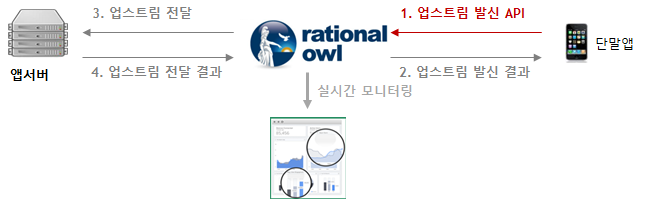

# Android 단말 앱 개발가이드

## 목차

- [Introduction](#introduction)
- [단말앱 라이브러리 적용](#단말앱-라이브러리-적용)
- [FCM 적용](#FCM-적용)
- [단말앱 초기화](#단말앱-초기화)
- [단말앱 등록](#단말앱-등록)
    - [단말앱 등록 요청](#단말앱-등록-요청)
    - [단말앱 등록 결과](#단말앱-등록-결과)
- [단말앱 등록해제](#단말앱-등록해제)
    - [단말앱 등록해제 요청](#단말앱-등록해제-요청)
    - [단말앱 등록해제 결과](#단말앱-등록해제-결과)
- [메시지 리스너 등록](#메시지-리스너-등록)
- [업스트림 메시지 발신](#업스트림-메시지-발신)
    - [업스트림 메시지 발신 요청](#업스트림-메시지-발신-요청)
    - [업스트림 메시지 발신 결과](#업스트림-메시지-발신-결과)
- [P2P 메시지 발신](#p2p-메시지-발신)
    - [P2P 메시지 발신 요청](#p2p-메시지-발신-요청)
    - [P2P 메시지 발신 결과](#p2p-메시지-발신-결과)
- [메시지 수신](#메시지-수신)


## Introduction

> 단말앱은 단말앱 라이브러리가 제공하는 API를 통해 실시간 데이터 통신을 할 수 있다.

단말앱 API는 다음과 같다.

- 메시지 발신 API
  - 업스트림 데이터 발신 API
  - P2P 데이터 발신 API

- 메시지 수신 콜백
  - 다운스트림 데이터 수신시 콜백
  - P2P 데이터 수신시 콜백

- 단말앱 등록/해제 API
  - 단말앱 등록 API
  - 단말앱 등록해제 API

## 단말앱 라이브러리 적용

안드로이드 단말 앱을 개발하기 위해서 먼저 안드로이드용 래셔널아울 단말 앱 라이브러리를 다운로드 받는다.
본 문서는 안드로이드 스튜디오 개발환경을 기준으로 설명한다.

- <a href="https://guide.rationalowl.com/library" target="_blank">Android 단말앱 라이브러리를 다운</a> 받는다.

- 안드로이드 스튜디오를 런칭하고 다운받은 라이브러리를 libs 폴더내에 복사한다.


- 탑레벨(프로젝트 레벨) build.gradle 파일에 파일에 'flatDir { dirs 'libs' }'이 삽입되어 있어야 한다.


- 앱레벨 build.gradle 파일에 세 라이브러리가 디펜던시에 명시되어야 한다.
  - 래셔널아울 단말앱 라이브러리(예:com.rationalowl.Minerva.client.android:ro-android-1.1.2:1.1.2@aar)
  - 라이프사이클 라이브러리 (android.arch.lifecycle:extensions:1.1.0)
  - FCM 라이브러리(com.google.firebase:firebase-core, com.google.firebase-messaging)


## FCM 적용

안드로이드 마쉬멜로 이전에는 백그라운드의 제한이 없어서 안드로이드 단말앱에서 래셔널아울 단말앱 라이브러리를 통해 실시간 푸시 알림이 가능하였다.

그러나 안드로이드 마쉬멜로의 백그라운드 제한과 결정적으로 안드로이드 오레오의 등장으로 사실상 단말앱이 백그라운드시 퍼블릭 푸시가 유일한 알림 수단이 되었다. 따라서 현재 래셔널아울 서비스도 안드로이드 단말이 백그라운드일 경우 FCM을 통해 알림을 보낸다.

[FCM 설정 가이드](https://github.com/RationalOwl/rationalowl-guide/tree/master/device-app/fcm-setting)를 통해 FCM설정한다.


## 단말앱 초기화

단말앱이 래셔널아울 서비스의 실시간 메시지 API를 이용하기 위해서는 init() API를 단말앱 초기화 루틴에서 호출해야 한다.
Application 클래스의 onCreate()에서 호출하도록 권고한다.

```java
public class Service1App extends Application {
    private static final String TAG = "MyApp";


    public void onCreate(){
        Log.d(TAG, "onCreate enter");
        super.onCreate();
        Context context = getApplicationContext();
        MinervaManager.init(context);
    }

}
```

## 단말앱 등록

단말앱이 래셔널아울 API를 통해 실시간 데이터 통신을 하기 위해서는먼저 단말앱을 원하는 고객 모바일 서비스에 등록한다. 등록된 단말앱들이 해당 모바일 서비스에 등록된 모든 단말과 실시간 메시지를 수/발신 할 수 있다.

관리자콘솔의 '서비스 > 단말현황'에서 단말앱 등록 및 등록해제 과정을 실시간 모니터링할 수 있다.


### 단말앱 등록 요청

registerDevice() API를 통해 단말앱을 원하는 서비스의 단말앱으로 등록 요청한다. 
주의할 점은 API호출후 단말앱 등록결과 발급받은 단말등록아이디를 반드시 저장/관리해야 한다. 일단 단말등록아이디를 발급받으면 이 후 registerDevice() API를 호출할 필요는 없다. 즉, 단말앱 등록 API는 단말앱 설치 후 1회만 호출하면 된다.


API인자는 다음과 같다.

- gateHost
  - 래셔널아울 메시징 게이트 서버
  - 국가별로 별도로 존재
  - 무료평가판의 경우 기본 "gate.rationalowl.com"
- serviceId
  - 단말앱이 등록하고자하는 서비스의 아이디
  - 관리자콘솔의 '서비스 > 서비스정보'에서 확인
- deviceRegName
  - 관리자콘솔에서 단말을 구분하기 위한 용도
  - 사용하지 않을 경우 null로 입력

```java
// sometimes, FCM onTokenRefresh() callback not called,
// So, before registering we should need to call explicitly it.
String fcmToken = FirebaseInstanceId.getInstance().getToken();
MinervaManager mgr = MinervaManager.getInstance();
mgr.setDeviceToken(fcmToken);

// register device app.
mgr.registerDevice("gate.rationalowl.com", "54a50ca3c9fa4629a3766b225fae4f8d","My Android 1");
```

### 단말앱 등록 결과

#### 단말앱 등록 결과 리스너 등록

단말앱 등록 및 등록해제 API호출 이후 결과를 알려주는 콜백인터페이스인 DeviceRegisterResultListener를 먼저 등록한다.

DeviceRegisterResultListener인터페이스는 두 개의 메소드가 있다.

1. onRegisterResult
 - 단말앱 등록 결과 콜백
2. onUnregisterResult
 - 단말앱 등록 해제 결과 콜백

setRegisterResultListener() API를 통해 DeviceRegisterResultListener 리스너를 등록한다.

```java
//set register callback listener
MinervaManager minMgr = MinervaManager.getInstance();
minMgr.setRegisterResultListener(this);
```

#### 단말앱 등록 결과 콜백 처리

단말앱 등록 결과는 onRegisterResult() 콜백을 통해 처리한다. 


```java
@Override
public void onRegisterResult(int resultCode, String resultMsg, String deviceRegId) {
    Log.d(TAG, "onRegisterResult " + resultCode);
    String msg = resultMsg + "registration id : " + deviceRegId;
    //yes registration has completed successfully!
    if(resultCode == Result.RESULT_OK) {
        // save deviceRegId to local file
        // and send deviceRegId to app server using MinervaManager.sendUpstreamMsg()
        // MinervaManager minMgr = MinervaManager.getInstance();
        // minMgr.sendUpstreamMsg("data including deviceRegId", "your app server registration id");
    }
    //already registered
    else if(resultCode == Result.RESULT_DEVICE_ALREADY_REGISTERED) {
        // already registered.
    }
    //registration error has occurred!
    else {
        //error occurred while registering device app.
    }
    Log.d(TAG, msg);
}
```
단말앱 등록이 성공되면 발급받은 단말 등록 아이디를 단말앱은 저장 및 관리해야 하고 해당 단말 등록 아이디를 단말앱을 관리 및 통신할 대상 앱서버에게 업스트림 API를 통해 전달해야 한다.   
마찬가지로 앱서버는 전달받은 단말 등록 아이디를 저장 및 관리해야 한다.


단말앱 등록 결과 반환받는 값들은 다음과 같다.

 1. 결과 코드
 2. 결과 메시지
 3. 단말 등록 아이디
    - 단말 앱을 구분하는 구분자
    - 단말앱 등록 성공이거나 기등록된 경우 전달받는다.
    - 단말앱 등록 성공일 경우 이를 앱 서버에게 upstream API를 통해 전달해야 한다.

## 단말앱 등록해제

고객 서비스 내에서 사용하지 않는 단말앱을 등록 해제한다. 
래셔널아울 관리자 콘솔은 단말앱 등록해제 결과에 대해 실시간 모니터링을 제공한다.

### 단말앱 등록해제 요청

unregisterDevice() API를 통해 단말앱 등록해제 요청한다.

```java
MinervaManager mgr = MinervaManager.getInstance(this);
// service which device app should un-register
String serviceId = "faebcfe844d54d449136491fb253619d";
mgr.unregisterDevice(serviceId);
```

### 단말앱 등록해제 결과

단말앱 등록해제 결과는 앞서 DeviceRegisterResultListener 리스너로 등록한 onUnregisterResult() 콜백을 통해 처리한다. 

```java
@Override
public void onUnregisterResult(int resultCode, String resultMsg) {

    //yes unregistration has completed successfully!
    if(resultCode == Result.RESULT_OK) {
    }
    //registration error has occurred!
    else {
    }
}
```

단말앱 등록해제 결과 단말앱 라이브러리는 단말앱에 다음의 값들을 알려준다.

 1. 결과 코드
 2. 결과 메시지


## 메시지 리스너 등록


단말앱은 두 종류의 메시지를 발신한다.

1. 앱서버로 업스트림 메시지를 발신
2. 다른 단말앱들에 P2P메시지를 발신

또한 두 종류의 메시지를 수신한다.

1. 앱서버로부터 다운스트림 메시지 수신
2. 다른 단말앱으로부터 P2P 메시지 수신

이러한 메시지 발신 결과와 메시지 수신을 처리하기 위해서는 메시지 리스너를 등록해야 한다.

MessageListener 인터페이스는 세 개의 메소드를 선언한다.

1. onMsgReceived 
 - 앱서버로부터 다운스트림 메시지 수신시 호출
 - 다른 단말앱으로부터 P2P 메시지 수신시 호출
 - 폰 전원꺼짐 등 다양한 이유로 미전달 메시지 수신시 호출 
2. onSendUpstreamMsgResult
 - 앱서버로 업스트림 메시지를 발신 결과 콜백
3. onSendP2PMsgResult
 - 다른 단말앱들에 P2P메시지를 발신 결과 콜백

메시지 리스너 등록은 메시지 수발신을 처리할 Activity의 onResume()에서 setMsgListener로 지정해야 한다.
샘플코드는 다음과 같다.

```java
@Override
protected void onResume() {
    Logger.debug(TAG, "onResume() enter");
    super.onResume();          
    mListAdapter.notifyDataSetChanged();

    // set message callback listener at onResume()
    MinervaManager minMgr = MinervaManager.getInstance();
    minMgr.setMsgListener(this);
}
```

반드시 메시지 수발신을 처리할 Activity의 onPause()에서 메시지 리스너를 해제해야 한다.
샘플코드는 다음과 같다.

```java
@Override
public void onPause() {
    Logger.debug(TAG, "onPause() enter");
    super.onPause();

    // clear message callback listener at onPause()
    MinervaManager minMgr = MinervaManager.getInstance();
    minMgr.clearMsgListener();
}
```

단말앱내에 메시지를 처리할 Activity가 몇개가 있든지 반드시 onResume()에서 메시지 리스너를 등록하고
onPause()에서는 메시지 리스너를 해제해야 하는 규칙을 따라야 한다.


## 업스트림 메시지 발신

래셔널아울 서비스는 다수의 앱서버를 지원하고 단말앱은 특정 앱서버에게 업스트림 메시지를 발신한다. 
래셔널아울 관리자 콘솔을 통해 실시간 메시지 전달을 모니터링할 수 있다. 이는 고객 서비스 개발시에는 개발의 용이함을 제공하고 서비스 운영시에는 서비스 대응력을 높이고 예측 가능성을 향상시킨다.

래셔널아울에서 지원하는 업스트림 메시지의 특성은 다음과 같다.

- 지원하는 데이터 포맷은 스트링으로 일반 스트링문자나 json 포맷등 고객 서비스 특성에 맞게 설정하면 된다.
- 업스트림은 메시지 큐잉을 지원하지 않는다.
- 래셔널아울 콘솔은 데이터 전달 현황에 대해 실시간 모니터링을 제공한다.



### 업스트림 메시지 발신

sendUpstreamMsg() API를 통해 업스트림 메시지를 발신한다.

```java
MinervaManager minMgr = MinervaManager.getInstance(this);
String requestId = minMgr.sendUpstreamMsg(msg, serverId);
```

API의 각 인자별 의미는 다음과 같다.

1. msg
 - 전달할 데이터로 모바일 서비스 특성에 맞게 json포맷 또는 일반 스트링으로 포맷팅하면 된다.
2. serverRegId
 - 데이터를 전달할 앱서버의 등록아이디

메시지 전달현황은 관리자 콘솔의 '서비스 > 메시지현황'에서 실시간 모니터링 할 수 있다.


### 업스트림 메시지 발신 결과


앞서 메시지 리스너로 등록한 onSendUpstreamMsgResult() 콜백이 호출된다.

```java
@Override
public void onSendUpstreamMsgResult(int resultCode, String resultMsg, String requestId) {
    Log.d(TAG, "onSendUpstreamMsgResult enter");
}  
```

업스트림 메시지 발신 결과는 발신이 성공했는지 확인하는 용도로 제공되고 아래의 값들을 포함하고 있다.

 1. 결과 코드
 2. 결과 메시지
 3. requestId
    - 어느 API 호출에 대한 결과인지 확인하는 용도


## P2P 메시지 발신

래셔널아울 서비스는 P2P 메시지를 지원한다.
래셔널아울 관리자 콘솔을 통해 실시간 메시지 전달을 모니터링할 수 있다. 이는 고객 서비스 개발시에는 개발의 용이함을 제공하고 서비스 운영시에는 서비스 대응력을 높이고 예측 가능성을 향상시킨다.

래셔널아울에서 지원하는 P2P 메시지의 특성은 다음과 같다.

- 평균 0.2초의 실시간 데이터 전달을 보장한다.
- 한대 이상의 단말앱에 메시지를 발신한다.
- 한번에 보낼 수 있는 최대 대상 단말 수는 2000대이다.
- 지원하는 데이터 포맷은 스트링으로 일반 스트링문자나 json 포맷등 고객 서비스 특성에 맞게 설정하면 된다.
- 메시지 전달 대상 단말앱이 네트워크에 연결되지 않을 경우 큐잉 후 단말이 네트워크 접속시 전달하는 큐잉을 지원한다.
- 기본 큐잉 기간은 3일이고 엔터프라이즈 에디션에서는 최대 30일까지 설정 가능하다.
- 큐잉 기능을 이용할지 말지는 단말앱 라이브러리에서 제공하는 P2P API 인자로 결정한다.
- P2P API에서 대상 단말앱이 네트워크에 연결되지 않은 경우 전달 데이터외에 알림 타이틀과 알림 문자를 별도로 지정할 수 있다.  
- 래셔널아울 콘솔은 데이터 전달 현황에 대해 실시간 모니터링을 제공한다.


### P2P 메시지 발신

sendP2PMsg() API를 통해 P2P 메시지를 발신한다.

```java
MinervaManager minMgr = MinervaManager.getInstance(this);
ArrayList<String> destDevices = new ArrayList<String>();
// destiny devices are collection of device registration id
// max 2000 device registration id can be added.
destDevices.add("707e4135954c4819a93fea729317b3e0");
destDevices.add("1241670df8694da586605bf431f150a9");
destDevices.add("4285e11625ff4e71a94ad799457358a3");
// if you want to push to the device apps which are inactive, set notification title and notification body.
String pmi = minMgr.sendP2PMsg(msg, destDevices, true, "noti title", "noti body");
```

API의 각 인자별 의미는 다음과 같다.

1. msg
 - 전달할 데이터로 모바일 서비스 특성에 맞게 json포맷 또는 일반 스트링으로 포맷팅하면 된다.
2. destDevices
 - 데이터를 전달할 단말앱(단말앱 등록 아이디) 목록
 - 한번에 최대 2,000 단말앱까지 가능
3. supportMsgQ
 - false
   - 단말이 비활성에서 활성으로 전환시 미전달 메시지를 단말앱에 전달하지 않는다.
   - 단말이 활성상태에서 실시간 데이터 전달 용도로만 사용시 false로 사용한다.
 - true
   - 미전달 메시지를 메시징 서버에서 큐잉기간(디폴트 3일)동안 큐잉하고 있다가 단말상태가 활성상태가 되면 미전달 메시지를 단말앱에 전달한다.
4. notiTitle
 - 알림 용도로 메시지 전달 시 단말앱이 비활성시 알림 타이틀로 표시할 문자
 - notiTitle과 notiBody가 모두 null이면 단말앱이 비활성시 푸시 메시지를 발송하지 않는다.
5. notiBody
 - 알림 용도로 메시지 전달 시 단말앱이 비활성시 알림 내용으로 표시할 문자


메시지 전달현황은 관리자 콘솔의 '서비스 > 메시지현황'에서 실시간 모니터링 할 수 있다.


### P2P 메시지 발신 결과


메시지 리스너로 등록한 onSendP2PMsgResult() 콜백이 호출된다. 

```java
@Override
public void onSendP2PMsgResult(int resultCode, String resultMsg, String requestId) {
    Log.d(TAG, "onSendP2PMsgResult enter");
} 
```

P2P 메시지 발신 결과는 발신이 성공했는지 확인하는 용도로 제공되고 아래의 값들을 포함하고 있다.

1. 결과 코드
 - 샘플코드에서 bundle.getInt("resultCode")로 반환
2. 결과 메시지
 - 샘플코드에서 bundle.getString("resultMsg")로 반환
3. requestId
 - minMgr.sendP2PMsg()의 반환값과 동일하다.
 - P2P 발신 결과와 sendP2PMsg() API 호출원을 검증하는 용도


## 메시지 수신

단말앱 실행시 앱서버로부터의 실시간 다운스트림 메시지와 다른 단말앱으로부터의 실시간 P2P 메시지를 수신한다. 그 밖에 단말 전원이 꺼지거나 단말앱 미실행등 여러가지 이유로 실시간 메시지 수신을 못한 경우 단말앱 실행시 미전달 메시지를 수신한다.
메시지 수신시 등록한 메시지 리스너의 onMsgReceived() 콜백이 호출된다. 

```java
@Override
public void onMsgReceived(ArrayList<JSONObject> msgs) {
    Logger.debug(TAG, "onMsgReceived enter");

    int msgSize = msgs.size();

    try {
        JSONObject oneMsg = null;
        int msgType;
        String sender = null;
        String data = null, notiTitle = null, notiBody = null;
        long serverTime;
        long curTime = System.currentTimeMillis();
        long elapseTime;
        Calendar cal = Calendar.getInstance();
        String curTimeStr = cal.get(Calendar.YEAR) + "/" + (cal.get(Calendar.MONTH) + 1) + "/" + cal.get(Calendar.DAY_OF_MONTH) + "/" + cal.get(Calendar.HOUR_OF_DAY) + ":" + cal.get(Calendar.MINUTE) + ":" + cal.get(Calendar.SECOND);
        String serverTimeStr = null;
        MsgCache cache = MsgCache.getInstance();
        PushMsg pushMsg = new PushMsg();

        // recent messages are ordered previous position [recentest, recent, old, older, oldest...]
        // this sample app treat old message first.
        for (int i = msgSize - 1; i >= 0; i--) {
            oneMsg = msgs.get(i);
            msgType = (int) oneMsg.get(MinervaManager.FIELD_MSG_TYPE);  // 1(downstream), 2(p2p)
            sender = (String) oneMsg.get(MinervaManager.FIELD_MSG_SENDER);
            data = (String) oneMsg.get(MinervaManager.FIELD_MSG_DATA);
            serverTime = (Long) oneMsg.get(MinervaManager.FIELD_MSG_SERVER_TIME);

            // optional fields
            if(oneMsg.has(MinervaManager.FIELD_MSG_NOTI_TITLE)) {
                notiTitle = (String) oneMsg.get(MinervaManager.FIELD_MSG_NOTI_TITLE);
            }

            if(oneMsg.has(MinervaManager.FIELD_MSG_NOTI_BODY)) {
                notiBody = (String) oneMsg.get(MinervaManager.FIELD_MSG_NOTI_BODY);
            }
            curTime = System.currentTimeMillis();
            elapseTime = curTime - serverTime;
            cal.setTimeInMillis(serverTime);
            serverTimeStr = cal.get(Calendar.YEAR) + "/" + (cal.get(Calendar.MONTH) + 1) + "/" + cal.get(Calendar.DAY_OF_MONTH) + "/" + cal.get(Calendar.HOUR_OF_DAY) + ":" + cal.get(Calendar.MINUTE) + ":" + cal.get(Calendar.SECOND);

            pushMsg = new PushMsg();
            pushMsg.mData = data;
            pushMsg.mSrcTime = serverTimeStr;
            pushMsg.mDestTime = curTimeStr;
            pushMsg.mElapsedTime = elapseTime;
            cache.addMsg(pushMsg);
        }
    }
    catch (Exception e) {
        e.printStackTrace();
    }
    mListAdapter.notifyDataSetChanged();
}
```
샘플코드에서 알 수 있듯이 onMsgReceived()콜백 파라미터로 수신한 메시지 목록이 넘어오고 각 메시지에는 다음의 정보를 포함하고 있다.
  - 메시지 타입 : 1(다운스트림), 2(P2P)
  - 메시지 발신주체 : 다운스트림일 경우 메시지 발신한 앱서버의 서버등록아이디, P2P 일 경우 발신 단말앱 등록 아이디
  - 메시지 데이터
  - 메시지 발신시간
  - 단말앱이 백그라운드시 표시할 알림 타이틀
  - 단말앱이 백그라운드시 표시할 알림 본문
