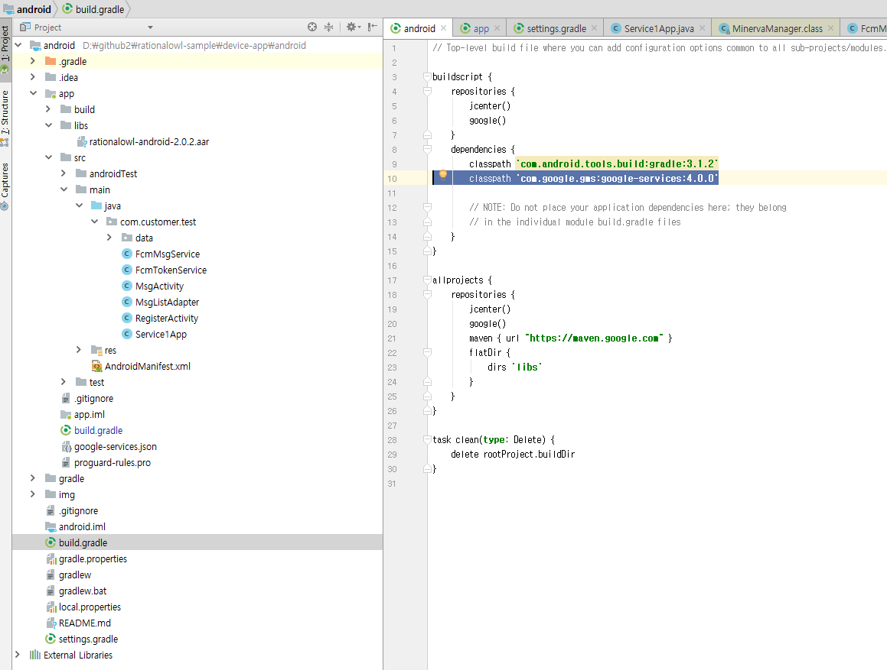
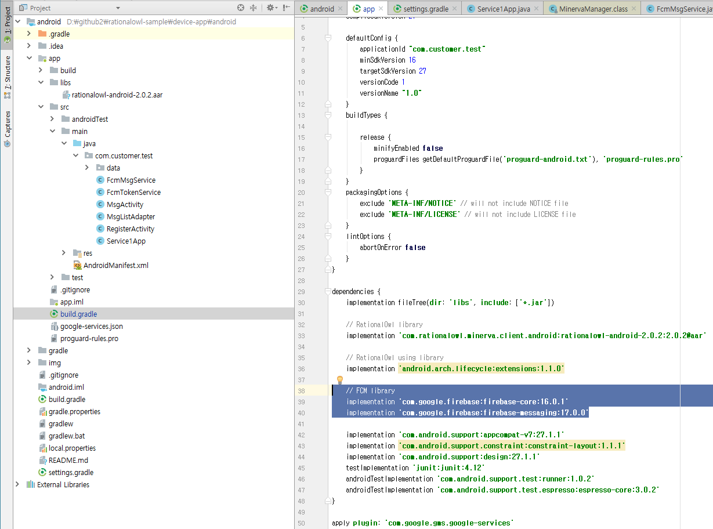

# 래셔널아울 안드로이드 단말용 FCM 설정 가이드

>## Introduction

> 래셔널아울 서비스를 이용하는 단말앱이 포그라운드일 경우 실시간 데이터 수/발신이 가능하나 안드로이드 단말앱일 경우 백그라운드일 때 FCM(Firebase Cloud Messaging)을 통해 알림 메시지를 수신한다.


아래는 래셔널아울 서비스를 통해 안드로이드 단말앱이 실행되지 않을 때, 단말앱이 P2P 메시지와 다운스트림(푸시) 메시지를 수신하는 과정이다.


## 파이어베이스 콘솔에 프로젝트 생성

[Firebase 콘솔](https://console.firebase.google.com/)에서 안드로이드 단말앱에 푸시알림을 전달하기 위해 프로젝트를 추가해야 한다.

1. '프로젝트 추가'버튼을 클릭한다.


2. '프로젝트 추가'창에 프로젝트 이름과 국가/지역을 입력한다.


3. 'Android 앱에 Firebase 추가' 클릭


4. 안드로이드 패키지명과 앱닉네임을 입력하고 '앱등록' 버튼을 클릭한다.


5. 'google-services.json'파일을 다운로드 후 안드로이드 스튜디오 앱루트 디렉토리에 카피한다. 


6. 프로젝트 레벨 'build.gradle' depencies에 google-services를 추가한다.



7. 앱 레벨 'build.gradle' depencies에 firebase-core와 firebase-messaging을 추가한다.




## FCM 안드로이드 단말앱 적용

FCM 푸시 알림을 안드로이드 단말앱에 적용하기 위해서 를 처리하기 위해서는 FirebaseInstanceIdService를 구현해야 한다.

1. FCM 단말 토큰 생성시 호출되는 서비스인 FirebaseInstanceIdService를 상속한 클래스


```java
public class MyFcmTokenService extends FirebaseInstanceIdService {

    private static final String TAG = "MyFcmTokenService";

    /**
     * Called if InstanceID token is updated. This may occur if the security of
     * the previous token had been compromised. Note that this is called when the InstanceID token
     * is initially generated so this is where you would retrieve the token.
     */

    @Override
    public void onTokenRefresh() {
        // Get updated InstanceID token.
        String refreshedToken = FirebaseInstanceId.getInstance().getToken();
        Log.d(TAG, "Refreshed token: " + refreshedToken);

        MinervaManager minMgr = MinervaManager.getInstance();
        minMgr.setDeviceToken(refreshedToken);
    }

}   
```

- 토큰 생성 및 갱신시 호출되는 콜백인 onTokenRefresh()에서 MinervaManager.setDeviceToken()을 호출해야 한다.

이로써 안드로이드 단말앱 설정이 끝났다.

## FCM 서버키 등록

1. [Firebase 콘솔](https://console.firebase.google.com/)에서 이전단계에서 생성한 프로젝트를 클릭한다.


2. '프로젝트 설정' 버튼을 클릭한다.


3. '클라우드 메시징' 탭을 누르면 서버키 값이 나타나는데 해당 값을 카피한다.


4. 래셔널아울 콘솔에 로그인한다.


5. '+서비스'버튼을 클릭하여 서비스 이름과 서비스 설명을 입력후 추가 버튼을 클릭한다.


6. 서비스 목록에 추가된 서비스의 '바로가기' 버튼을 클릭한다.


7. 'FCM 서버키 등록' 버튼을 클릭한다.


8. 앞서 Firebase 콘솔에서 카피한 서버키를 입력 후 '업로드' 버튼을 클릭한다.


9. FCM 서버키가 정상 등록된 것을 확인한다.


이로서 안드로이드 단말앱이 백그라운드일 경우 앱서버로부터의 다운스르트림 메시지나 다른 단말앱으로부터의 P2P 메시지를 수신시 FCM 을 통한 알림 메시지를 수신할 수 있다.