# 래셔널아울 APNS 인증서 설정 가이드

>## Introduction

> **래셔널아울 서비스를 이용하는 안드로이드 단말앱**의 경우 단말앱이 포그라운드에서 실행되지 않더라도 **다운스트림/P2P 메시지 수신이 가능**하다.     
그에 반해, IOS단말앱일 경우 OS제약 때문에 앱이 포그라운드에서 실행되고 있지 않을 경우 다운스트림/P2P 메시지를 수신할 유일한 방법이 APNS(Apple Push Notification Service)를 통한 푸시 알림이다. 본 문서에서는 래셔널아울 서비스에서 APNS 푸심알림 설정을 하기 위한 1. APNS 서버용 인증서 생성방법과 2. 생성한 인증서를 래셔널아울 관리자 콘솔을 통한 업로드하는 방법에 대해 설명한다.         

아래는 래셔널아울 서비스를 통해 IOS단말앱이 실행되지 않을 때, 단말앱이 P2P 메시지와 다운스트림(푸시) 메시지를 수신하는 과정이다.

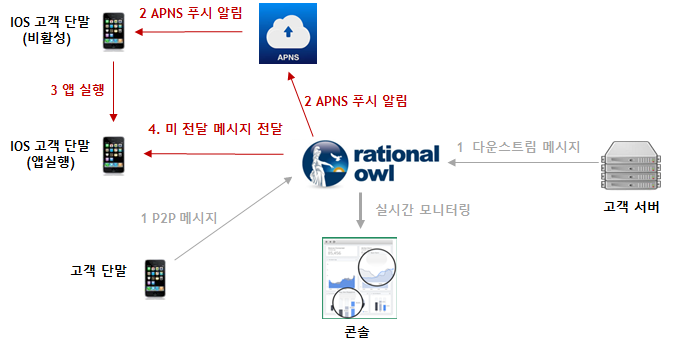


## 인증서 요청 파일 생성

APNS 서버용 인증서를 생성하기 위해서 먼저 인증서 요청 파일을 생성해야 한다.

1. 맥 우측 상단의 찾기 버튼을 눌러 '키체인 접근'을 검색하여 키체인 접근 앱을 실행시킨다.

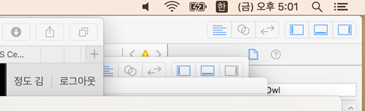

2. '키체인 접근 > 인증서 지원 > 인증 기관에서 인증서 요청...' 순서로 클릭한다.


3. 이메일 주소, 일반 이름을 입력 후 디스크에 저장 옵션 선택 후 계속 버튼 클릭한다.

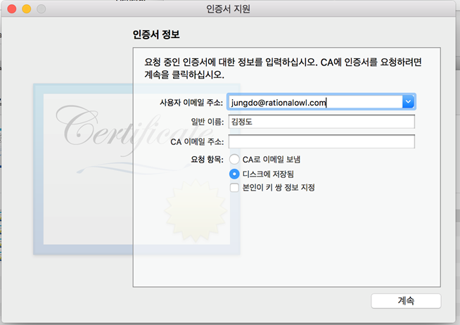

4. 인증서 요청 파일 저장   
'CertificateSigningRequest.certSigningRequest'파일이름으로 저장할 폴더를 지정한다. 인증서 폴더는 개발용 및 상용 서비스용으로 별도 관리 및 저장할 것을 권고한다. 본 문서에서는 개발용 인증서를 기준으로 'dev'폴더에 'CertificateSigningRequest.certSigningRequest'파일이름으로 저장한다.

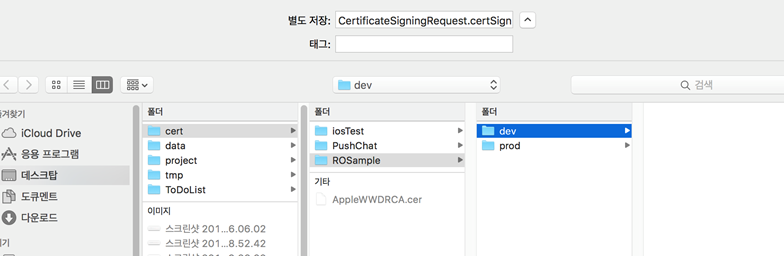


## 단말앱 ID 생성

APNS를 이용하기 위해서는 모든 앱은 고유한App ID를 생성해야 한다. 주의할 점은 App ID 생성과정에서 지정하는 'Bundle ID'를 개발시 XCode에서 지정하는 'Bundle Identifier'와 동일한 값을 지정한다.

1. IOS개발자 페이지(https://developer.apple.com)에 접속하여 우측 상단에Account를 눌러 로그인한다.   
 개발자 페이지에 등록되지 않았다면 먼저 등록해야 한다.

2. 'Certificates, IDs & Profiles' 클릭한다.

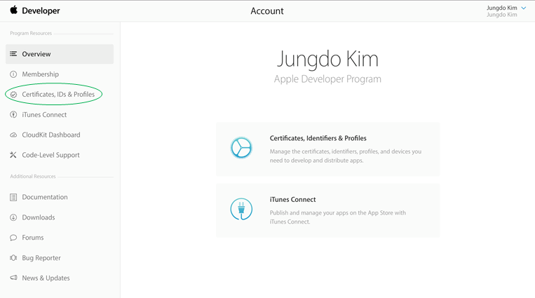

3. 'Identifiers > App IDs'를 클릭하면 기존 생성했던 App ID목록이 나타난다.
4. 우측 상단의 + 를 클릭하여 새 App ID생성한다.

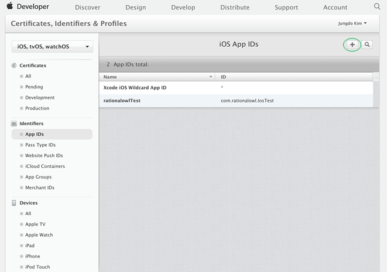

4. AppID Description에 앱 이름을 입력한다. Ex: RationalOwlSample
5. Explicit App ID에Bundle ID를 입력한다. Ex:com.sample.ROSample
 - xcode에서 앱 작성시 입력하는  **Bundle Identifier와 동일**한 값

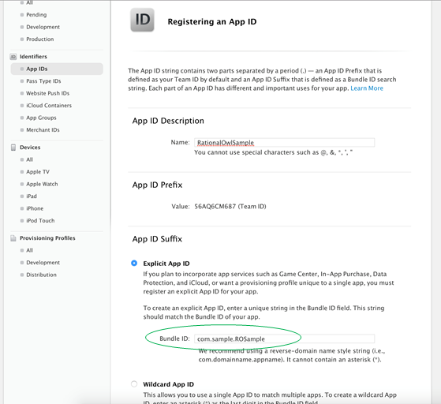

6. App Services항목에서 Push Notifications항목을 체크한다.
7. 이후 register버튼과 done버튼을 클릭해 App ID생성을 완료한다.

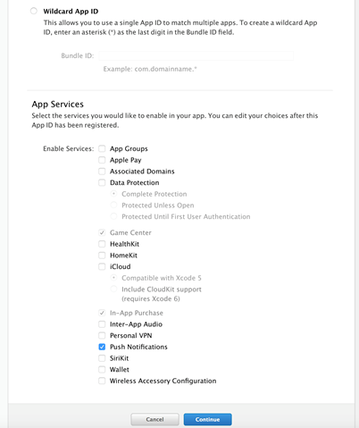

8. 이후 register버튼과 done버튼을 클릭해 App ID생성을 완료한다.


## 인증서 생성
앱이 APNS푸시를 이용하기 위해서는 APNS 푸시 발신을 위한 인증서가 필요하다. 
인증서 생성 후 생성한 인증서를 PC에 저장하는 절차는 아래와 같다.

1. App IDs항목에서 방금 생성한 App ID항목을 클릭하면 아래 그림과 같은 화면이 나타난다.


2. Edit버튼을 클릭한다.
3. create certificate...버튼을 클릭한다.      
본 문서에서는 개발용 인증서 생성을 위해 'Development SSL Certificates'란의 'Create Certificate...'버튼을 클릭한다. 실제 상용 서비스용 인증서를 생성하려면 아래 항목인 'Production SSL Certificate'을 선택하면 된다.


4. continue버튼을 클릭한다.

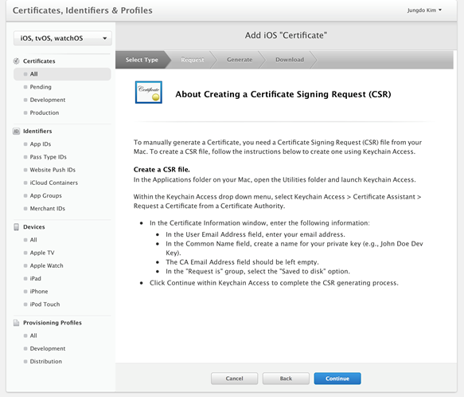

5. Choose File...버튼을 클릭하고 앞서 생성한 인증서 요청 파일인 'CertificateSigningRequest.certSigningRequest'을 선택 후 Continue버튼을 클릭한다.

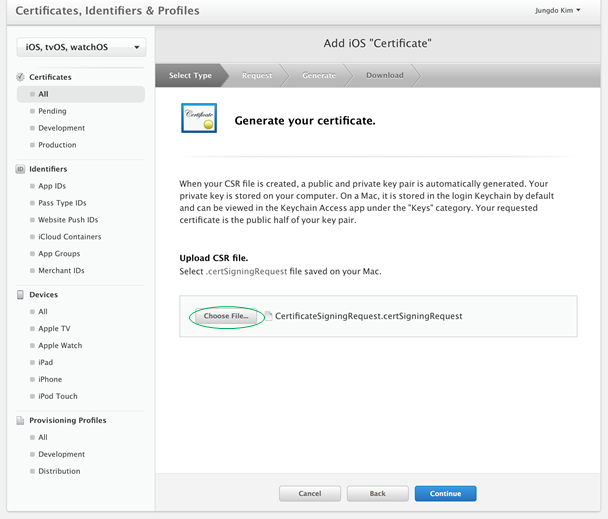

6. 인증서가 생성되었다. Download버튼을 클릭해서 인증서를 다운 받는다.   
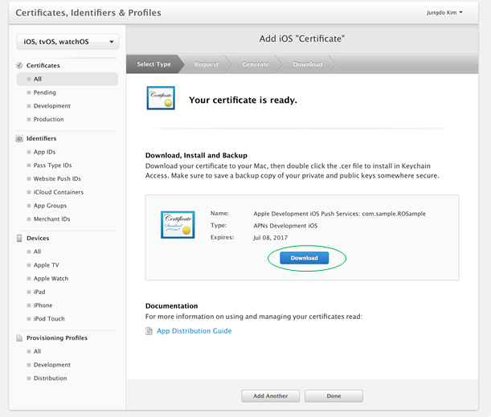

7. 다운받은 인증서를 폴더에 저장한다.
  - 다운받은 인증서를 개발용과 서비스용 별로 구분하여 별도의 폴더에 보관하는 것을 권장
  - 본 가이드에서는 인증서 이름을 'dev_cert.cer'이름으로 저장했다.
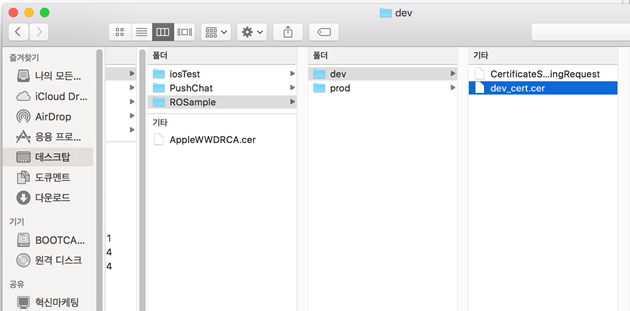

## P12 파일 생성
앞서 생성한 인증서(dev_cert.cert)를 이용하기 위해서 외부에 인증서를 주고 받을 수 있는 포맷인 p12파일 포맷으로 변경한다. 


1. 앞서 다운받은 인증서를 더블클릭하여 인증서를 키체인에 포함시키고 '키체인 앱'이 실행된다.


>## 단말앱 초기화
단말앱이 래셔널아울 서비스의 실시간 메시지 API를 이용하기 위해서는 init() API를 단말앱 초기화 루틴에서 호출해야 한다.
      
안드로이드의 경우 앞장의 '단말 라이브러리 적용 > 4'파트에서 'android:name'필드'에 명시한 Application 클래스의 onCreate()에서 호출하도록 권고한다.

```java
public class Service1App extends Application {
    private static final String TAG = "MyApp";

    private static Context context;
    

    public void onCreate(){
        Log.d(TAG, "onCreate enter");
        super.onCreate();
        context = getApplicationContext();
        MinervaManager.init(context);
    }


    public static Context getContext() {
        return context;
    }
}
```

>## 단말앱 등록
단말앱이 래셔널아울 API를 통해 실시간 데이터 통신을 하기 위해서는먼저 단말앱을 원하는 고객 모바일 서비스에 등록한다. 등록된 단말앱들이 해당 모바일 서비스에 등록된 모든 단말과 실시간 메시지를 수/발신 할 수 있다.

관리자콘솔의 '서비스 > 단말현황'에서 단말앱 등록 및 등록해제 과정을 실시간 모니터링할 수 있다.


### 앱서버 등록 요청

registerDevice() API를 통해 단말앱을 원하는 서비스의 단말앱으로 등록 요청한다. 
주의할 점은 API호출후 단말앱 등록결과 발급받은 단말등록아이디를 반드시 저장/관리해야 한다. 일단 단말등록아이디를 발급받으면 이 후 registerDevice() API를 호출할 필요는 없다. 즉, 단말앱 등록 API는 단말앱 설치 후 1회만 호출하면 된다.

API인자는 다음과 같다.
1. gateHost
 - 래셔널아울 메시징 게이트 서버
 - 국가별로 별도로 존재
 - 무료평가판의 경우 기본 "gate.rationalowl.com"
2. serviceId 
 - 단말앱이 등록하고자하는 서비스의 아이디
 - 관리자콘솔의 '서비스 > 서비스정보'에서 확인
3. deviceRegName 
 - 관리자콘솔에서 단말을 구분하기 위한 용도
 - 사용하지 않을 경우 null로 입력****

```java
String gateHost = "gate.rationalowl.com";
String serviceId = "faebcfe844d54d449136491fb253619d";
String deviceRegName = "단말등록이름";
MinervaManager mgr = MinervaManager.getInstance(this);
mgr.registerDevice(gateHost, serviceId, deviceRegName);
```


### 단말앱 등록 결과
단말앱 등록이 성공되면 발급받은 단말 등록 아이디를 단말앱은 저장 및 관리해야 하고 해당 단말 등록 아이디를 단말앱을 관리 및 통신할 대상 앱서버에게 업스트림 API를 통해 전달해야 한다.
마찬가지로 앱서버는 전달받은 단말 등록 아이디를 저장 및 관리해야 한다.

단말앱 등록 결과 반환받는 값들은 다음과 같다.

 1. 단말 등록 아이디
    - 단말 앱을 구분하는 구분자
    - 단말앱 등록 성공이거나 기등록된 경우 전달받는다.
    - 단말앱 등록 성공일 경우 이를 앱 서버에게 upstream API를 통해 전달해야 한다.
 2. 결과 코드
 3. 결과 메시지


안드로이드의 경우 "com.rationalowl.minerva.action.ACTION_MINERVA_DEVICE_REGISTER_RESULT" action명으로 BroadcastReceiver에게 전달된다.

```java
 public void onReceive(Context context, Intent intent) {
    String action = intent.getAction();    
    
    if(action.equals(MinervaManager.ACTION_MINERVA_DEVICE_REGISTER_RESULT)) {          
        Bundle bundle = intent.getExtras();
        int resultCode = bundle.getInt("resultCode");    
        String msg = null;

        // yes registration has completed successfully!
        if(resultCode == Result.RESULT_OK) {
            String deviceRegId = bundle.getString("deviceRegId");            
            // save deviceRegId
            // save it..

            // sendUpstream deviceRegId to the app server which should communicate with
            String data = deviceRegId;
            String serverRegId = "server registration id which should be communicated!";
            MinervaManager minMgr = MinervaManager.getInstance(this);
            minMgr.sendUpstreamMsg(msg, serverRegId);
        }
        // already registered
        else if(resultCode == Result.RESULT_DEVICE_ALREADY_REGISTERED) {
            String deviceRegId = bundle.getString("deviceRegId");                   
        }
        // registration error has occurred!
        else {
            // error message
            msg = bundle.getString("resultMsg");
        }         
    }   
    ... 
 }  
```


## 단말앱 등록해제
고객 서비스 내에서 사용하지 않는 단말앱을 등록 해제한다. 
래셔널아울 관리자 콘솔은 단말앱 등록해제 결과에 대해 실시간 모니터링을 제공한다.

### 단말앱 등록해제 요청

unregisterDevice() API를 통해 단말앱 등록해제 요청한다.

```java
MinervaManager mgr = MinervaManager.getInstance(this);
// service which device app should un-register
String serviceId = "faebcfe844d54d449136491fb253619d";
mgr.unregisterDevice(serviceId);
```

### 단말앱 등록해제 결과

단말앱 등록해제 결과 단말앱 라이브러리는 단말앱에 다음의 값들을 알려준다.

 1. 단말 등록 아이디
    - 단말 앱을 구분하는 구분자    
 2. 결과 코드
 3. 결과 메시지

안드로이드 경우 "com.rationalowl.minerva.action.ACTION_MINERVA_DEVICE_UNREGISTER_RESULT" action명으로 BroadcastReceiver에게 전달된다.


```java
 public void onReceive(Context context, Intent intent) {
    String action = intent.getAction();    
    
    if(action.equals(MinervaManager.ACTION_MINERVA_DEVICE_REGISTER_RESULT)) {
        ...
    }                
    else if(action.equals(MinervaManager.ACTION_MINERVA_DEVICE_UNREGISTER_RESULT)) {
        Log.d(TAG, "onReceive 2 " + action);       
        Bundle bundle = intent.getExtras();
        int resultCode = bundle.getInt("resultCode");    
        String msg = null;
        //yes unregistration has completed successfully!
        if(resultCode == Result.RESULT_OK) {
            String deviceRegId = bundle.getString("deviceRegId");           
        }          
        //registration error has occurred!
        else {
            // error message
            msg = bundle.getString("resultMsg");
        }                    
    }
    ... 
 }  
```


## 업스트림 메시지 발신
래셔널아울 서비스는 다수의 앱서버를 지원하고 단말앱은 특정 앱서버에게 업스트림 메시지를 발신한다. 
래셔널아울 관리자 콘솔을 통해 실시간 메시지 전달을 모니터링할 수 있다. 이는 고객 서비스 개발시에는 개발의 용이함을 제공하고 서비스 운영시에는 서비스 대응력을 높이고 예측 가능성을 향상시킨다.

래셔널아울에서 지원하는 업스트림 메시지의 특성은 다음과 같다.  
  - 0.5초 이내 실시간 데이터 전달을 보장한다.
  - 지원하는 데이터 포맷은 스트링으로 일반 스트링문자나 json 포맷등 고객 서비스 특성에 맞게 설정하면 된다.
  - 업스트림은 메시지 큐잉을 지원하지 않는다.  
  - 래셔널아울 콘솔은 데이터 전달 현황에 대해 실시간 모니터링을 제공한다.


  
### 업스트림 메시지 발신 요청
sendUpstreamMsg() API를 통해 업스트림 메시지를 발신한다.

```java
MinervaManager minMgr = MinervaManager.getInstance(this);
String requestId = minMgr.sendUpstreamMsg(msg, serverId);
```

### 업스트림 메시지 발신 결과


업스트림 메시지 발신 결과는 발신이 성공했는지 확인하는 용도로 제공되고 아래의 값들을 포함하고 있다.

 1. requestId
    - 어느 API 호출에 대한 결과인지 확인하는 용도
 2. 결과 코드
 3. 결과 메시지

안드로이드 경우` "com.rationalowl.minerva.action.ACTION_MINERVA_UPSTREAM_MSG_RESULT" action명으로 BroadcastReceiver에게 전달된다.

```java
 public void onReceive(Context context, Intent intent) {
    String action = intent.getAction();    
    
    if(action.equals(MinervaManager.ACTION_MINERVA_UPSTREAM_MSG_RESULT)) {                        
        Bundle bundle = intent.getExtras();
        int resultCode = bundle.getInt("resultCode");    
        String resultMsg = bundle.getString("resultMsg");
        //umi(upstream message id) 
        //if some one need to know sendUpstreamMsg() API caller,
        //this field can handle it.
        String requstId = bundle.getString("umi");

        //yes upstream message sent successfully
        if(resultCode == Result.RESULT_OK) {
            //do something
            Log.d(TAG, "upstream success requstId = " + requstId);
        }          
        //upstream message fail
        else {
            //do something.
            Log.d(TAG, "upstream fail requstId = " + requstId);
        }       
    }                 
    ... 
 }  
```


## P2P 메시지 발신
래셔널아울 서비스는 P2P 메시지를 지원한다. 
래셔널아울 관리자 콘솔을 통해 실시간 메시지 전달을 모니터링할 수 있다. 이는 고객 서비스 개발시에는 개발의 용이함을 제공하고 서비스 운영시에는 서비스 대응력을 높이고 예측 가능성을 향상시킨다.

래셔널아울에서 지원하는 P2P 메시지의 특성은 다음과 같다.  
  - 0.5초 이내 실시간 데이터 전달을 보장한다.
  - 한대 이상의 단말앱에 메시지를 발신한다.  
  - 한번에 보낼 수 있는 최대 대상 단말 수는 2000대이다.
  - 지원하는 데이터 포맷은 스트링으로 일반 스트링문자나 json 포맷등 고객 서비스 특성에 맞게 설정하면 된다.
  - 메시지 전달 대상 단말앱이 네트워크에 연결되지 않을 경우 큐잉 후 단말이 네트워크 접속시 전달하는 큐잉을 지원한다.
  - 기본 큐잉 기간은 3일이고 엔터프라이즈 에디션에서는 최대 30일까지 설정 가능하다.
  - 큐잉 기능을 이용할지 말지는 단말앱 라이브러리에서 제공하는 P2P API 인자로 결정한다.
  - P2P API에서 대상 단말앱이 네트워크에 연결되지 않은 경우 전달 데이터외에 알림 타이틀과 알림 문자를 별도로 지정할 수 있다.  
  - 래셔널아울 콘솔은 데이터 전달 현황에 대해 실시간 모니터링을 제공한다.


  
### P2P 메시지 발신 요청
sendP2PMsg() API를 통해 P2P 메시지를 발신한다.

```java
MinervaManager minMgr = MinervaManager.getInstance(this);
ArrayList<String> destDevices = new ArrayList<String>();
// destiny devices are collection of device registration id
// max 2000 device registration id can be added.
destDevices.add("707e4135954c4819a93fea729317b3e0");
destDevices.add("1241670df8694da586605bf431f150a9");
destDevices.add("4285e11625ff4e71a94ad799457358a3");
minMgr.sendP2PMsg(msg, destDevices);
```

### P2P 메시지 발신 결과


P2P 메시지 발신 결과는 발신이 성공했는지 확인하는 용도로 제공되고 아래의 값들을 포함하고 있다.

 1. requestId
    - 어느 API 호출에 대한 결과인지 확인하는 용도
 2. 결과 코드
 3. 결과 메시지

안드로이드의 경우 "com.rationalowl.minerva.action.ACTION_MINERVA_P2P_MSG_RESULT" action명으로 BroadcastReceiver에게 전달된다.

```java
 public void onReceive(Context context, Intent intent) {
    String action = intent.getAction();    
    
    if(action.equals(MinervaManager.ACTION_MINERVA_UPSTREAM_MSG_RESULT)) {                        
        ...
    }   
    else if(action.equals(MinervaManager.ACTION_MINERVA_P2P_MSG_RESULT)) {
        Bundle bundle = intent.getExtras();
        int resultCode = bundle.getInt("resultCode");    
        String resultMsg = bundle.getString("resultMsg");
        //pmi(P2P message id) 
        String requstId = bundle.getString("pmi");
        //yes P2P message sent successfully
        if(resultCode == Result.RESULT_OK) {
            //do something
            Log.d(TAG, "P2P send success requstId = " + requstId);
        }          
        //upstream message fail
        else {
            //do something.
            Log.d(TAG, "P2P fail requstId = " + requstId);
        }       
    }                               
    ... 
}  
```


## 메시지 수신
단말앱은 앱서버로부터의 다운스트림 메시지와 다른 단말앱으로부터의 P2P 메시지를 수신한다. 

### 다운스트림 메시지 수신
앱서버에서 발신하는 멀티캐스트, 브로드캐스트, 그룹 메시지를 단말앱이 수신시 단말앱 라이브러리는 단말앱에게 다음의 값들을 알려준다.

1. 다운스트림 메시지 갯수    
2. 다운스트림 메시지 목록  
   메시지 목록의 각 메시지는 다음의 값들을 포함한다.
  - 메시지 발신한 앱서버의 서버등록아이디
  - 메시지 데이터
  - 메시지 발신시간
  - 단말앱이 백그라운드시 표시할 알림 타이틀
  - 단말앱이 백그라운드시 표시할 알림 본문


안드로이드의 경우 "com.rationalowl.minerva.action.ACTION_MINERVA_PUSH_MSG_RECEIVED" action명으로 BroadcastReceiver에게 전달된다.

```java
 public void onReceive(Context context, Intent intent) {
    String action = intent.getAction();    
    
    if(action.equals(MinervaManager.ACTION_MINERVA_UPSTREAM_MSG_RESULT)) {                        
        ...
    }   
    else if(action.equals(MinervaManager.ACTION_MINERVA_PUSH_MSG_RECEIVED)) {      
        Bundle bundle = intent.getExtras();
        int msgSize = bundle.getInt(MinervaManager.FIELD_MSG_SIZE);
        String jsonStr = bundle.getString(MinervaManager.FIELD_MSG_LIST);
       
        try {
            ArrayList<Map<String, Object>> testJson = mapper.readValue(jsonStr, new TypeReference<ArrayList<Map<String, Object>>>() {});
            
            for(int i = 0; i < msgSize; i++) {
                Map<String, Object> oneMsg = testJson.get(i);
                String sender = (String)oneMsg.get(MinervaManager.FIELD_MSG_SENDER);
                String data = (String)oneMsg.get(MinervaManager.FIELD_PUSH_DATA);
                long serverTime = (Long)oneMsg.get(MinervaManager.FIELD_PUSH_SERVER_TIME);                    
                long notiTitle = (Long)oneMsg.get(MinervaManager.FIELD_MSG_NOTI_TITLE);                    
                long notiBody = (Long)oneMsg.get(MinervaManager.FIELD_MSG_NOTI_BODY);                    
            }            
        }
        catch(Exception e) {
            e.printStackTrace();
        }
    }                               
    ... 
}  
```

### P2P 메시지 수신
모바일 서비스 내 다른 단말앱에서 발신한 P2P 메시지를 단말앱이 수신시 단말앱 라이브러리은 단말앱에게 다음의 값들을 알려준다.

1. P2P 메시지 갯수    
2. P2P 메시지 목록  
   메시지 목록의 각 메시지는 다음의 값들을 포함한다.
  - 메시지 발신한 단말앱의 단말등록아이디
  - 메시지 데이터
  - 메시지 발신시간
  - 단말앱이 백그라운드시 표시할 알림 타이틀
  - 단말앱이 백그라운드시 표시할 알림 본문


P2P 메시지 수신시 "com.rationalowl.minerva.action.ACTION_MINERVA_P2P_MSG_RECEIVED" action명으로 BroadcastReceiver에게 전달된다.

```java
 public void onReceive(Context context, Intent intent) {
    String action = intent.getAction();    
    
    if(action.equals(MinervaManager.ACTION_MINERVA_UPSTREAM_MSG_RESULT)) {                        
        ...
    }   
    else if(action.equals(MinervaManager.ACTION_MINERVA_PUSH_MSG_RECEIVED)) {      
        ...
    }                  
    else if(action.equals(MinervaManager.ACTION_MINERVA_P2P_MSG_RECEIVED)) {      
        Bundle bundle = intent.getExtras();
        int msgSize = bundle.getInt(MinervaManager.FIELD_MSG_SIZE);
        String jsonStr = bundle.getString(MinervaManager.FIELD_MSG_LIST);
       
        try {
            ArrayList<Map<String, Object>> testJson = mapper.readValue(jsonStr, new TypeReference<ArrayList<Map<String, Object>>>() {});
            
            for(int i = 0; i < msgSize; i++) {
                Map<String, Object> oneMsg = testJson.get(i);
                String sender = (String)oneMsg.get(MinervaManager.FIELD_MSG_SENDER);
                String data = (String)oneMsg.get(MinervaManager.FIELD_PUSH_DATA);
                long serverTime = (Long)oneMsg.get(MinervaManager.FIELD_PUSH_SERVER_TIME);                    
                long notiTitle = (Long)oneMsg.get(MinervaManager.FIELD_MSG_NOTI_TITLE);                    
                long notiBody = (Long)oneMsg.get(MinervaManager.FIELD_MSG_NOTI_BODY);                    
            }            
        }
        catch(Exception e) {
            e.printStackTrace();
        }
    }                                
    ... 
}  
```


