# 래셔널아울 IOS 설정 가이드

>## Introduction

> p8 인증키를 통해 APNS 푸시알림 설정하는 과정을 설명한다. p12 인증서를 통한 방법은 매년 인증서를 갱신해야 하는 번거로움이 있는 반면 p8 인증키를 통해 APNS 푸시알림을 설정하면 매년 갱신할 필요가 없어 편리하다.

아래는 래셔널아울 서비스를 통해 IOS단말앱이 실행되지 않을 때, 단말앱이 P2P 메시지와 다운스트림(푸시) 메시지를 수신하는 과정이다.

## 인증키(.p8) 발급

1. [Apple Developer Center](https://developer.apple.com/account) 에 로그인한다.

2. Certificates, IDs & Profiles 항목을 클릭한다.

3. Keys 항목을 클릭후 'Keys +' 버튼을 클릭한다.
- 키는 최대 2개까지 등록가능하다.

4. Key Name에 키이름을 입력하고 APNs 항목을 체크 후 Continue 버튼을 클릭한다.
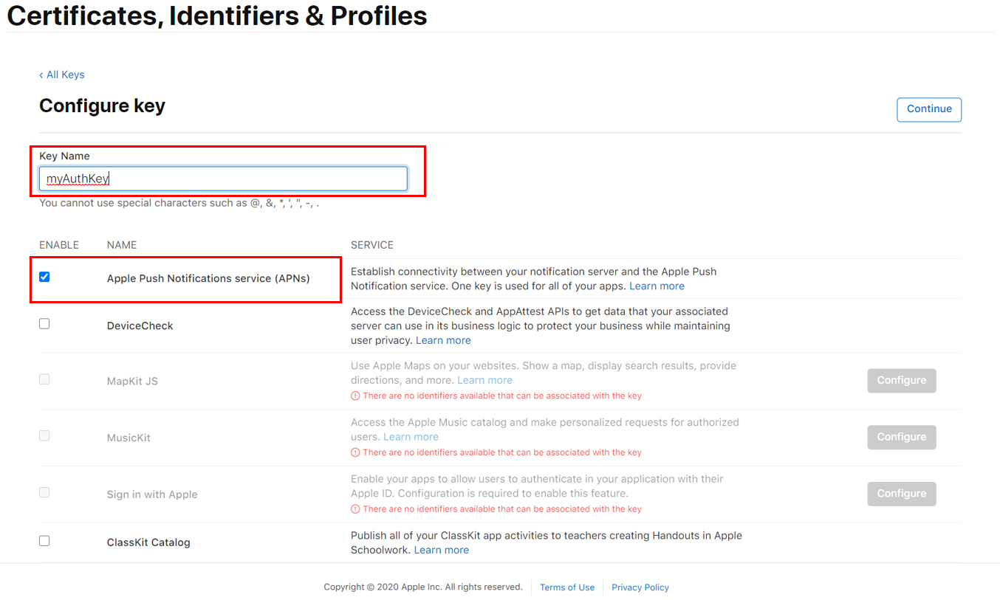

5. 'Register' 버튼을 클릭하여 인증키(.p8) 발급을 완료한다.

6. 'Download'버튼을 클릭하여 인증키(.p8) 파일을 다운로드한다.
 - 인증키는 한번만 다운로드 가능하여 다운로드한 인증키 파일 관리에 신중해야 한다.

## 래셔널아울 서비스에 P8 파일 업로드하기
앞서 발급한 p8 형식의 인증키 파일을 래셔널아울 관리자 콘솔에 업로드하면 래셔널아울 서비스를 통해 백그라운드의 단말앱에게 APNS를 통한 알림이 가능해진다. 

1. 래셔널아울 관리자 콘솔에 로그인한다.
 - 래셔널아울 서비스 가입시 등록한 이메일과 비밀번호를 입력한다.

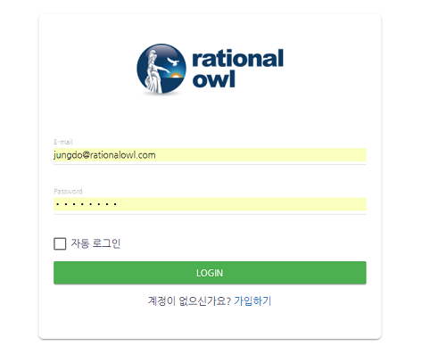

2. 앞서 생성한 APNS인증서를 이용해서 APNS 푸시를 이용할 모바일 서비스 추가 버튼을 클릭한다.
 - 이미 서비스가 등록했다면 해당 서비스를 클릭해 서비스로 진입한다.
 - 본 가이드 문서에서는 새 모바일 서비스 등록 기준으로 설명한다.

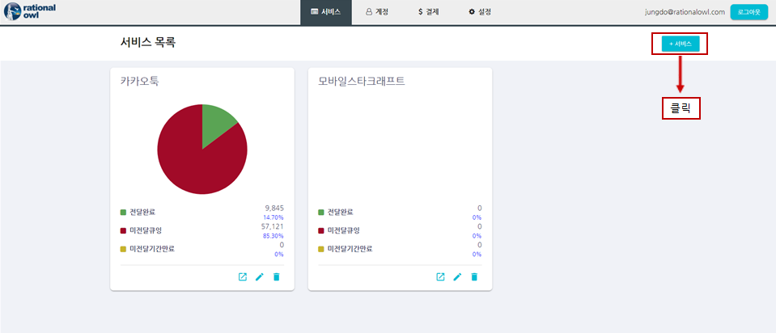

3. 모바일 서비스 추가 팝업 화면에 서비스명과 서비스에 대한 설명을 입력 후 추가 버튼을 클릭한다.

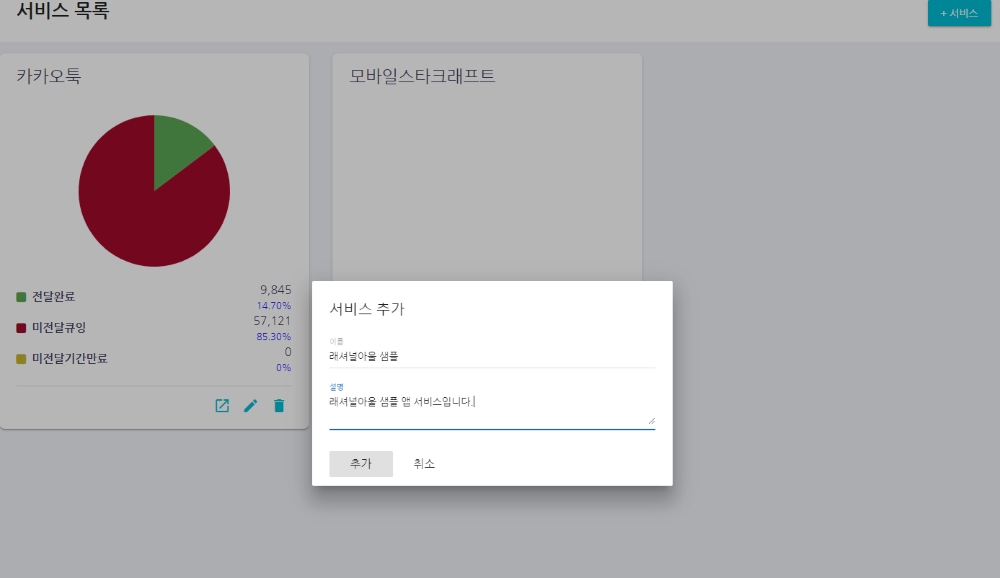

4. 방금 등록한 서비스 탭이 나타나면 해당 서비스 탭을 클릭한다.

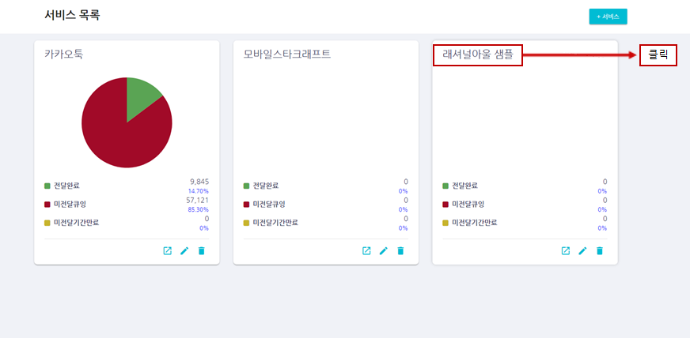

5. 새로 등록한 서비스 화면으로 진입 후 단말 현황 메뉴를 클릭한다.

6. 'APNS 등록'버튼을 클릭한다.

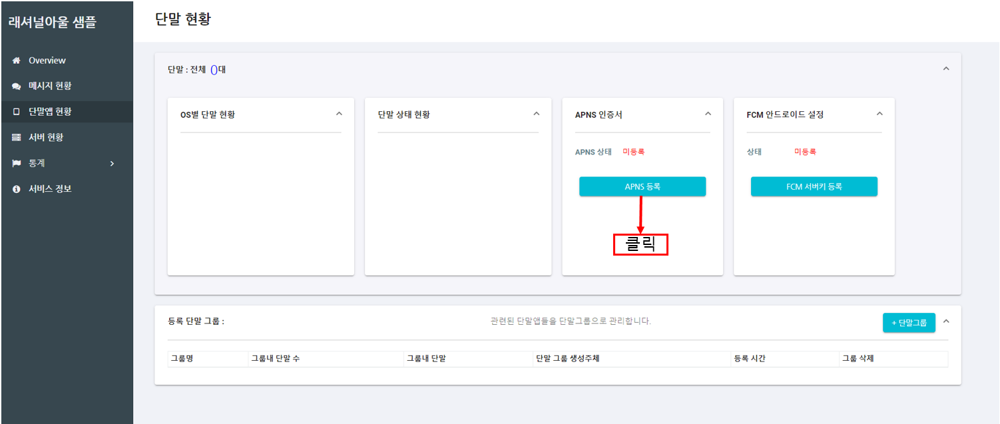

7. 인증방식을 'p8 인증키 파일'를 선택한다.
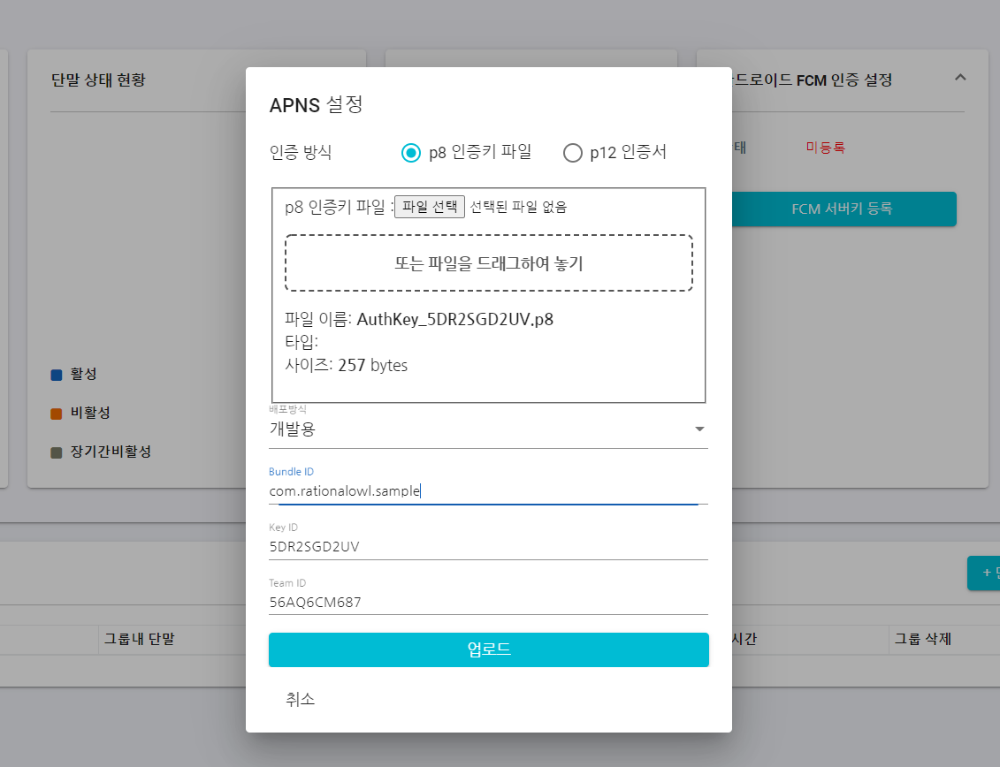

8. '파일선택'버튼을 눌러 앞서 다운로드한 p8 인증키 파일을 선택한다.

9. 배포방식을 '개발용' 또는 '배포용' 중 선택한다.
 - 개발단계에서는 '개발용'을 선택한다.
 - 앱스토어에 배포할 경우 '배포용'을 선택한다.

10. Bundle ID를 입력한다.
 - [Apple Developer Center](https://developer.apple.com/account) 에서 Identifier 메뉴에서 Bundle ID를 확인 가능하다.
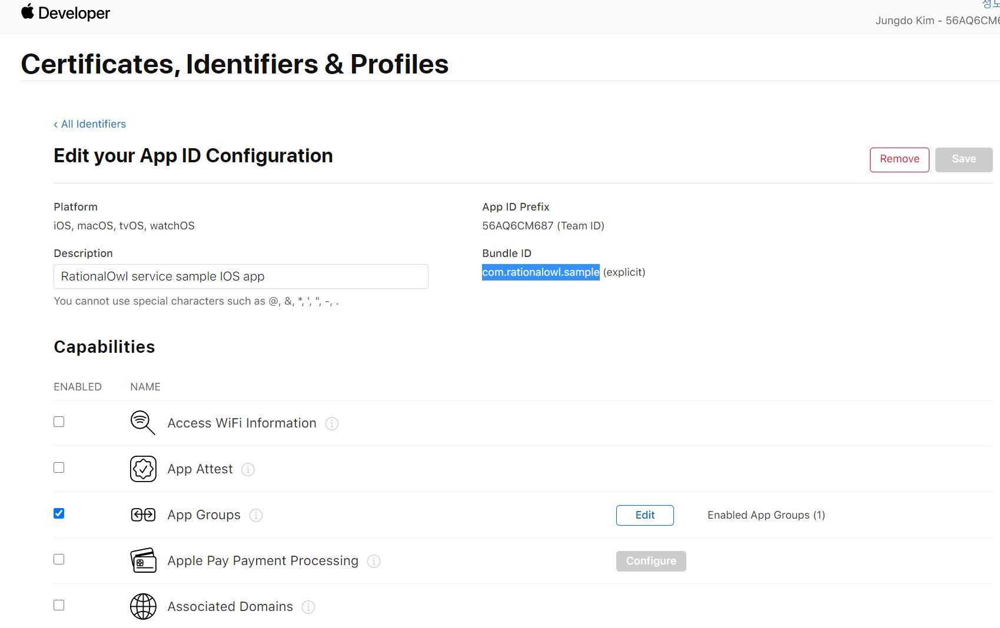

11. Key ID를 입력한다.
 - [Apple Developer Center](https://developer.apple.com/account) 에서 Keys 메뉴에서 Key ID를 확인 가능하다.
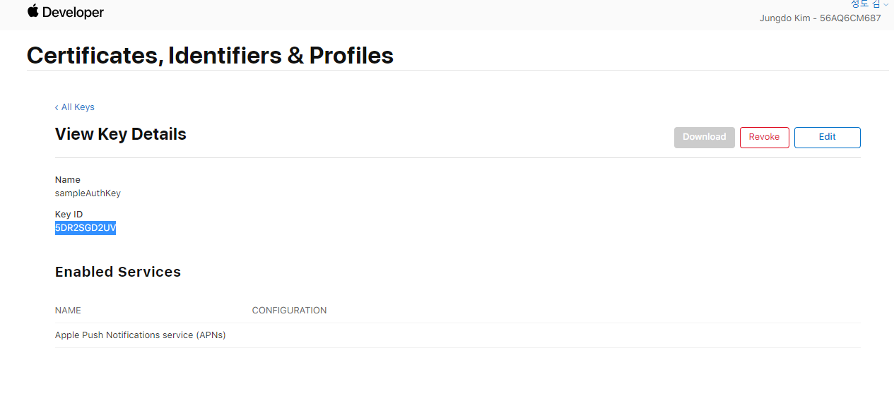

12. Team ID를 입력한다.
 - [Apple Developer Center](https://developer.apple.com/account) 에서 Identifier 메뉴에서 Team ID를 확인 가능하다.

13. 업로드 버튼을 클릭하여 인증서 상태를 확인한다.
 - 상태가 정상이면 인증서가 정상적으로 업로드되었다.
 - 상태가 비정상으로 나타날 경우 인증서가 잘못 만들어졌다는 의미이며, 본 가이드대로 진행했는지 확인해야 한다.
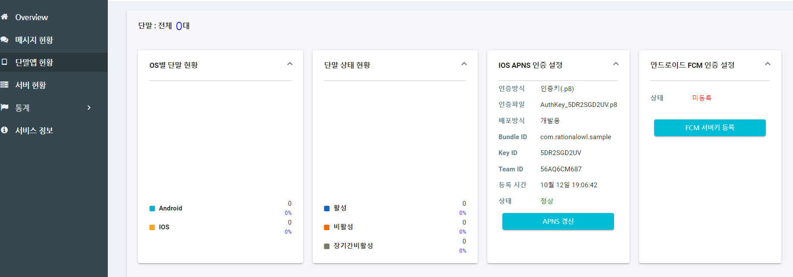
이로서 래셔널아울 서비스를 통해 IOS 단말앱이 백그라운드일 경우 APNS 알림을 발신 할 준비가 끝났다.

## 프로비저닝 프로파일 생성

앞서 APNS 알림을 발신을 위한 절차가 끝났다. 그러나 IOS 단말앱이 APNS 알림을 수신하기 위한 절차가 남아 있다. 즉, IOS 단말앱에 프로비저닝 프로파일을 생성해야 한다. 앞서 개발용 APNS인증서를 이용하기 위한 개발용 프로비저닝 프로파일 기준으로 설명한다.

1. 웹브라우저로 Apple Developers Center에 로그인 후 'Certificates, Identifiers & Profiles'섹션의 'Provisioning Profiles' 를 클릭한다.
2. 새 프로파일을 만들려면 오른쪽 상단의 + 버튼을 클릭한다.
3. 'Development' 섹션에서 iOS App Development를 선택하고 'Continue'를 클릭한다.

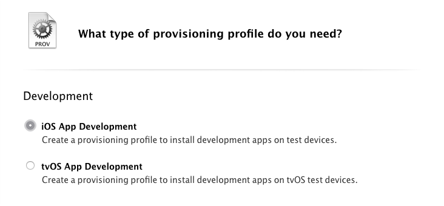

4. 드랍다운 메뉴에서 사용할 APP ID를 선택한다.
 - APNS 개발용 인증서 생성시 입력한 Explicit App ID와 동일한 ID를 선택한다. Ex:com.rationalowl.sample
 - xcode에서 앱 작성시 **Bundle Identifier** 에도 동일한 값을 입력해야 한다.

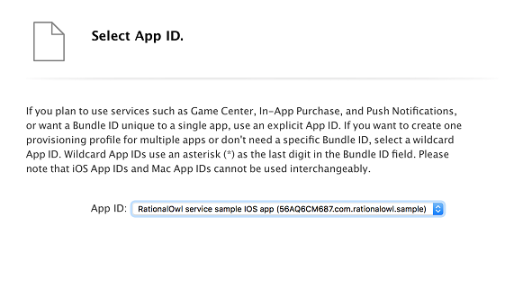

5. 프로비저닝 프로파일에 포함할 인증서를 선택하고 'Continue'버튼을 누른다.

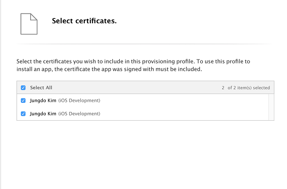

6. 개발용 프로파일을 적용한 단말앱을 설치할 개발용 단말을 선택한다.

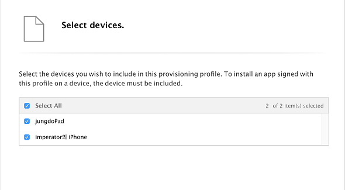

7. 프로비저닝 프로파일 이름을 입력한다.

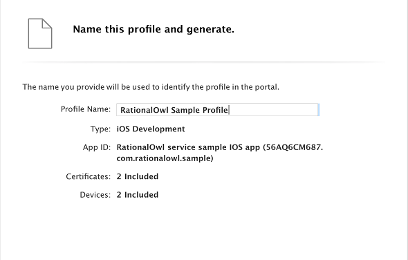

8. Download를 눌러 프로비저닝 프로파일을 Mac으로 다운로드한다.

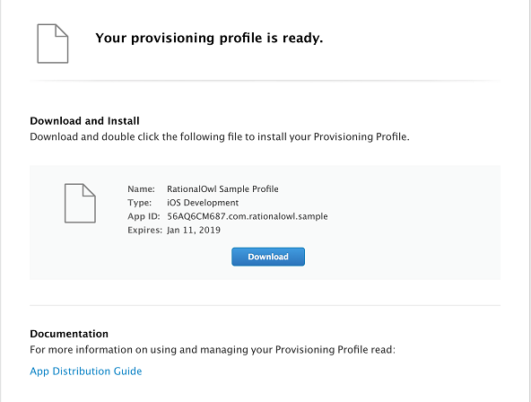

9. 다운로드한 프로비저닝 프로파일을 두번 클릭하면 Xcode에 프로비저닝 프로파일이 적용된다.

이제 Xcode로 단말앱 개발시 Bundle ID를 p12 인증서 생성시 입력한 Explicit App ID ( Ex: com.rationalowl.com)와 동일하게 입력하면 해당 단말앱에서 APNS 알림을 수신할 수 있다.
