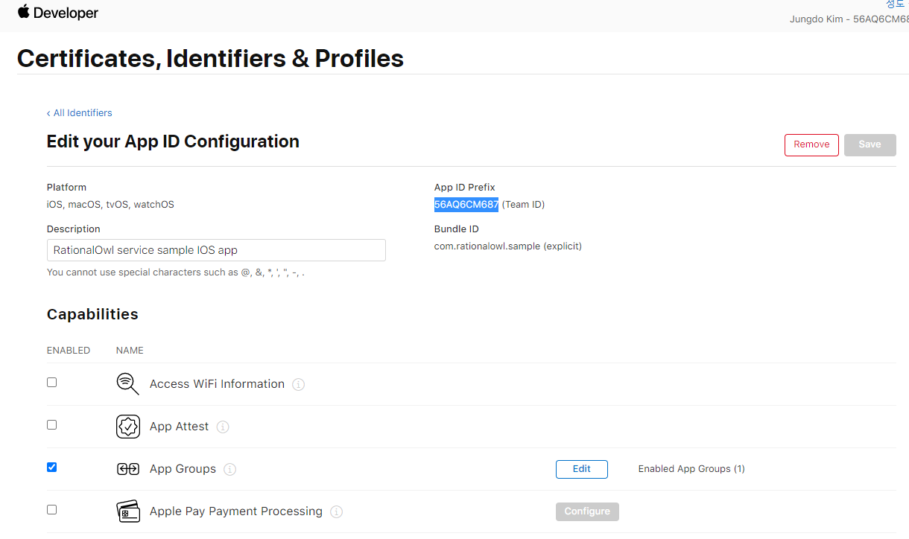

# 래셔널아울 IOS 설정 가이드

>## Introduction

> p8 인증키를 통해 APNS 푸시알림 설정하는 과정을 설명한다. p12 인증서를 통한 방법은 매년 인증서를 갱신해야 하는 번거로움이 있는 반면 p8 인증키를 통해 APNS 푸시알림을 설정하면 매년 갱신할 필요가 없어 편리하다.

아래는 래셔널아울 서비스를 통해 IOS단말앱이 실행되지 않을 때, 단말앱이 P2P 메시지와 다운스트림(푸시) 메시지를 수신하는 과정이다.

## 인증키(.p8) 발급

1. [Apple Developer Center](https://developer.apple.com/account) 에 로그인한다.

2. Certificates, IDs & Profiles 항목을 클릭한다.

3. Keys 항목을 클릭후 'Keys +' 버튼을 클릭한다.
- 키는 최대 2개까지 등록가능하다.

4. Key Name에 키이름을 입력하고 APNs 항목을 체크 후 Continue 버튼을 클릭한다.

5. 'Register' 버튼을 클릭하여 인증키(.p8) 발급을 완료한다.

6. 'Download'버튼을 클릭하여 인증키(.p8) 파일을 다운로드한다.
 - 인증키는 한번만 다운로드 가능하여 다운로드한 인증키 파일 관리에 신중해야 한다.

## 래셔널아울 서비스에 P8 인증서 업로드하기

1. 앱 Bundle ID 확인
 - [Apple Developer Center](https://developer.apple.com/account) 에서 Identifier 메뉴에서 Bundle ID를 확인 가능하다.

2. Key ID 확인
 - [Apple Developer Center](https://developer.apple.com/account) 에서 Keys 메뉴에서 Key ID를 확인 가능하다.

3. Team ID 확인
 - [Apple Developer Center](https://developer.apple.com/account) 에서 Identifier 메뉴에서 Team ID를 확인 가능하다.

4. 래셔널아울 웹 관리자 콘솔에 접속후 overview > IOS APNS 인증 설정 > APNS 등록/갱신 버튼을 클릭 후
앞서 등록한 각 항목을 입력한다.

1) 인증 방식: P8 인증키 파일 선택
2) 앞서 등록한 P8 인증서 파일 선택
3) 배포방식: 개발단계에서는 '개발용', 앱스토어 배포 단계에서는 '앱스토어 배포용' 선택
4) 앞서 확인한 앱 bundle Id 입력
5) 앞서 확인한 key id 입력
6) 앞서 확안한 team id 입력
7) 업로드 버튼 클릭

이로서 IOS 단말앱에 푸시 알림을 발신할 수 있다.