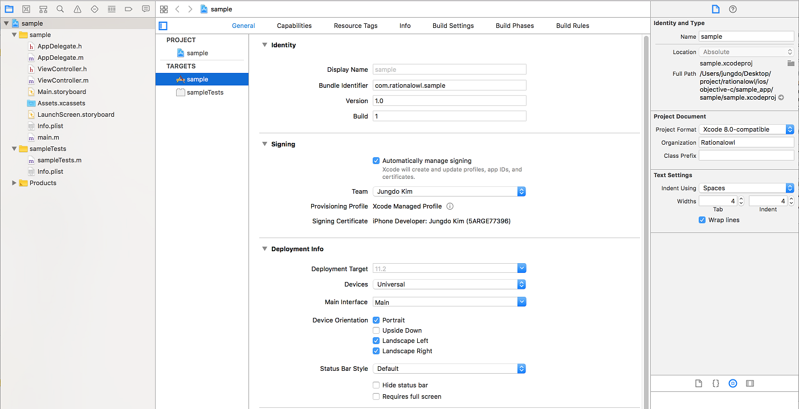
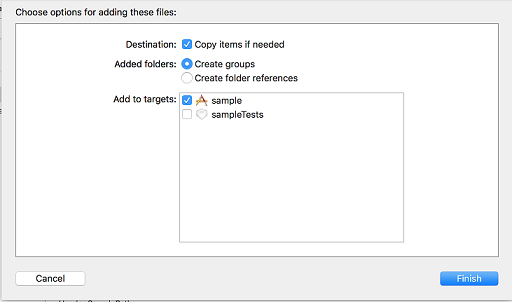
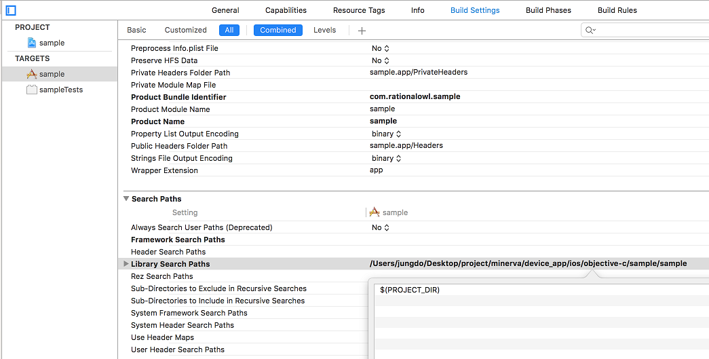
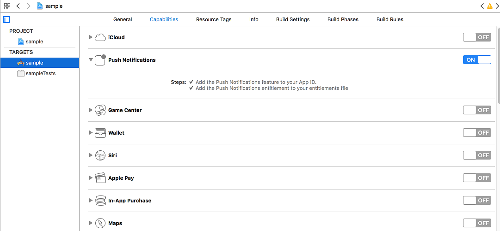

# 래셔널아울 IOS Objective-C 단말 앱 개발 가이드

## Introduction

단말앱은 래셔널아울 단말앱 라이브러리가 제공하는 API를 통해 모바일 서비스 내 단말앱 및 앱서버와 실시간 데이터 통신을 할 수 있다. 

래셔널아울 단말앱 API는 다음과 같다.

1. 메시지 발신 API
 - 업스트림 데이터 발신 API
 - P2P 데이터 발신 API 

2. 메시지 수신 콜백
 - 다운스트림 데이터 수신시 콜백
 - P2P 데이터 수신시 콜백

3. 단말앱 등록/해제 API
 - 단말앱 등록 API
 - 단말앱 등록해제 API

>##  단말앱 개발환경 세팅

### 개발 전 IOS 설정
IOS의 특성때문에 IOS단말앱이 백그라운드 알림을 받기 위해서는 APNS 인증서 설정이 필요하고 또한 프로비저닝 프로파일 설정도 필요하다. [IOS 설정 가이드](http://guide.rationalowl.com/guide/device-app/ios/setting)를 통해 개발 전 설정을 먼저 진행해야 한다.

### 개발 단계 설정

본 문서는 단말앱 라이브러리를 다운받아 단계별 개발하는 방법을 기준으로 설명한다. 본 문서에서는 기본 개발 개념을 이해하는데 집중하고 실제 개발 단계에서는 [래셔널아울 샘플앱](https://github.com/RationalOwl/rationalowl-sample)를 통해 개발 환경과 기본 소스가 세팅된 환경에서 개발을 시작하는 것이 효율적이다. 


1. 먼저, 래셔널아울 Objective-C 단말앱 라이브러리 [RationalOwl.framework](http://guide.rationalowl.com/download/device-app/ios/objective-c/Rationalowl.framework)를 다운받는다.

2. XCode를 런칭하고 File > New > Project를 클릭 후 간단한 'Single View App'을 선택한다.


3. 'Organization Identifier'를 입력하고 (ex: com.rationalowl) 'Product Name'을 입력하면 (ex: sample) Bundle Identifier가 생성되는데 (ex: com.rationalowl.sample)  샘플앱이 APNS 푸시 알림을 이용한다면 생성된 Bundle Identifier가 IOS 설정 가이드 문서에서 APNS 인증서 설정한 Explicit App ID와 동일해야 한다. 입력 후 Next 버튼을 클릭한다.


4. 샘플 프로젝트가 생성되었다.



5. 다운받은 Rationalowl.framework 라이브러리를 마우스 드래그로 XCode프로젝트에 추가한다. 


6. Copy items if needed항목을 체크한다.



7. Build Setting > Search Paths > Framework Search Paths 항목에 RationaOwl.framework를 카피한 폴더를 지정한다.
 - 가이드의 '5'과정에서 라이브러리를 프로젝트 루트에 드래그하여 프로젝트 루트에 카피하였다.
 - 프로젝트 루트에 라이브러리를 카피한 경우 $(PROJECT_DIR)을 입력하면 된다.
 - 이로서 프로젝트 내 샘플 코드에서 라이브러리를 import 해서 래셔널아울 API 호출이 가능하다.




8. General > Embedded Binaries 항목에 RationaOwl.framework를 선택한다.
 - 이로서 프로젝트 내 샘플 코드에서 라이브러리를 import 해서 래셔널아울 API 호출이 가능하다.


9. XCode에 추가된 Rationalowl.framework 라이브러리에는 4개의 헤드 파일이 존재하는 것을 확인 할 수 있다. MinervaManager.h는 API 호출이 정의되어 있고, MinervaDelegate.h에는 단말앱 등록 결과 콜백, 메시지 발신 결과/수신 콜백이 정의되어 있고 Result.h에는 결과코드 및 결과 메시지 상수가 정의되어 있다. 그리고 RationalOwl.h는 이 세 개의 헤드파일을 임포트하고 있다.


## 플랫폼 특성 API
각 플랫폼별 특성과 제약때문에 특정 플랫폼에만 존재하는 API가 있다.    
IOS Objective-C 단말앱 라이브러리에서는 다음의 API가 그것이다.

### 단말앱 라이프 사이클
단말앱은 AppDelegate 에서 다음의 API를 호출해야 한다.

#### (void) becomeActive
 - 단말앱이 액티브 상태로 전이시 호출한다.
 - AppDelegate 의 applicationDidBecomeActive 내에서 호출한다.

```swift
- (void)applicationDidBecomeActive:(UIApplication *)application {
    /*
     Restart any tasks that were paused (or not yet started) while the application was inactive. If the application was previously in the background, optionally refresh the user interface.
     */
    
    MinervaManager* minMgr = [MinervaManager getInstance];
    [minMgr becomeActive];
}
```

#### (void) enterBackground

 - 단말앱이 백그라운드 상태로 전이시 호출한다.
 - AppDelegate 의 applicationWillResignActive 내에서 호출한다.

```swift
- (void)applicationWillResignActive:(UIApplication *)application {
    /*
     Sent when the application is about to move from active to inactive state. This can occur for certain types of temporary interruptions (such as an incoming phone call or SMS message) or when the user quits the application and it begins the transition to the background state.
     Use this method to pause ongoing tasks, disable timers, and throttle down OpenGL ES frame rates. Games should use this method to pause the game.
     */
    
    MinervaManager* minMgr = [MinervaManager getInstance];
    [minMgr enterBackground];
    
}
```

### APNS 푸시 알림

#### 단말앱 APNS 푸시 알림 활성화 설정

단말앱 개발시에도 APNS 활성 설정이 필요하다.

1. PROJECT > TARGETS > Capabilities > Push Notification 'ON'설정



2. PROJECT > TARGETS > Capabilities > Background Modes > Remote notifications 'ON'설정


단말앱은 AppDelegate에서 다음의 API를 호출해야 한다.

#### (void) setDeviceToken: (NSString *)token
 - APNS 등록 결과 수신시 호출한다.
 - AppDelegate 의 didRegisterForRemoteNotificationsWithDeviceToken 내에서 호출한다.

```swift
- (void)application:(UIApplication *)app didRegisterForRemoteNotificationsWithDeviceToken:(NSData *)deviceToken {
    NSLog(@"devToken=%@",deviceToken);
    NSString *token = [[deviceToken description] stringByTrimmingCharactersInSet: [NSCharacterSet characterSetWithCharactersInString:@"<>"]];
    token = [token stringByReplacingOccurrencesOfString:@" " withString:@""];
    MinervaManager* minMgr = [MinervaManager getInstance];
    [minMgr setDeviceToken:token];
}
```

#### (void) receivedApns: (NSDictionary *)userInfo
 - 단말앱이 APNS 푸시 알림 수신시 호출한다.
 - AppDelegate 의 didReceiveRemoteNotification 내에서 호출한다.

```swift
- (void)application:(UIApplication*) application didReceiveRemoteNotification:(nonnull NSDictionary *)userInfo fetchCompletionHandler:(nonnull void (^)(UIBackgroundFetchResult))completionHandler {
    NSLog(@"didReceiveRemoteNotification");
    MinervaManager* minMgr = [MinervaManager getInstance];
    [minMgr receivedApns:userInfo];
}
```

>## 단말앱 등록
단말앱이 래셔널아울 API를 통해 실시간 데이터 통신을 하기 위해서는먼저 단말앱을 원하는 고객 모바일 서비스에 등록한다. 등록된 단말앱들이 해당 모바일 서비스에 등록된 모든 단말과 실시간 메시지를 수/발신 할 수 있다.

관리자콘솔의 '서비스 > 단말현황'에서 단말앱 등록 및 등록해제 과정을 실시간 모니터링할 수 있다.


### 단말앱 등록 요청

registerDevice() API를 통해 단말앱을 원하는 서비스의 단말앱으로 등록 요청한다. 
주의할 점은 API호출 후 단말앱 등록 결과 발급받은 단말등록아이디를 반드시 저장/관리해야 한다. 일단 단말등록아이디를 발급받으면 이 후 registerDevice() API를 호출할 필요는 없다. 즉, 단말앱 등록 API는 단말앱 설치 후 1회만 호출하면 된다.

API인자는 다음과 같다.
1. gateHost
 - 래셔널아울 메시징 게이트 서버
 - 국가별로 별도로 존재
 - 무료평가판의 경우 기본 "gate.rationalowl.com"
2. serviceId 
 - 단말앱이 등록하고자하는 서비스의 아이디
 - 관리자콘솔의 '서비스 > 서비스정보'에서 확인
3. deviceRegName 
 - 관리자콘솔에서 단말을 구분하기 위한 용도
 - 사용하지 않을 경우 null로 입력****

```swift
- (IBAction) regDevice {
  
    NSString* gateHost = inputNameField.text;
    MinervaManager* mgr = [MinervaManager getInstance];
    [mgr registerDevice:gateHost serviceId:@"faebcfe844d54d449136491fb253619d" deviceRegName:@"my i pad 1"];
}
```
### 단말앱 등록 결과
단말앱 등록이 성공되면 발급받은 단말 등록 아이디를 단말앱은 저장 및 관리해야 하고 해당 단말 등록 아이디를 단말앱을 관리 및 통신할 대상 앱서버에게 업스트림 API를 통해 전달해야 한다.
마찬가지로 앱서버는 전달받은 단말 등록 아이디를 저장 및 관리해야 한다.

단말앱 등록 결과 반환받는 값들은 다음과 같다.

 1. 단말 등록 아이디
    - 단말 앱을 구분하는 구분자
    - 단말앱 등록 성공이거나 기등록된 경우 전달받는다.
    - 단말앱 등록 성공일 경우 이를 앱 서버에게 upstream API를 통해 전달해야 한다.
 2. 결과 코드
 3. 결과 메시지


Objective-C 의 경우 MinervaDelegate.h에 정의된 onRegisterResult 콜백이 호출된다.

```swift
-(void) onRegisterResult: (int) resultCode resultMsg : (NSString*) resultMsg deviceRegId : (NSString*) deviceRegId {
    NSLog(@"onRegisterResult ");
    
    // device app registration success!
    // send deviceRegId to the app server.
    if(resultCode == RESULT_OK) {
        MinervaManager* mgr = [MinervaManager getInstance];
        [mgr sendUpstreamMsg:@"your device app info including deviceRegId" serverRegId:@"your app server reg id here"];
    }
} 
```

## 단말앱 등록해제
고객 서비스 내에서 사용하지 않는 단말앱을 등록 해제한다. 
래셔널아울 관리자 콘솔은 단말앱 등록해제 결과에 대해 실시간 모니터링을 제공한다.

### 단말앱 등록해제 요청

unregisterDevice() API를 통해 단말앱 등록해제 요청한다.

```swift
- (IBAction) unregDevice {
    MinervaManager* mgr = [MinervaManager getInstance];
    [mgr unregisterDevice:@"faebcfe844d54d449136491fb253619d"];
}
```

### 단말앱 등록해제 결과

단말앱 등록해제 결과 단말앱 라이브러리는 단말앱에 다음의 값들을 알려준다.

 1. 단말 등록 아이디
    - 단말 앱을 구분하는 구분자    
 2. 결과 코드
 3. 결과 메시지

Objective-C 의 경우 MinervaDelegate.h에 정의된 onUnregisterResult 콜백이 호출된다.

```swift
-(void) onUnregisterResult: (int) resultCode resultMsg : (NSString*) resultMsg {
    NSLog(@"onUnregisterResult ");
}
```


## 업스트림 메시지 발신
래셔널아울 서비스는 다수의 앱서버를 지원하고 단말앱은 특정 앱서버에게 업스트림 메시지를 발신한다. 
래셔널아울 관리자 콘솔을 통해 실시간 메시지 전달을 모니터링할 수 있다. 이는 고객 서비스 개발시에는 개발의 용이함을 제공하고 서비스 운영시에는 서비스 대응력을 높이고 예측 가능성을 향상시킨다.

래셔널아울에서 지원하는 업스트림 메시지의 특성은 다음과 같다.  
  - 0.5초 이내 실시간 데이터 전달을 보장한다.
  - 지원하는 데이터 포맷은 스트링으로 일반 스트링문자나 json 포맷등 고객 서비스 특성에 맞게 설정하면 된다.
  - 업스트림은 메시지 큐잉을 지원하지 않는다.  
  - 래셔널아울 콘솔은 데이터 전달 현황에 대해 실시간 모니터링을 제공한다.


  
### 업스트림 메시지 발신 요청
sendUpstreamMsg() API를 통해 업스트림 메시지를 발신한다.

```swift
- (IBAction)sendUpstreamMsg:(id)sender {
    //NSString* svcId = @"d0a83353281e4b678774a0efa44fdd82";
    NSString* serverId = @"513bb7114fc04ffbbd5f7ff6da173f97";
    NSString* msg = msgField.text;
    MinervaManager* mgr = [MinervaManager getInstance];
    [mgr sendUpstreamMsg:msg serverRegId:serverId];
    ...
}
```

### 업스트림 메시지 발신 결과


업스트림 메시지 발신 결과는 발신이 성공했는지 확인하는 용도로 제공되고 아래의 값들을 포함하고 있다.

 1. umi(Upstream Message Id)
    - 어느 API 호출에 대한 결과인지 확인하는 용도
 2. 결과 코드
 3. 결과 메시지

Objective-C 의 경우 MinervaDelegate.h에 정의된 onUpstreamMsgResult 콜백이 호출된다.

```swift
-(void) onUpstreamMsgResult: (int) resultCode resultMsg : (NSString*) resultMsg umi : (NSString*) umi {
    NSLog(@"onUpstreamMsgResult umi = %@", umi);
}
```


## P2P 메시지 발신
래셔널아울 서비스는 P2P 메시지를 지원한다. 
래셔널아울 관리자 콘솔을 통해 실시간 메시지 전달을 모니터링할 수 있다. 이는 고객 서비스 개발시에는 개발의 용이함을 제공하고 서비스 운영시에는 서비스 대응력을 높이고 예측 가능성을 향상시킨다.

래셔널아울에서 지원하는 P2P 메시지의 특성은 다음과 같다.  
  - 0.5초 이내 실시간 데이터 전달을 보장한다.
  - 한대 이상의 단말앱에 메시지를 발신한다.  
  - 한번에 보낼 수 있는 최대 대상 단말 수는 2000대이다.
  - 지원하는 데이터 포맷은 스트링으로 일반 스트링문자나 json 포맷등 고객 서비스 특성에 맞게 설정하면 된다.
  - 메시지 전달 대상 단말앱이 네트워크에 연결되지 않을 경우 큐잉 후 단말이 네트워크 접속시 전달하는 큐잉을 지원한다.
  - 기본 큐잉 기간은 3일이고 엔터프라이즈 에디션에서는 최대 30일까지 설정 가능하다.
  - 큐잉 기능을 이용할지 말지는 단말앱 라이브러리에서 제공하는 P2P API 인자로 결정한다.
  - P2P API에서 대상 단말앱이 네트워크에 연결되지 않은 경우 전달 데이터외에 알림 타이틀과 알림 문자를 별도로 지정할 수 있다.  
  - 래셔널아울 콘솔은 데이터 전달 현황에 대해 실시간 모니터링을 제공한다.


  
### P2P 메시지 발신 요청
sendP2PMsg() API를 통해 P2P 메시지를 발신한다.

```swift
- (IBAction)sendP2PMsg:(id)sender {
    NSString* msg = msgField.text;
    NSMutableArray* devices = [[NSMutableArray alloc] init];
    [devices addObject:@"cf12c6b3c46e4e318b6e3c77b0590b9d"];
    MinervaManager* mgr = [MinervaManager getInstance];
    [mgr sendP2PMsg:msg devices:devices];
    
    ...
}
```

### P2P 메시지 발신 결과


P2P 메시지 발신 결과는 발신이 성공했는지 확인하는 용도로 제공되고 아래의 값들을 포함하고 있다.

 1. pmi(P2P Message Id)
 - 어느 API 호출에 대한 결과인지 확인하는 용도
 2. 결과 코드
 3. 결과 메시지

Objective-C 의 경우 MinervaDelegate.h에 정의된 onP2PMsgResult 콜백이 호출된다.

```swift
-(void) onP2PMsgResult: (int) resultCode resultMsg : (NSString*) resultMsg pmi : (NSString*) pmi {
    NSLog(@"onP2PMsgResult pmi = %@", pmi);
}
```


## 메시지 수신
단말앱은 앱서버로부터의 다운스트림 메시지와 다른 단말앱으로부터의 P2P 메시지를 수신한다. 

### 다운스트림 메시지 수신
앱서버에서 발신하는 멀티캐스트, 브로드캐스트, 그룹 메시지를 단말앱이 수신시 단말앱 라이브러리는 단말앱에게 다음의 값들을 알려준다.

1. 다운스트림 메시지 갯수    
2. 다운스트림 메시지 목록  
   메시지 목록의 각 메시지는 다음의 값들을 포함한다.
  - 메시지 발신한 앱서버의 서버등록아이디
  - 메시지 데이터
  - 메시지 발신시간
  - 단말앱이 백그라운드시 표시할 알림 타이틀
  - 단말앱이 백그라운드시 표시할 알림 본문


Objective-C 의 경우 MinervaDelegate.h에 정의된 onDownstreamMsgRecieved 콜백이 호출된다.

```swift
-(void) onDownstreamMsgRecieved: (int) msgSize msgList : (NSArray*) msgList alarmIdx : (int) alarmIdx {
    NSLog(@"onMsgRecieved msg size = %d", msgSize);
    NSDictionary* msg;
    
    NSString* serverRegId;
    long serverTime;
    NSString* msgData;
    
    NSDateFormatter* format = [[NSDateFormatter alloc] init];
    [format setDateFormat:@"yyyy/MM/dd HH:mm:ss"];
    
    for(int i = 0; i < msgSize; i++) {
        msg = msgList[i];
        // message sender(app server)
        serverRegId = msg[@"sender"];
        // message sent time
        serverTime = [msg[@"serverTime"] longValue];
        NSDate* date = [NSDate dateWithTimeIntervalSince1970:(serverTime /1000)];
        msgData = msg[@"data"];  
        NSString* displayStr = [NSString stringWithFormat:@"%@  [sent time:%@]", msgData, [format stringFromDate:date]];
        //[self.messages insertObject:displayStr atIndex:0];
        [self.messages addObject:displayStr];
    }
    
    ...
}
```

### P2P 메시지 수신
모바일 서비스 내 다른 단말앱에서 발신한 P2P 메시지를 단말앱이 수신시 단말앱 라이브러리은 단말앱에게 다음의 값들을 알려준다.

1. P2P 메시지 갯수    
2. P2P 메시지 목록  
   메시지 목록의 각 메시지는 다음의 값들을 포함한다.
  - 메시지 발신한 단말앱의 단말등록아이디
  - 메시지 데이터
  - 메시지 발신시간
  - 단말앱이 백그라운드시 표시할 알림 타이틀
  - 단말앱이 백그라운드시 표시할 알림 본문


Objective-C 의 경우 MinervaDelegate.h에 정의된 onP2PMsgRecieved 콜백이 호출된다.

```swift
-(void) onP2PMsgRecieved: (int) msgSize msgList : (NSArray*) msgList alarmIdx : (int) alarmIdx {
    NSLog(@"onP2PMsgRecieved msg size = %d", msgSize);
    NSDictionary* msg;
    NSString* sender; //sending device
    long serverTime;
    NSString* msgData;
    NSString* msgId;
    NSDateFormatter* format = [[NSDateFormatter alloc] init];
    [format setDateFormat:@"yyyy/MM/dd HH:mm:ss"];
    
    for(int i = 0; i < msgSize; i++) {
        msg = msgList[i];
        msgId = msg[@"msgId"];
        sender = msg[@"sender"];
        serverTime = [msg[@"serverTime"] longValue];
        NSDate* date = [NSDate dateWithTimeIntervalSince1970:(serverTime /1000)];
        msgData = msg[@"data"];
        NSString* displayStr = [NSString stringWithFormat:@"p2p:%@  [sent time:%@]", msgData, [format stringFromDate:date]];
        //[self.messages insertObject:displayStr atIndex:0];
        [self.messages addObject:displayStr];
    }
    
    ...
}
```


