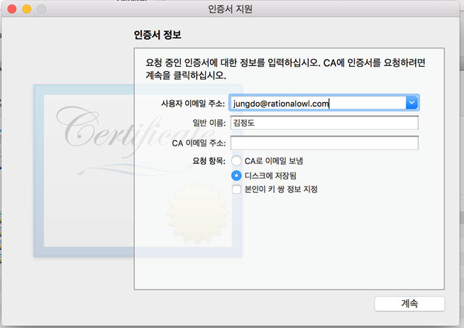
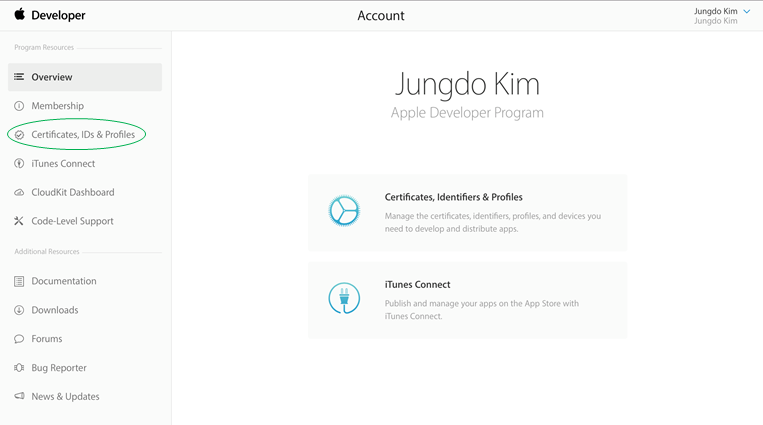
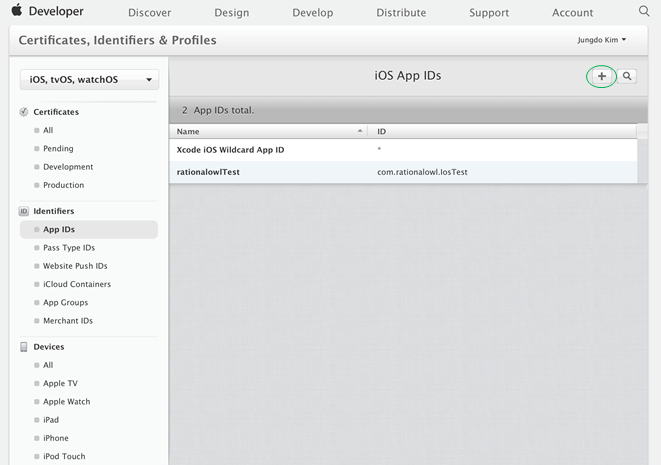
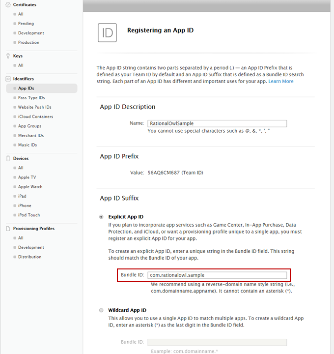
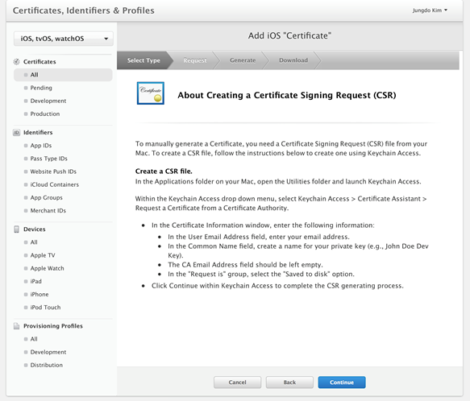
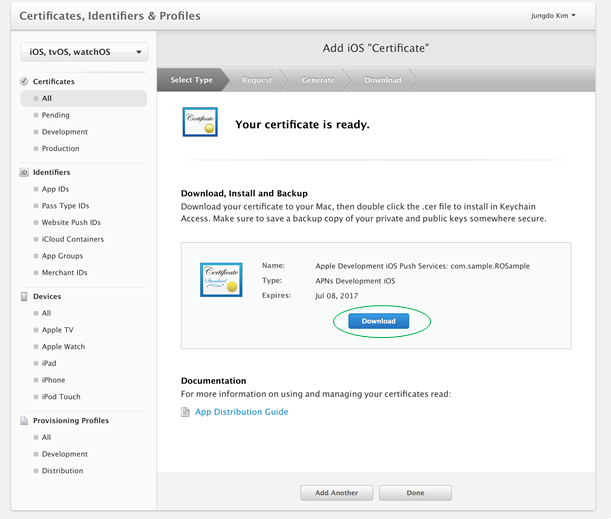
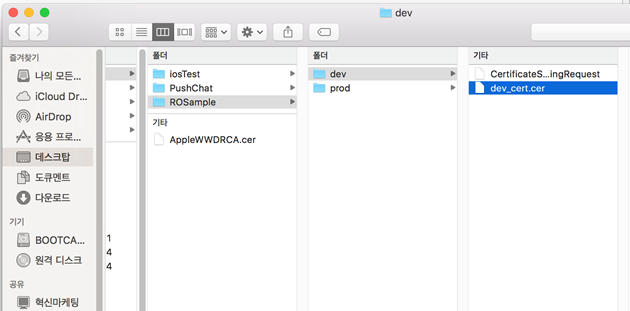
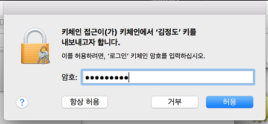

# 래셔널아울 APNS 인증서 설정 가이드

>## Introduction

> **래셔널아울 서비스를 이용하는 안드로이드 단말앱**의 경우 단말앱이 포그라운드에서 실행되지 않더라도 **다운스트림/P2P 메시지 수신이 가능**하다. 
그에 반해, IOS단말앱일 경우 OS제약 때문에 앱이 포그라운드에서 실행되고 있지 않을 경우 다운스트림/P2P 메시지를 수신할 유일한 방법이 APNS(Apple Push Notification Service)를 통한 푸시 알림이다. 본 문서에서는 래셔널아울 서비스에서 APNS 푸심알림 설정을 하기 위한 1. APNS 서버용 인증서 생성방법과 2. 생성한 인증서를 래셔널아울 관리자 콘솔을 통한 업로드하는 방법에 대해 설명한다.         
따라서 IOS단말앱이 포그라운드에서 실시간 데이터 전달만 하는 모바일 서비스일 경우 본 과정을 거칠 필요가 없다. 

아래는 래셔널아울 서비스를 통해 IOS단말앱이 실행되지 않을 때, 단말앱이 P2P 메시지와 다운스트림(푸시) 메시지를 수신하는 과정이다.

## 인증서 요청 파일 생성

APNS 서버용 인증서를 생성하기 위해서 먼저 인증서 요청 파일을 생성해야 한다.

1. 맥 우측 상단의 찾기 버튼을 눌러 '키체인 접근'을 검색하여 키체인 접근 앱을 실행시킨다.

2. '키체인 접근 > 인증서 지원 > 인증 기관에서 인증서 요청...' 순서로 클릭한다.

3. 이메일 주소, 일반 이름을 입력 후 디스크에 저장 옵션 선택 후 계속 버튼 클릭한다.

4. 인증서 요청 파일 저장   
'CertificateSigningRequest.certSigningRequest'파일이름으로 저장할 폴더를 지정한다. 인증서 폴더는 개발용 및 상용 서비스용으로 별도 관리 및 저장할 것을 권고한다. 본 문서에서는 개발용 인증서를 기준으로 'dev'폴더에 'CertificateSigningRequest.certSigningRequest'파일이름으로 저장한다.

## 단말앱 ID 생성

APNS를 이용하기 위해서는 모든 앱은 고유한App ID를 생성해야 한다. 주의할 점은 App ID 생성과정에서 지정하는 'Bundle ID'를 개발시 XCode에서 지정하는 'Bundle Identifier'와 동일한 값을 지정한다.

1. IOS개발자 페이지(https://developer.apple.com)에 접속하여 우측 상단에Account를 눌러 로그인한다.   
 개발자 페이지에 등록되지 않았다면 먼저 등록해야 한다.

2. 'Certificates, IDs & Profiles' 클릭한다.

3. 'Identifiers > App IDs'를 클릭하면 기존 생성했던 App ID목록이 나타난다.
4. 우측 상단의 + 를 클릭하여 새 App ID생성한다.

4. AppID Description에 앱 이름을 입력한다. Ex: RationalOwlSample
5. Explicit App ID에Bundle ID를 입력한다. Ex:com.sample.ROSample
 - xcode에서 앱 작성시 입력하는  **Bundle Identifier와 동일**한 값

6. App Services항목에서 Push Notifications항목을 체크한다.
7. 이후 register버튼과 done버튼을 클릭해 App ID생성을 완료한다.

8. 이후 register버튼과 done버튼을 클릭해 App ID생성을 완료한다.

## 인증서 생성
앱이 APNS푸시를 이용하기 위해서는 APNS 푸시 발신을 위한 인증서가 필요하다. 
인증서 생성 후 생성한 인증서를 PC에 저장하는 절차는 아래와 같다.

1. App IDs항목에서 방금 생성한 App ID항목을 클릭하면 아래 그림과 같은 화면이 나타난다.

2. Edit버튼을 클릭한다.
3. create certificate...버튼을 클릭한다.      
본 문서에서는 개발용 인증서 생성을 위해 'Development SSL Certificates'란의 'Create Certificate...'버튼을 클릭한다. 실제 상용 서비스용 인증서를 생성하려면 아래 항목인 'Production SSL Certificate'을 선택하면 된다.

4. continue버튼을 클릭한다.

5. Choose File...버튼을 클릭하고 앞서 생성한 인증서 요청 파일인 'CertificateSigningRequest.certSigningRequest'을 선택 후 Continue버튼을 클릭한다.

6. 인증서가 생성되었다. Download버튼을 클릭해서 인증서를 다운 받는다.   

7. 다운받은 인증서를 폴더에 저장한다.
  - 다운받은 인증서를 개발용과 서비스용 별로 구분하여 별도의 폴더에 보관하는 것을 권장
  - 본 가이드에서는 인증서 이름을 'dev_cert.cer'이름으로 저장했다.

## P12 파일 생성
앞서 생성한 인증서(dev_cert.cert)와 개인키를 포함한 p12파일 포맷의 외부 입출력 가능한 파일을 만든다. 

1. 앞서 다운받은 인증서를 더블클릭하면 인증서가 맥OS의 키체인에 포함되고 '키체인 앱'이 실행된다.
2. 키체인 앱에 자신이 방금 생성한 인증서인 Apple Development IOS Push Services인증서의 맨 앞 화살표를 클릭한다.
3. 인증서 화살표가 펼쳐지면 열쇠모양의 개인키가 나타난다. 
4. 인증서와 개인키를 모두 선택 후 마우스 오른쪽을 클릭하면 팝업 메뉴가 나타난다.
5. 팝업 메뉴 중 '2개 항목 내보니기...'를 선택한다.

6. 저장하기 화면에서 인증서를 저장했던 폴더에 저장할 p12 파일 이름을 입력한다.
 - 가이드문서에서는 'dev_cert_key'를 입력했다.

7. p12 형식의 인증서 암호를 입력한다.

8. 키체인 암호를 입력한다.

8. 폴더에 'dev_cert_key.p12'이름의 개인키를 포함한 인증서가 생성된 것을 확인할 수 있다.    

## P12 파일 업로드하기
앞서 생성한 p12 형식의 인증서(dev_cert_key.p12)를 래셔널아울 관리자 콘솔에 업로드하면 래셔널아울 서비스를 통해 백그라운드의 단말앱에게 APNS를 통한 알림이 가능해진다.

1. 래셔널아울 관리자 콘솔에 로그인 후 '서비스 > 단말 현황'을 클릭한다.

2. 'APNS 등록

