# IOS Swift 단말 앱 개발가이드

## 목차

- [Introduction](#introduction)
- [단말앱 개발환경 세팅](#단말앱-개발환경-세팅)
    - [개발 전 IOS 설정](#개발-전-ios-설정)
    - [개발 단계 설정](#개발-단계-설정)
        - [Bridging-Header 파일 적용](#bridging-header-파일-적용)
    - [IOS API 레퍼런스 비고](#ios-api-레퍼런스-비고)
- [플랫폼 특성 API](#플랫폼-특성-api)
    - [단말앱 라이프 사이클](#단말앱-라이프-사이클)
        - [(void) becomeActive](#void-becomeactive)
        - [(void) enterBackground](#void-enterbackground)
    - [APNS 푸시 알림](#apns-푸시-알림)
        - [단말앱 APNS 푸시 알림 활성화 설정](#단말앱-apns-푸시-알림-활성화-설정)
        - [(void) setDeviceToken: (NSString *)token](#void-setdevicetoken-nsstring-token)
        - [(void) receivedApns: (NSDictionary *)userInfo](#void-receivedapns-nsdictionary-userinfo)
- [단말앱 등록](#단말앱-등록)
    - [단말앱 등록 요청](#단말앱-등록-요청)
    - [단말앱 등록 결과](#단말앱-등록-결과)
- [단말앱 등록해제](#단말앱-등록해제)
    - [단말앱 등록해제 요청](#단말앱-등록해제-요청)
    - [단말앱 등록해제 결과](#단말앱-등록해제-결과)
- [업스트림 메시지 발신](#업스트림-메시지-발신)
    - [업스트림 메시지 발신 요청](#업스트림-메시지-발신-요청)
    - [업스트림 메시지 발신 결과](#업스트림-메시지-발신-결과)
- [P2P 메시지 발신](#p2p-메시지-발신)
    - [P2P 메시지 발신 요청](#p2p-메시지-발신-요청)
    - [P2P 메시지 발신 결과](#p2p-메시지-발신-결과)
- [메시지 수신](#메시지-수신)
    - [다운스트림 메시지 수신](#다운스트림-메시지-수신)
    - [P2P 메시지 수신](#p2p-메시지-수신)

## Introduction

단말앱은 래셔널아울 단말앱 라이브러리가 제공하는 API를 통해 모바일 서비스 내 단말앱 및 앱서버와 실시간 데이터 통신을 할 수 있다. 

래셔널아울 단말앱 API는 다음과 같다.

- 메시지 발신 API
  - 업스트림 데이터 발신 API
  - P2P 데이터 발신 API

- 메시지 수신 콜백
  - 다운스트림 데이터 수신시 콜백
  - P2P 데이터 수신시 콜백

- 단말앱 등록/해제 API
  - 단말앱 등록 API
  - 단말앱 등록해제 API

## 단말앱 개발환경 세팅

### 개발 전 IOS 설정

[IOS 설정 가이드](https://github.com/RationalOwl/rationalowl-guide/tree/master/device-app/ios-setting)를 통해 개발 전 아래 설정을 먼저 진행해야 한다.

- APNS 발신용 인증서 생성 및 래셔널아울 서비스에 등록
- 프로비저닝 프로파일 설정

### 개발 단계 설정

본 문서는 단말앱 라이브러리를 다운받아 단계별 개발하는 방법을 기준으로 설명한다. 본 문서에서는 기본 개발 개념을 이해하는데 집중하고 실제 개발 단계에서는 [래셔널아울 샘플앱](https://github.com/RationalOwl/rationalowl-sample)를 통해 개발 환경과 기본 소스가 세팅된 환경에서 개발을 시작하는 것이 효율적이다.

- 먼저, 래셔널아울 IOS 단말앱 라이브러리 [RationalOwl.framework](http://guide.rationalowl.com/download/device-app/ios/swift/Rationalowl.framework.zip)를 다운받는다.

- XCode를 런칭하고 File > New > Project를 클릭 후 간단한 'Single View App'을 선택한다.

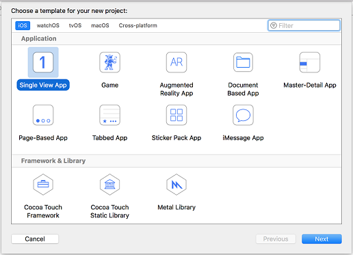

- 'Organization Identifier'를 입력하고 (ex: com.rationalowl) 'Product Name'을 입력하면 (ex: sample) Bundle Identifier가 생성되는데 (ex: com.rationalowl.sample)  샘플앱이 APNS 푸시 알림을 이용한다면 생성된 Bundle Identifier가 IOS 설정 가이드 문서에서 APNS 인증서 설정한 Explicit App ID와 동일해야 한다. 입력 후 Next 버튼을 클릭한다.


- 샘플 프로젝트가 생성되었다.

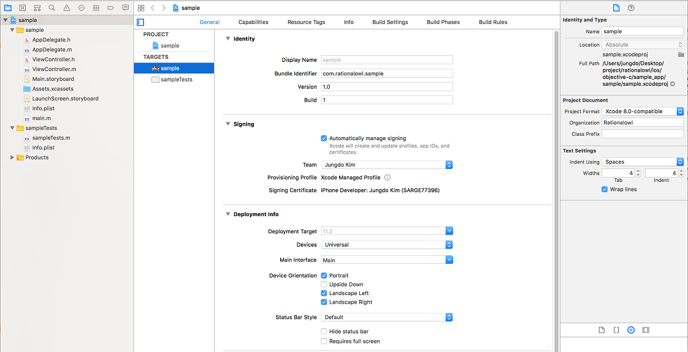

- 다운받은 Rationalowl.framework 라이브러리를 마우스 드래그로 XCode프로젝트에 추가한다.

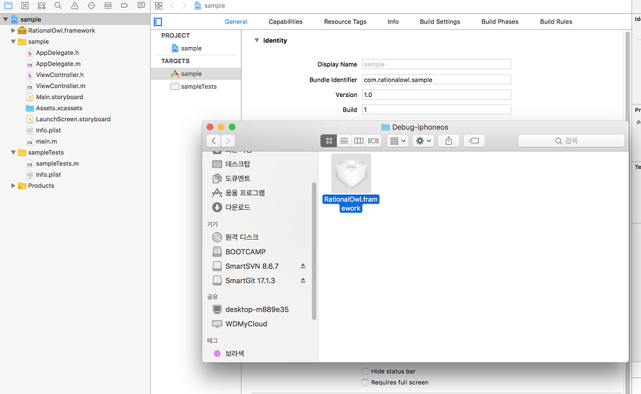

- Copy items if needed항목을 체크한다.


- General > Embedded Binaries 항목에 RationaOwl.framework를 선택한다.
  - Embedded Binaries에 프레임워크를 설정하면 라이브러리 설정은 끝이다.
  - Embedded Binaries 설정으로 라이브러리 링크와 패쓰 설정이 자동으로 세팅된다.

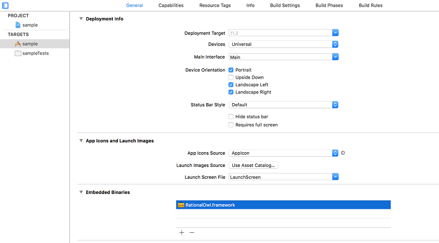

- XCode에 추가된 Rationalowl.framework 라이브러리에는 4개의 헤드 파일이 존재하는 것을 확인 할 수 있다. MinervaManager.h는 API 호출이 정의되어 있고, MinervaDelegate.h에는 단말앱 등록 결과 콜백, 메시지 발신 결과/수신 콜백이 정의되어 있고 Result.h에는 결과코드 및 결과 메시지 상수가 정의되어 있다. 그리고 RationalOwl.h는 이 세 개의 헤드파일을 임포트하고 있다.

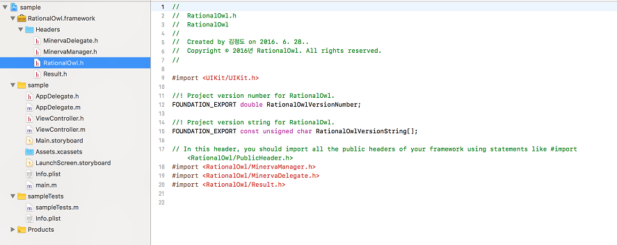

#### Bridging-Header 파일 적용

래셔널아울 IOS 단말앱 라이브러리[RationalOwl.framework](http://guide.rationalowl.com/download/device-app/ios/objective-c/Rationalowl.framework)는 Objective-C로 만들어진 라이브러리이다. Swift단말앱에서 해당 라이브러리를 이용하기 위해서는 Bridging Header파일을 적용하면 된다.

- 'sample-Bridging-Header.h' 파일을 생성 후 #import <RationalOwl/RationalOwl.h> 를 추가한다.

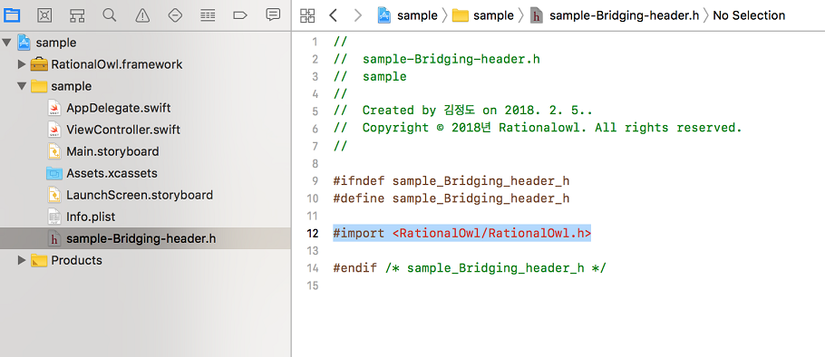

- Build Settings에서 'bridging'으로 검색하면 'Objective-C Bridging Header'항목이 나온다. 항목 우측을 클릭하면 나타나는 팝업에 앞서 생성한 헤드파일을 드래그하면 해당 경로가 복사된다.

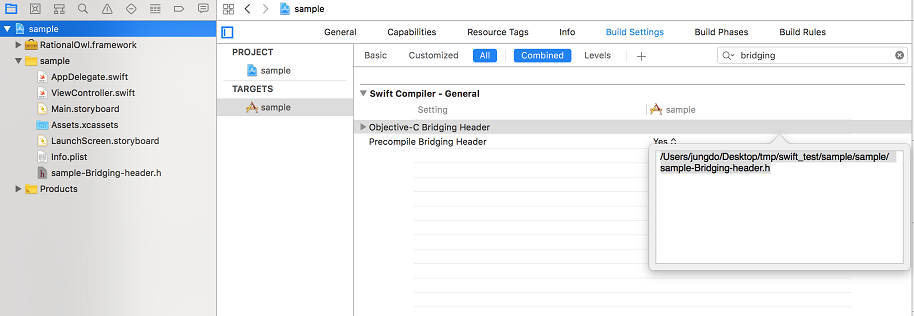

이로써 Swift에서 IOS 단말앱 라이브러리를 이용할 준비가 끝났다.

### IOS API 레퍼런스 비고

IOS 단말앱 문서에서는 별도의 API 레퍼런스를 제공하지 않는다. IOS 단말앱 라이브러리인 'RationalOwl.framework'내의 3개의 헤더파일에 주석으로 명세한 API가 그것인데 해당 헤드 파일을 직접 참조하기 바란다.
1. MinervaManager.h
 - 단말앱 등록/등록헤제 API
 - 업스트림 메시지 발신 API
 - P2P 메시지 발신 API
 - 단말앱 라이프사이클 관련 API
 - 단말앱 등록/등록해제 결과 콜백 지정 API
 - 메시지 수/발신 결과 콜백 지정 API
2. MinervaDelegate.h
 - DeviceRegisterResultDelegate 정의 
   - 단말앱 등록/등록해제 결과 콜백 인터페이스
 - MessageDelegate 정의
   - 다운스트림 메시지 수신시 콜백 인터페이스
   - P2P 메시지 수신시 콜백 인터페이스
   - 업스트림 메시지 발신 결과 콜백 인터페이스
   - P2P 메시지 발신 결과 콜백 인터페이스
3. Result.h
- 래셔널아울 단말앱에서 발생하는 결과값 및 결과 메시지 상수 정의

## 플랫폼 특성 API

각 플랫폼별 특성과 제약때문에 특정 플랫폼에만 존재하는 API가 있다.
IOS 단말앱 라이브러리에서는 다음의 API가 그것이다.

### 단말앱 라이프 사이클

단말앱은 AppDelegate 에서 다음의 API를 호출해야 한다.

#### (void) becomeActive

- 단말앱이 액티브 상태로 전이시 호출한다.
- AppDelegate 의 applicationDidBecomeActive 내에서 호출한다.

```swift
func applicationDidBecomeActive(_ application: UIApplication) {
    // Restart any tasks that were paused (or not yet started) while the application was inactive. If the application was previously in the background, optionally refresh the user interface.

    let minMgr: MinervaManager = MinervaManager.getInstance();
    minMgr.becomeActive();
}
```

#### (void) enterBackground

- 단말앱이 백그라운드 상태로 전이시 호출한다.
- AppDelegate 의 applicationWillResignActive 내에서 호출한다.

```swift
func applicationWillResignActive(_ application: UIApplication) {
    // Sent when the application is about to move from active to inactive state. This can occur for certain types of temporary interruptions (such as an incoming phone call or SMS message) or when the user quits the application and it begins the transition to the background state.
    // Use this method to pause ongoing tasks, disable timers, and invalidate graphics rendering callbacks. Games should use this method to pause the game.

    let minMgr: MinervaManager = MinervaManager.getInstance();
    minMgr.enterBackground();
}
```

### APNS 푸시 알림

#### 단말앱 APNS 푸시 알림 활성화 설정

단말앱 개발시에도 APNS 활성 설정이 필요하다.

- PROJECT > TARGETS > Capabilities > Push Notification 'ON'설정

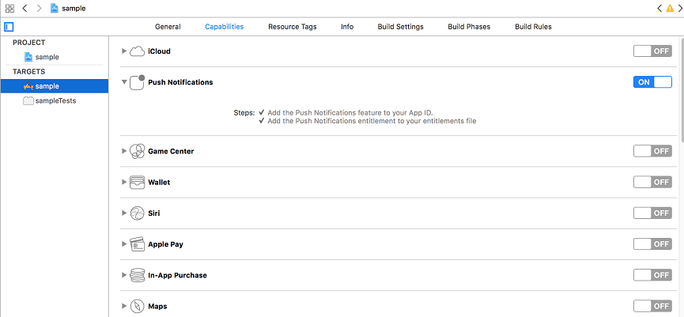

- PROJECT > TARGETS > Capabilities > Background Modes > Remote notifications 'ON'설정

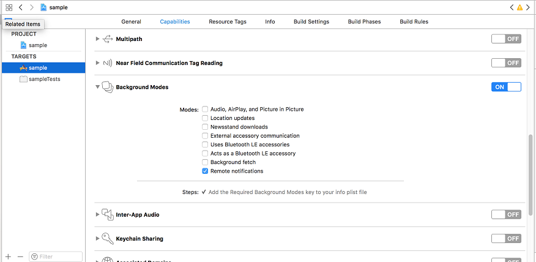

- APNS 알림을 수신하기 위해 관련 라이브러리를 추가한다.

'Build Phases > Lin Bainary With Libraties' 에서 + 버튼을 눌러 UserNotifications.framework를 추가한다.

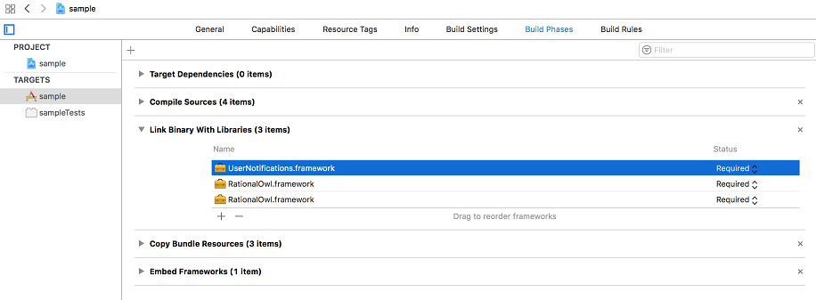

단말앱은 AppDelegate에서 다음의 API를 호출해야 한다.

#### (void) setDeviceToken: (NSString *)token

- APNS 등록 결과 수신시 호출한다.
- AppDelegate 의 didRegisterForRemoteNotificationsWithDeviceToken 내에서 호출한다.

```swift
    // Called when APNs has assigned the device a unique token
    func application(_ application: UIApplication, didRegisterForRemoteNotificationsWithDeviceToken deviceToken: Data) {
    // Convert token to string
    let token = deviceToken.reduce("", {$0 + String(format: "%02X", $1)});
    let minMgr: MinervaManager = MinervaManager.getInstance();
    minMgr.setDeviceToken(token);

    // Persist it in your backend in case it's new
}
```

#### (void) receivedApns: (NSDictionary *)userInfo

- 단말앱이 APNS 푸시 알림 수신시 호출한다.
- AppDelegate 의 didReceiveRemoteNotification 내에서 호출한다.

```swift
    // Push notification received
    func application(_ application: UIApplication, didReceiveRemoteNotification data: [AnyHashable : Any]) {
        print("Push notification received: \(data)")
        let minMgr: MinervaManager = MinervaManager.getInstance();
        minMgr.receivedApns(data);
    }
```

## 단말앱 등록

단말앱이 래셔널아울 API를 통해 실시간 데이터 통신을 하기 위해서는먼저 단말앱을 원하는 고객 모바일 서비스에 등록한다. 등록된 단말앱들이 해당 모바일 서비스에 등록된 모든 단말과 실시간 메시지를 수/발신 할 수 있다.

관리자콘솔의 '서비스 > 단말현황'에서 단말앱 등록 및 등록해제 과정을 실시간 모니터링할 수 있다.


### 단말앱 등록 요청

registerDevice() API를 통해 단말앱을 원하는 서비스의 단말앱으로 등록 요청한다. 
주의할 점은 API호출 후 단말앱 등록 결과 발급받은 단말등록아이디를 반드시 저장/관리해야 한다. 일단 단말등록아이디를 발급받으면 이 후 registerDevice() API를 호출할 필요는 없다. 즉, 단말앱 등록 API는 단말앱 설치 후 1회만 호출하면 된다.

API인자는 다음과 같다.

- gateHost
  - 래셔널아울 메시징 게이트 서버
  - 국가별로 별도로 존재
  - 무료평가판의 경우 기본 "gate.rationalowl.com"

- serviceId
  - 단말앱이 등록하고자하는 서비스의 아이디
  - 관리자콘솔의 '서비스 > 서비스정보'에서 확인

- deviceRegName
  - 관리자콘솔에서 단말을 구분하기 위한 용도
  - 사용하지 않을 경우 null로 입력

```swift
@IBAction func regDevice() {
    let serviceId: String = "faebcfe844d54d449136491fb253619d";
    let gateHost: String = inputNameField.text!;
    let mgr: MinervaManager = MinervaManager.getInstance();
    mgr.registerDevice(gateHost, serviceId: serviceId, deviceRegName: "my I phone");
}
```

### 단말앱 등록 결과

registerDevice API 호출 결과 onRegisterResult 콜백이 호출된다.

```swift
func onRegisterResult(_ resultCode: Int32, resultMsg: String!, deviceRegId: String!) {
    print("onRegisterResult resultCode = \(resultCode) resultMsg = \(resultMsg) deviceRegId = \(deviceRegId)")

    // device app registration success!
    // send deviceRegId to the app server.
    if(resultCode == RESULT_OK) {
        //let mgr: MinervaManager = MinervaManager.getInstance();
        //mgr.sendUpstreamMsg("send deviceRegId to the app server", serverRegId: "app server reg id");

    }
}
```

콜백 파라미터의 의미는 다음과 같다.

- resultCode
  - 결과 코드
  - 등록 성공시 Result.RESULT_OK
  - 기등록된 경우 Result.RESULT_DEVICE_ALREADY_REGISTERED
  - 그외 비정상 에러값
- resultMsg
  - 결과 코드의 의미
- 단말 등록 아이디
  - 단말앱을 구분하는 구분자로 단말앱이 등록 성공시 새로 발급받는다.
  - 최초 단말앱 등록 성공시나 기등록된 경우에도 전달받는다.
  - 단말앱 등록 성공일 경우 이를 앱 서버에게 upstream API를 통해 전달해야 한다.
  - 앱서버가 단말 등록 아이디를 수신시 이를 저장 및 관리해야 한다.

## 단말앱 등록해제

고객 서비스 내에서 사용하지 않는 단말앱을 등록 해제한다. 
래셔널아울 관리자 콘솔은 단말앱 등록해제 결과에 대해 실시간 모니터링을 제공한다.

### 단말앱 등록해제 요청

unregisterDevice() API를 통해 단말앱 등록해제 요청한다.

API인자는 다음과 같다.

- serviceId
  - 단말앱이 등록해제 하고자하는 서비스의 아이디
  - 관리자콘솔의 '서비스 > 서비스정보'에서 확인

```swift
@IBAction func unregDevice() {
    let serviceId: String = "faebcfe844d54d449136491fb253619d";
    let mgr: MinervaManager = MinervaManager.getInstance();
    mgr.unregisterDevice(serviceId);
}
```

### 단말앱 등록해제 결과

unregisterDevice API 호출 결과 onUnregisterResult 콜백이 호출된다.

```swift
func onUnregisterResult(_ resultCode: Int32, resultMsg: String!) {
    print("onUnregisterResult resultCode = \(resultCode) resultMsg = \(resultMsg)")
}
```

콜백 파라미터의 의미는 다음과 같다.

- resultCode
  - 결과 코드
  - 성공시 Result.RESULT_OK
  - 그외 비정상 에러값
- resultMsg
  - 결과 코드의 의미

## 업스트림 메시지 발신

래셔널아울 서비스는 다수의 앱서버를 지원하고 단말앱은 특정 앱서버에게 업스트림 메시지를 발신한다.
래셔널아울 관리자 콘솔을 통해 실시간 메시지 전달을 모니터링할 수 있다. 이는 고객 서비스 개발시에는 개발의 용이함을 제공하고 서비스 운영시에는 서비스 대응력을 높이고 예측 가능성을 향상시킨다.

래셔널아울에서 지원하는 업스트림 메시지의 특성은 다음과 같다.

- 0.5초 이내 실시간 데이터 전달을 보장한다.
- 지원하는 데이터 포맷은 스트링으로 일반 스트링문자나 json 포맷등 고객 서비스 특성에 맞게 설정하면 된다.
- 업스트림은 메시지 큐잉을 지원하지 않는다.
- 래셔널아울 콘솔은 데이터 전달 현황에 대해 실시간 모니터링을 제공한다.


### 업스트림 메시지 발신 요청

sendUpstreamMsg() API를 통해 업스트림 메시지를 발신한다.

API인자는 다음과 같다.

- msg
  - 앱서버에게 전달하고자 하는 데이터
  - 일반 스트링 혹은 json포맷의 스트링

- serverRegId
  - 데이터를 전달하고자 하는 대상 앱서버 등록 아이디

```swift
@IBAction func sendUpstreamMsg() {
    let serverId: String = "fb8bf1de65e443e294588923e187a248";
    let msg: String = inputMessageField.text!;
    let mgr: MinervaManager = MinervaManager.getInstance();
    mgr.sendUpstreamMsg(msg, serverRegId:serverId);
    ...
}
```

### 업스트림 메시지 발신 결과


sendUpstreamMsg API 호출 결과 onUpstreamMsgResult 콜백이 호출된다.

```swift
func onUpstreamMsgResult(_ resultCode: Int32, resultMsg: String!, umi: String!) {
    print("onMsgRecieved msg upstream message id = \(umi)")
}
```

콜백 파라미터의 의미는 다음과 같다.

- resultCode
  - 결과 코드
  - 성공시 Result.RESULT_OK
  - 그외 비정상 에러값
- resultMsg
  - 결과 코드의 의미
- umi(Upstream Message Id)
  - 어느 API 호출에 대한 결과인지 확인하는 용도

## P2P 메시지 발신

래셔널아울 서비스는 P2P 메시지를 지원한다.
래셔널아울 관리자 콘솔을 통해 실시간 메시지 전달을 모니터링할 수 있다. 이는 고객 서비스 개발시에는 개발의 용이함을 제공하고 서비스 운영시에는 서비스 대응력을 높이고 예측 가능성을 향상시킨다.

래셔널아울에서 지원하는 P2P 메시지의 특성은 다음과 같다.

- 0.5초 이내 실시간 데이터 전달을 보장한다.
- 한대 이상의 단말앱에 메시지를 발신한다.
- 한번에 보낼 수 있는 최대 대상 단말 수는 2000대이다.
- 지원하는 데이터 포맷은 스트링으로 일반 스트링문자나 json 포맷등 고객 서비스 특성에 맞게 설정하면 된다.
- 메시지 전달 대상 단말앱이 네트워크에 연결되지 않을 경우 큐잉 후 단말이 네트워크 접속시 전달하는 큐잉을 지원한다.
- 기본 큐잉 기간은 3일이고 엔터프라이즈 에디션에서는 최대 30일까지 설정 가능하다.
- 큐잉 기능을 이용할지 말지는 단말앱 라이브러리에서 제공하는 P2P API 인자로 결정한다.
- P2P API에서 대상 단말앱이 네트워크에 연결되지 않은 경우 전달 데이터외에 알림 타이틀과 알림 문자를 별도로 지정할 수 있다.  
- 래셔널아울 콘솔은 데이터 전달 현황에 대해 실시간 모니터링을 제공한다.

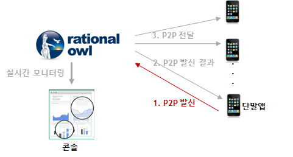

### P2P 메시지 발신 요청

sendP2PMsg() API를 통해 P2P 메시지를 발신한다.

API인자는 다음과 같다.

- msg
  - 단말앱들에게 전달하고자 하는 데이터
  - 일반 스트링 혹은 json포맷의 스트링

- devices
  - 데이터를 전달하고자 하는 대상 단말앱들의 등록 아이디 목록

```swift
@IBAction func sendP2PstreamMsg() {
    let msg: String = inputMessageField.text!;
    let devices: Array<String> = ["57e14b87cc2646ef883b99d7de7a9567"];
    let mgr: MinervaManager = MinervaManager.getInstance();
    mgr.sendP2PMsg(msg, devices:devices);
    ...
}
```

### P2P 메시지 발신 결과


sendP2PMsg API 호출 결과 onP2PMsgResult 콜백이 호출된다.

```swift
func onP2PMsgResult(_ resultCode: Int32, resultMsg: String!, pmi: String!) {
    print("onMsgRecieved msg p2p message id = \(pmi)")
}
```

콜백 파라미터의 의미는 다음과 같다.

- resultCode
  - 결과 코드
  - 성공시 Result.RESULT_OK
  - 그외 비정상 에러값
- resultMsg
  - 결과 코드의 의미
- pmi(P2P Message Id)
  - 어느 API 호출에 대한 결과인지 확인하는 용도

## 메시지 수신

단말앱은 앱서버로부터 다운스트림 메시지 수신 시 또는 다른 단말앱으로부터 P2P 메시지 수신 시 콜백이 호출되어 단말앱이 이를 처리할 수 있게 한다.

### 다운스트림 메시지 수신

앱서버에서 발신하는 멀티캐스트, 브로드캐스트, 그룹 메시지를 단말앱이 수신시 onDownstreamMsgRecieved 콜백이 호출된다.

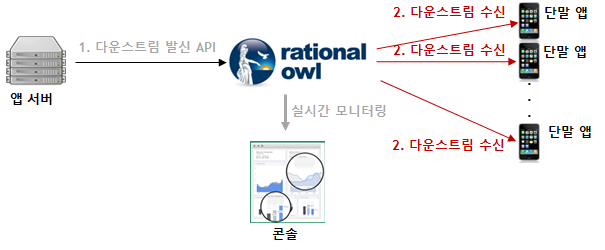

```swift
func onDownstreamMsgRecieved(_ msgSize: Int32, msgList: [Any]!, alarmIdx: Int32) {
    print("onMsgRecieved msg size = \(msgSize)")
    var msg: Dictionary<String, Any>;
    // who send message
    var sender: String;
    var sendTime: Double;
    var msgData: String;
    let dateFormatter = DateFormatter();
    dateFormatter.dateFormat = "yyyy/MM/dd HH:mm:ss";

    for i in 0..<msgList.count {
        msg = msgList[i] as! Dictionary<String, Any>;
        // message sender(app server)'s app server registraion id
        sender = msg["sender"] as! String;
        // message sent time
        sendTime = msg["serverTime"] as! Double;
        let date = Date(timeIntervalSince1970: sendTime/1000);
        msgData = msg["data"] as! String;
        let displayStr: String = "\(msgData)   \(dateFormatter.string(from: date))";
        self.messages.append(displayStr);
    }
    ...
}

```

콜백 파라미터의 의미는 다음과 같다.

- msgSize
  - 다운스트림 메시지 갯수
- msgList
  - 다운스트림 메시지 목록
  - 메시지 목록의 각 메시지는 다음의 값들을 포함한다.
    - 메시지 발신한 앱서버의 서버등록아이디
    - 메시지 데이터
    - 메시지 발신시간
    - 단말앱이 백그라운드시 표시할 알림 타이틀
    - 단말앱이 백그라운드시 표시할 알림 본문

### P2P 메시지 수신

다른 단말앱으로부터 P2P 메시지 수신시 onP2PMsgRecieved 콜백이 호출된다.

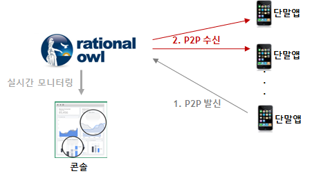

```swift
func onP2PMsgRecieved(_ msgSize: Int32, msgList: [Any]!, alarmIdx: Int32) {
    print("onMsgRecieved msg size = \(msgSize)")
    var msg: Dictionary<String, Any>;
    var sender: String;
    var sendTime: Double;
    var msgData: String;
    let dateFormatter = DateFormatter();
    dateFormatter.dateFormat = "yyyy/MM/dd HH:mm:ss";

    for i in 0..<msgList.count {
        msg = msgList[i] as! Dictionary<String, Any>;
        // message sender(device app)'s device app registraion id
        sender = msg["sender"] as! String;
        // message sent time
        sendTime = msg["serverTime"] as! Double;
        let date = Date(timeIntervalSince1970: sendTime/1000);
        msgData = msg["data"] as! String;
        let displayStr: String = "p2p:\(msgData)   \(dateFormatter.string(from: date))";
        self.messages.append(displayStr);
    }
    ...
}
```

콜백 파라미터의 의미는 다음과 같다.

- msgSize
  - 다운스트림 메시지 갯수
- msgList
  - P2P 메시지 목록
  - 메시지 목록의 각 메시지는 다음의 값들을 포함한다.
    - 메시지 발신한 단말앱의 단말등록아이디
    - 메시지 데이터
    - 메시지 발신시간
    - 단말앱이 백그라운드시 표시할 알림 타이틀
    - 단말앱이 백그라운드시 표시할 알림 본문