# 시작하기

## 목차

- [적용분야](#적용분야)
- [서비스 구성요소](#서비스-구성요소)
    - [구성요소](#구성요소)
- [용어 설명](#용어-설명)
- [래셔널아울 서비스 이용 절차](#래셔널아울-서비스-이용-절차)
    - [고객 등록](#고객-등록)
    - [고객 서비스 등록](#고객-서비스-등록)
    - [앱서버 등록(구동)](#앱서버-등록구동)
        - [앱서버 등록 결과](#앱서버-등록-결과)
    - [앱서버 등록해제](#앱서버-등록해제)
        - [앱서버 등록해제 결과](#앱서버-등록해제-결과)
    - [단말앱 등록](#단말앱-등록)
        - [단말앱 등록 결과](#단말앱-등록-결과)
    - [단말앱 등록해제](#단말앱-등록해제)
        - [단말앱 등록해제 결과](#단말앱-등록해제-결과)    
    - [실시간 메시지 수/발신](#실시간-메시지-수발신)
    - [다운스트림 메시지](#다운스트림-메시지)
        - [멀티캐스트](#멀티캐스트)
        - [브로드캐스트](#브로드캐스트)
        - [그룹메시지](#그룹메시지)
        - [다운스트림 메시지 수신](#다운스트림-메시지-수신)
    - [업스트림 메시지](#업스트림-메시지)
        - [업스트림 메시지 수신](#업스트림-메시지-수신)
    - [P2P 메시지](#p2p-메시지)
        - [P2P 메시지 수신](#p2p-메시지-수신)
    - [단말그룹 관리](#단말그룹-관리)
    - [단말그룹 생성](#단말그룹-생성)
        - [단말그룹 생성 결과](#단말그룹-생성-결과)
    - [단말그룹에 단말앱 추가](#단말그룹에-단말앱-추가)
        - [단말그룹에 단말앱 추가 결과](#단말그룹에-단말앱-추가-결과)
    - [단말그룹에서 단말앱 제거](#단말그룹에서-단말앱-제거)
        - [단말그룹에서 단말앱 제거 결과](#단말그룹에서-단말앱-제거-결과)
    - [단말그룹 삭제](#단말그룹-삭제)
        - [단말그룹 삭제 결과](#단말그룹-삭제-결과)
모바일 서비스 내에서는 세 방향의 데이터 통신이 존재한다.

1. 다운스트림 데이터 : 앱서버에서 단말앱으로의 데이터 통신
   - 멀티캐스트
   - 브로드캐스트
   - 그룹메시지
2. 업스트림 데이터 : 단말앱에서 앱서버로의 데이터 통신
3. P2P 데이터 : 단말앱간의 데이터 통신

래셔널아울 서비스는 실시간 메시징 서비스로서 모바일 서비스 내 모든 방향의 실시간 데이터 전달/공유를 제공하는 서비스이다.

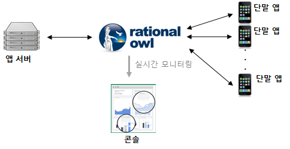

## 적용분야

래셔널아울 서비스는 앱스토어에 모바일앱을 개발 등록하는 모든 모바일앱들이 이용가능하다. 특히 실시간 데이터 전달 및 공유가 필요한 실시간 모바일 서비스를 API호출만으로 쉽게 개발할 수 있게 해 준다.

- 단말간 실시간 데이터 공유가 필요한 모바일 소셜 서비스
- 실시간 모바일 채팅 
- 모바일 게임 네트워크 엔진
- 실시간 주식현황, 금융거래 현황이 필요한 모바일 모니터링 서비스
- 동접 처리 비용을 절감하고자 하는 실시간 모바일 서비스
- 대용량 푸시 알림

## 서비스 구성요소

래셔널아울 서비스는 4개의 구성요소로 이루어진다.

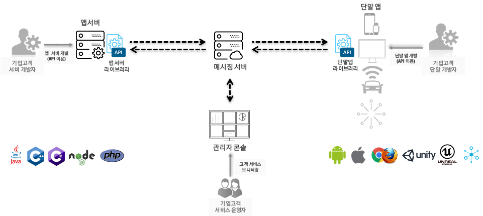

### 구성요소

- 메시징 서버
  - 단말 채널 설정
  - 데이터 흐름 관장
  - 클라우드에서 실행되어 고객은 별도의 메시징 서버를 준비할 필요 없음.
- 앱서버 라이브러리
  - 앱서버에 메시지 수/발신 API 제공
  - sendMulticast/sendBroadcast/sendGroupMsg 발신 API 제공
  - 업스트림 데이터 수신 콜백 제공
- 단말앱 라이브러리
  - 단말앱에 메시지 수/발신 API 제공
  - sendP2P/sendUpstream 발신 API 제공
  - 다운스트림/P2P 수신 콜백 제공
- 관리자 콘솔
  - 사용자 등록
  - 모바일 서비스 등록
  - 메시지 전달 현황 실시간 모니터링
  - 단말앱 상태 실시간 모니터링
  - 앱서버 상태 실시간 모니터링
  - 통계 기능 제공

## 용어 설명

래셔널아울 가이드 문서에 등장하는 용어를 설명한다.

| 용어         | 설명            |
|---------- |---- |
| 고객 서비스     | 래셔널아울의 실시간 메시지를 이용하는 모바일 서비스<br>고객 서비스에는 하나 이상의 앱서버와 다수의 단말앱이 등록된다.<br>고객 서비스에 등록된 단말앱과 앱서버는 서로 실시간 데이터를 주고 받을 수 있다.     |
| 서비스 아이디    | 고객이 관리자 콘솔을 통해 고객 서비스를 등록하면 발급되는 고객 서비스 구분자<br>앱서버와 단말앱이 고객 서비스에 등록시 이용          |
| 앱서버 라이브러리  | 앱서버에 포함되어 앱서버에게 실시간 메시지 수/발신 API제공                |
| 앱서버        | 앱서버 라이브러리가 제공하는 API를 통해 고객 서비스 내 단말과 실시간 데이터를 주고 받는다.<br>고객 서비스 내 1대 이상의 앱서버 등록이 가능하다. <br>한대의 앱서버는 자신과 통신하는 단말앱들의 단말등록 아이디를 저장/관리하여야 한다.                   |
| 앱서버 등록 이름  | 앱서버가 고객 서비스에 등록시 API에 입력하는 앱서버 이름 파라미터<br>관리자 콘솔에 디스플레이되어 다수의 앱서버가 등록시 각 앱서버를 구분하는 역할을 한다.<br>앱서버는 앱서버 등록 이름을 저장하고 있어야 한다.<br>앱서버가 재구동시 동일한 앱서버 등록 이름으로 등록 API를 호출해야 한다.<br>다른 앱서버 등록 이름으로 등록 API를 호출하면 새로운 앱서버가 등록한 것으로 간주되어 기존 통신하던 단말앱으로부터의 업스트림 메시지 수신이 불가능해진다.|
| 앱서버 등록 아이디 | 고객 서비스에 앱서버가 등록하면 발급되는 아이디로 앱서버를 구분하는 구분자 역할을 한다.<br>단말앱이 특정 앱서버로 업스트림 메시지 발신시 API의 파라미터로 사용<br>앱서버는 앱서버 등록 이름과 더불어 앱서버 등록 아이디를 저장하고 있어야 한다.                  |
| 단말앱 라이브러리  | 단말앱에 포함되어 단말앱에게 실시간 메시지 수/발신 API제공                  |
| 단말앱        | 단말앱 라이브러리가 제공하는 API를 통해 고객 서비스 내 단말/앱서버와 실시간 데이터를 주고 받는다.  |
| 단말앱 등록 이름  | 단말앱 고객 서비스에 등록시 API에 입력하는 단말앱 이름 파라미터<br>관리자 콘솔에 디스플레이되어 각 단말앱을 구분하는 역할을 한다.<br>앱서버와는 달리 단말앱 등록 이름은 저장할 필요도 없고 관련 제약도 없다.      |
| 단말앱 등록 아이디 | 고객 서비스에 단말앱을 등록하면 발급되는 아이디로 단말앱를 구분하는 구분자 역할을 한다.<br>앱서버가 특정 단말앱으로 다운스트림 메시지 발신시 API의 파라미터로 사용<br>단말앱이 특정 단말앱으로 P2P 메시지 발신시 API 파라미터로 사용<br>단말앱은 단말앱 등록 아이디를 발급받으면 통신할 앱서버에게 단말앱 등록 아이디를 업스트림 API를 통해 전달해 주어야 하고 앱서버는 전달받은 단말앱 등록 아이디를 저장/관리해야 한다.                  |

## 래셔널아울 서비스 이용 절차

래셔널아울 서비스를 이용하기 위한 절차는 다음과 같다.

- 고객 등록
- 고객 서비스 등록
- 앱서버 등록
- 단말앱 등록
- 단말그룹 관리
- 실시간 메시지 수/발신

앱서버 등록 후 앱서버는 실시간 메시지를 수/발신 할 수 있고, 단말앱 등록 후 단말앱은 실시간 메시지를 수/발신 할 수 있다.

### 고객 등록

래셔널아울 서비스를 이용하기 위해서 가장 먼저 고객 등록이 필요하다.

- 브라우저로 [www.rationalowl.com](http://www.rationalowl.com) 클릭

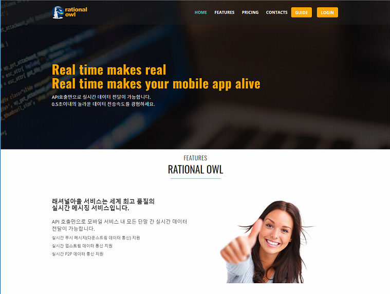

- LOGIN 버튼 클릭

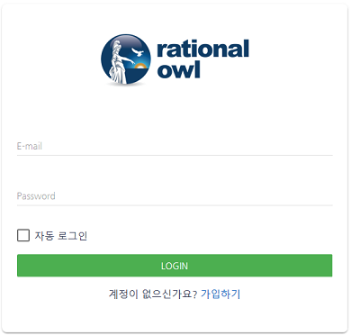

- E-mail, Name, Company, Password를 입력 후 'CREATE ACCOUNT'버튼 클릭
- 30분 이내에 이메일 인증 수행해야 한다.

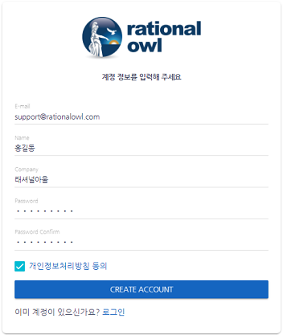

- 입력한 인증 메일 발송
- 수신 이메일에서 '이메일 인증' 링크 클릭

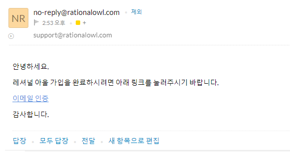

- 로그인 페이지에 등록시 입력한 이메일/패스워드 입력하면 등록이 완료되고 관리자 콘솔 서비스 화면이 나타난다.

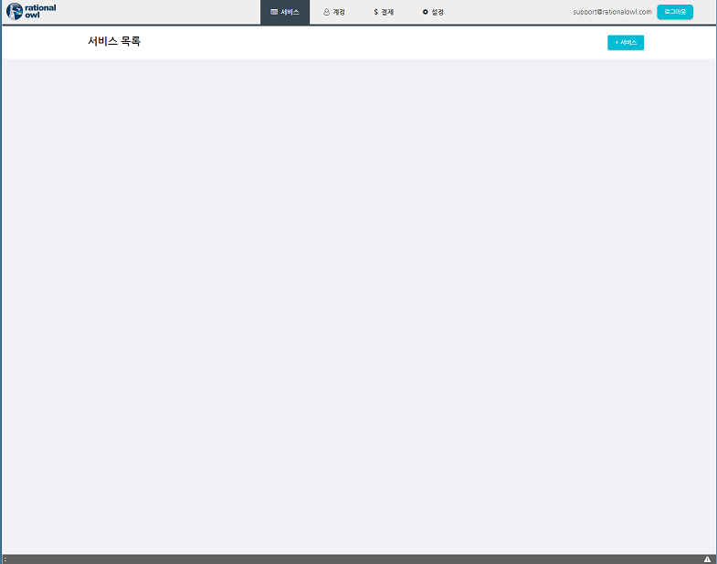

### 고객 서비스 등록

고객 서비스는 래셔널아울 서비스의 실시간 메시징을 이용하여 개발하고자 하는 모바일 서비스다. '카카우톡'이라는 모바일 메신저 서비스를 개발하고자 한다면 먼저 '카카우톡' 서비스 등록을 해야한다.

- 서비스 화면에서 +서비스 버튼 클릭 > 서비스명과 서비스 설명을 입력 후 '추가'버튼 클릭한다.

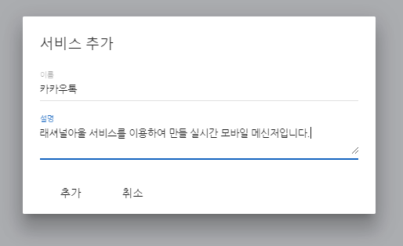

- 등록한 서비스 명의 창이 서비스 목록에 나타난다. 즉, 카카우톡 서비스 등록이 완료되었다.

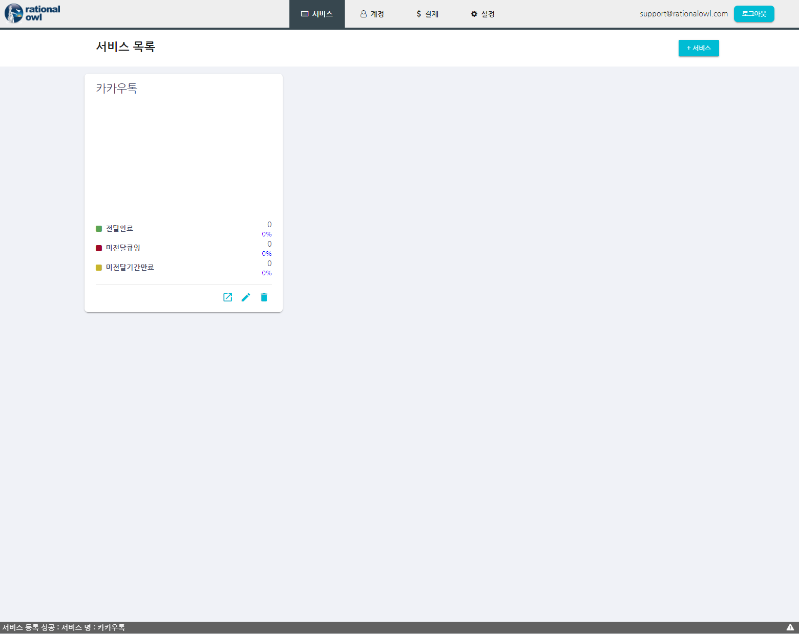

- 바로가기 버튼을 클릭한다.

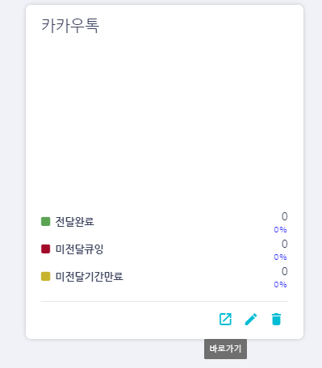

- 카카우톡 서비스 Overview 화면이 나타난다.
  - 해당 서비스에 등록한 단말앱/앱서버가 존재하지 않고, 전달한 메시지도 없어서 메시지/단말/서버 현황의 빈차트 화면이 나타난다.

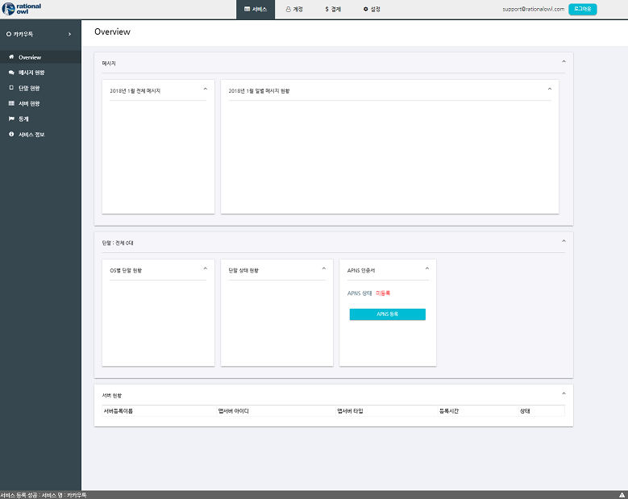

- 서비스 아이디 확인
  - 좌측 메뉴에서 '서비스 정보'를 클릭한다.
  - 서비스 정보 중 발급된 서비스ID가 나타난다. 
  - 실제 단말앱 및 앱서버 개발시 해당 값을 마우스 더블클릭으로 선택/복사 후 카카우톡 서비스의 서비스 아이디로 사용한다.

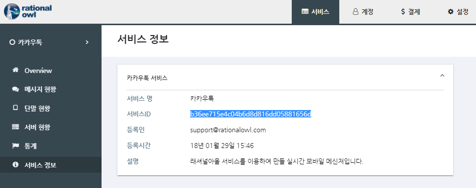

### 앱서버 등록(구동)

앱서버 개발은 앱서버 개발가이드를 참조하여 스텝바이스텝으로 개발 가능하다. 본 글에서는 [JAVA 앱서버 개발가이드](https://guide.rationalowl.com/guide/app-server/java)를 기준으로 설명한다.

앱서버는 registerAppServer() API를 통해 앱 서버를 등록한다. 참고로 하나의 래셔널아울 고객 서비스 내에서 다수의 앱 서버 등록이 가능하다.

래셔널아울 관리자 콘솔은 앱서버 등록 결과에 대해 실시간 모니터링을 제공한다.

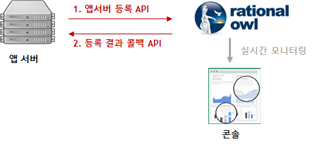

registerAppServer() API는 앱서버 구동시에도 호출해야 한다. 따라서 앱서버가 구동시마다 앱서버 등록 API는 호출해야 한다.
API 각 파라미터의 의미는 다음과 같다.

- serviceId
  - 앱서버가 등록하고자하는 서비스의 아이디
  - 관리자콘솔의 '서비스 > 서비스정보'에서 확인
- serverRegName
  - 관리자콘솔에서 앱서버를 구분하기 위한 용도
- gateHost
  - 래셔널아울 메시징 게이트 서버
  - 국가별로 별도로 존재
  - 무료평가판의 경우 기본 "gate.rationalowl.com" 

```java
AppServerManager serverMgr = AppServerManager.getInstance();
serverMgr.registerAppServer("b36ee715e4c04b6d8d816dd05881656d", "sample_server", "gate.rationalowl.com", 9080);
```

#### 앱서버 등록 결과

앱서버 등록 결과는 AppServerRegisterResultListener 인터페이스의 onRegisterResult()를 통해 알 수 있다. 
앱서버는 등록 성공시 다음의 두 가지를 반드시 저장/관리해야 하고 서버 재가동시 registerAppServer() API 호출시 동일한 값을 입력해야 한다.

- 발급되는 앱서버 등록 아이디
- 앱서버 등록 요청시 입력한 앱 서버 등록 이름

```java
public void onRegisterResult(int resultCode, String resultMsg, String appServerRegId, String appServerRegName) {
    output("RegisterResult:" + resultMsg + "  reg server id = " + appServerRegId + " reg server name = " + appServerRegName);

    if (resultCode == Result.RESULT_OK || resultCode == Result.RESULT_SERVER_REGNAME_ALREADY_REGISTERED) {
        // should save and manage mServerRegName and mServerRegId to the file or db.
    }
}
```

registerAppServer() API호출 결과는 관리자 콘솔의 '서비스 > 서버 현황'에서 실시간으로 확인할 수 있다.

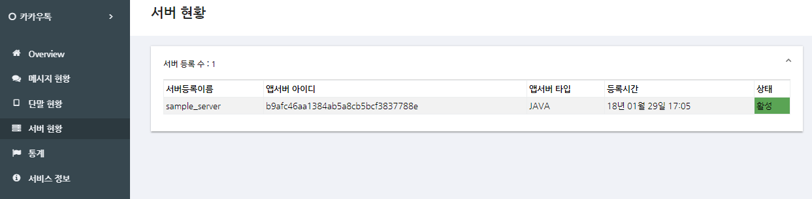

앱서버 상태가 활성인 경우 앱서버가 실시간 메시지를 수/발신 할 수 있는 상태임을 의미한다.

### 앱서버 등록해제

고객 서비스 내에서 사용하지 않는 앱 서버를 등록해제한다. 
래셔널아울 관리자 콘솔은 앱서버 등록해제 결과에 대해 실시간 모니터링을 제공한다.

앱서버는 unregisterAppServer() API를 통해 등록해제 요청한다.

```java
AppServerManager serverMgr = AppServerManager.getInstance();
serverMgr.unregisterAppServer("myServiceId", "app server1", "gate.rationalowl.com", 9080);
```

#### 앱서버 등록해제 결과

앱서버 등록해제 결과  onUnregisterResult() 콜백이 호출되고 해당 콜백으로 단말앱은 다음의 값들을 전달받는다.

- 결과 코드
- 결과 메시지

```java
public void onUnregisterResult(int resultCode, String resultMsg) {
    output("UnregisterResult:" + resultMsg);
}

```

unregisterAppServer() API호출 결과는 관리자 콘솔의 '서비스 > 서버 현황'에서 실시간으로 확인할 수 있다.

### 단말앱 등록
단말앱 개발은 단말앱 개발가이드를 참조하여 스텝바이스텝으로 개발 가능하다. 본 글에서는 [안드로이드 단말앱 개발가이드](https://guide.rationalowl.com/guide/device-app/android)를 기준으로 설명한다.
단말앱은 registerDevice() API를 통해 단말앱을 등록한다. 
래셔널아울 관리자 콘솔은 단말앱 등록 결과에 대해 실시간 모니터링을 제공한다.

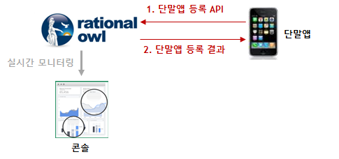

registerDevice() API의 파라미터는 다음과 같다.

- gateHost
  - 래셔널아울 메시징 게이트 서버
  - 국가별로 별도로 존재
  - 무료평가판의 경우 기본 "gate.rationalowl.com"
- serviceId
  - 단말앱이 등록하고자하는 서비스의 아이디
  - 관리자콘솔의 '서비스 > 서비스정보'에서 확인
- deviceRegName
  - 관리자콘솔에서 단말을 구분하기 위한 용도
  - 사용하지 않을 경우 null로 입력

```java
MinervaManager mgr = MinervaManager.getInstance();
mgr.registerDevice("gate.rationalowl.com", "b36ee715e4c04b6d8d816dd05881656d", "my device name");
```

#### 단말앱 등록 결과

단말앱 등록이 성공되면 발급받은 단말 등록 아이디를 단말앱은 저장 및 관리해야 하고 해당 단말 등록 아이디를 단말앱을 관리 및 통신할 대상 앱서버에게 업스트림 API를 통해 전달해야 한다.
마찬가지로 앱서버는 전달받은 단말 등록 아이디를 저장 및 관리해야 한다.

단말앱 등록 결과 콜백 또는 이벤트를 수신하고 단말앱은 다음의 값들을 전달받는다.

- 단말 등록 아이디
  - 단말 앱을 구분하는 구분자
  - 단말앱 등록 성공이거나 기등록된 경우 전달받는다.
  - 최초 단말앱 등록 성공일 경우 이를 앱 서버에게 upstream API를 통해 전달해야 한다.
- 결과 코드
- 결과 메시지

단말앱 등록 결과는 관리자 콘솔의 '서비스 > 단말 현황'에서 실시간으로 확인할 수 있다.

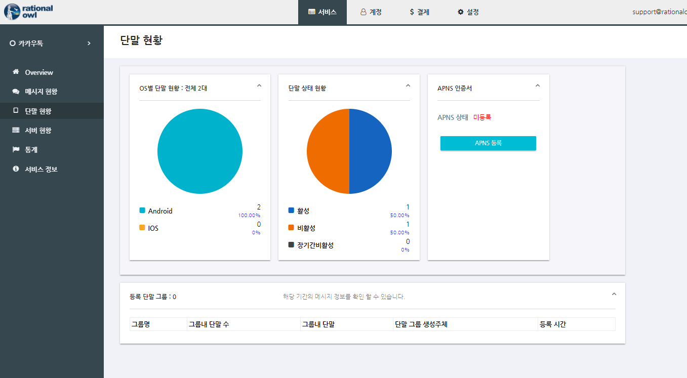

단말앱 상태가 활성인 경우 단말앱이 실시간 메시지를 수/발신 할 수 있는 상태임을 의미하고 활성 단말수가 곧 동접(동시접속) 단말수를 의미한다.

### 단말앱 등록해제

고객 서비스 내에서 사용하지 않는 단말앱을 등록 해제한다. 
래셔널아울 관리자 콘솔은 단말앱 등록해제 결과에 대해 실시간 모니터링을 제공한다.

단말앱은 unregisterDevice() API를 통해 단말앱 등록해제 요청한다.

```java
MinervaManager mgr = MinervaManager.getInstance();
// service which device app should un-register
String serviceId = "b36ee715e4c04b6d8d816dd05881656d";
mgr.unregisterDevice(serviceId);
```

unregisterDevice() API의 파라미터는 다음과 같다.

- serviceId
  - 단말앱이 등록해제 하고자하는 서비스의 아이디
  - 관리자콘솔의 '서비스 > 서비스정보'에서 확인

#### 단말앱 등록해제 결과

단말앱 등록해제 결과 단말앱 라이브러리는 단말앱에 다음의 값들을 알려준다. 단말앱은 등록해제 사실을 통신하는 앱서버에게 알려야 한다.

- 결과 코드
- 결과 메시지

단말앱이 등록해제 되면 단말앱은 래셔널아울 서비스를 이용할 수 없어서 업스트림 발신 API를 이용할 수 없다. 따라서 별도 통신으로 앱서버에게 등록해제됨을 알려야 한다.

단말앱 등록해제 결과는 관리자 콘솔의 '서비스 > 단말 현황'에서 실시간으로 확인할 수 있다.


### 실시간 메시지 수/발신

모바일 서비스를 구성하는 요소는 서비스를 제공하는 앱서버와 앱스토어에서 모바일 앱을 다운받아 단말에 설치하여 실행하는 단말앱으로 구성되고 모바일 서비스 내 구성원 간에는 세 방향의 데이터 통신이 존재한다.

- 다운스트림 데이터
  - 앱서버에서 단말앱으로의 데이터 통신
  - 실시간 데이터 통신 지원
  - 푸시 메시지 지원
    - 푸시 알림 지원
    - 큐잉 지원   
- 업스트림 데이터
  - 단말앱에서 앱서버로의 데이터 통신
  - 실시간 데이터 통신 지원
- P2P 데이터
  - 단말앱간 데이터 통신
  - 실시간 데이터 통신 지원
  - 푸시 메시지 지원
    - 푸시 알림 지원
    - 큐잉 지원   

래셔널아울 서비스는 모바일 서비스내 모든 기기에게 모든 방향의 데이터 통신을 간단한 API호출로 가능하게 한다. 

### 다운스트림 메시지

래셔널아울에서 앱서버에서 단말앱으로의 다운스트림 메시지를 지원한다.
단말앱이 포그라운드일 경우 0.2초대의 실시간 메시지를 전달하고 백그라운드일 경우 푸시 알림을 보낸다.     
그리고 래셔널아울 관리자 콘솔에서 제공하는 데이터 전달 현황 실시간 모니터링은 고객 서비스 개발시에는 개발의 용이함을 제공하고 서비스 운영시에는 서비스 대응력을 높이고 예측 가능성을 향상시킨다.

래셔널아울에서 지원하는 다운스트림 메시지의 특성은 다음과 같다.

- 단말앱이 포그라운드 실행 중일때 0.2초 내외에 실시간 데이터를 전달한다.
- 실시간 데이터 전달 용도로 메시지 발신시 대상 단말앱 수가 최대 2000대를 넘지 않도록 권고한다.
- 2000대 이상의 단말앱에 다운스트림 메시지 발신은 실시간 데이터 전달이 아닌 알림용으로 이용할 것을 권고한다.
- 지원하는 데이터 포맷은 스트링으로 일반 스트링문자나 json 포맷등 고객 서비스 특성에 맞게 설정하면 된다.
- 단말앱이 네트워크에 연결되지 않을 경우 큐잉 후 단말이 네트워크 접속시 전달하는 큐잉을 지원한다.
- 기본 큐잉 기간은 3일이고 엔터프라이즈 에디션에서는 최대 30일까지 설정 가능하다.
- 큐잉 기능을 이용할지 말지는 앱서버 라이브러리에서 제공하는 다운스트림 API 파라미터로 정한다.
- 단말앱이 백그라운드일 경우 푸시 알림을 지원한다.
- 푸시 알림을 이용할지 말지는 앱서버 라이브러리에서 제공하는 다운스트림 API 파라미터로 정한다.
- 래셔널아울 콘솔은 데이터 전달 현황에 대해 실시간 모니터링을 제공한다.

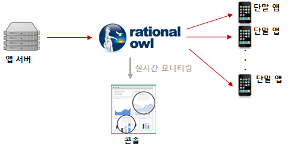

앱서버 라이브러리가 앱서버에 제공하는 다운스트림 발신 API는 다음과 같다.

- 멀티캐스트
- 브로드캐스트
- 그룹메시지

메시지 발신 API 파라미터에 따라 아래의 용도로 구분된다.
     
1. 실시간 데이터 전용 발신
게임, 채팅, 모바일 HTS와 같이 실시간 모바일 앱에서 앱들이 구동후 실시간 데이터 통신을 할 경우 굳이 푸시 알림이나 메시지 큐잉이 필요없는 경우, 실시간 데이터 전용으로 발신시
- 메시지 큐잉 미지원
- 푸시 알림 미지원
```java
AppServerManager serverMgr = AppServerManager.getInstance();
serverMgr.sendMulticastMsg(data, regIDs, false, null, null);
```

2. 메시지 큐잉만 지원시
푸시 알림은 발신하지 않지만 단말앱이 구동시 메시지 처리를 원하는 경우 사용한다.
- 메시지 큐잉 지원
- 푸시 알림 미지원

```java
AppServerManager serverMgr = AppServerManager.getInstance();
serverMgr.sendMulticastMsg(data, regIDs, true, null, null);
```
또는 
```java
AppServerManager serverMgr = AppServerManager.getInstance();
serverMgr.sendMulticastMsg(data, regIDs);
```

3. 푸시 메시지 용도로 사용시
공지, 알림 용도의 푸시 메시지로 사용시 사용한다.
- 메시지 큐잉 지원
- 푸시 알림 지원

```java
AppServerManager serverMgr = AppServerManager.getInstance();
serverMgr.sendMulticastMsg(data, regIDs, true, "알림타이틀", "알림 내용");
```


#### 멀티캐스트

- 한대 이상의 단말앱에 메시지를 발신한다.
- 한번에 보낼 수 있는 최대 대상 단말 수는 2000대이다.

```java
AppServerManager serverMgr = AppServerManager.getInstance();
serverMgr.sendMulticastMsg(data, regIDs, supportMsgQ, notiTitle, notiBody);
```

#### 브로드캐스트

- 고객 서비스내에 등록된 모든 단말앱들에게 메시지를 발신한다.
- 브로드캐스트 메시지는 실시간 데이터 전달의 용도로 이용되어서는 안된다.
- 브로드캐스트 메시지는 전체 서비스 내 단말앱에 푸시 알림 용도로만 사용해야 한다.

```java
AppServerManager serverMgr = AppServerManager.getInstance();
serverMgr.sendBroadcastMsg(data, supportMsgQ, notiTitle, notiBody);
```

#### 그룹메시지

- 그룹메시지는 단말그룹에게 메시지를 발신하는 방식으로 기능적으로 전통적인 통신방식인 멀티캐스트와 동일하다.
- 그룹 메시지 방식은 효율적이고 확장성이 높은 pub/sub 메시지 모델로 구현되었다.
- 동일한 대상 단말수일 경우 그룹 메시지 방식이 멀티캐스트보다 약 10% 전송속도가 빠르다.
- 1회성 또는 단발성 통신을 제외하고는 멀티캐스트 API보다는 그룹메시지 API의 사용을 권고한다.

```java
AppServerManager serverMgr = AppServerManager.getInstance();
serverMgr.sendGroupMsg(data, grpId, supportMsgQ, notiTitle, notiBody);
```

#### 다운스트림 메시지 수신

단말앱이 멀티캐스트, 브로드캐스트, 그룹 메시지를 수신시 단말앱은 다운스트림 메시지 수신 콜백이 호출된다.
단말앱은 콜백 내에서 다음의 값들을 전달받아 처리한다.

- 다운스트림 메시지 갯수
- 다운스트림 메시지 목록

메시지 목록의 각 메시지는 다음의 값들을 포함한다.

- 메시지 발신한 앱서버의 서버등록아이디
- 메시지 데이터
- 메시지 발신시간
- 단말앱이 백그라운드시 표시할 알림 타이틀
- 단말앱이 백그라운드시 표시할 알림 본문


메시지 전달 현황은 관리자 콘솔의 '서비스 > 메시지 현황'에서 실시간 모니터링이 가능하다.

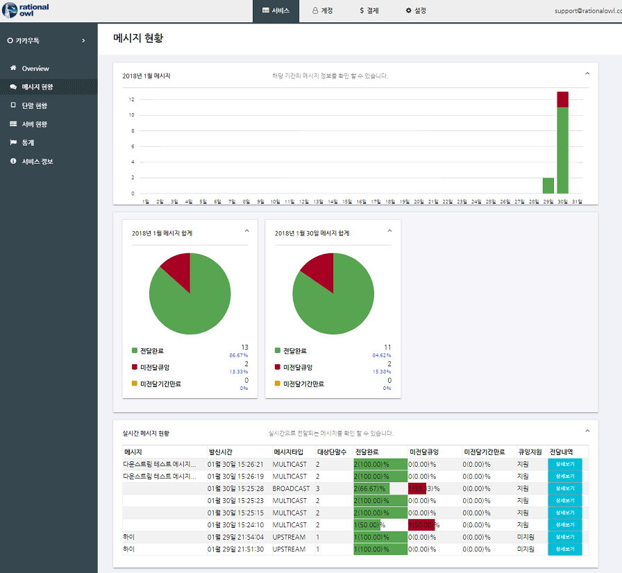

### 업스트림 메시지

래셔널아울 서비스는 다수의 앱서버를 지원하고 단말앱은 특정 앱서버에게 업스트림 메시지를 발신한다. 

래셔널아울에서 지원하는 업스트림 메시지의 특성은 다음과 같다.

- 0.5초 이내 실시간 데이터 전달을 보장한다.
- 지원하는 데이터 포맷은 스트링으로 일반 스트링문자나 json 포맷등 고객 서비스 특성에 맞게 설정하면 된다.
- 업스트림은 메시지 큐잉을 지원하지 않는다.
- 래셔널아울 콘솔은 데이터 전달 현황에 대해 실시간 모니터링을 제공한다.

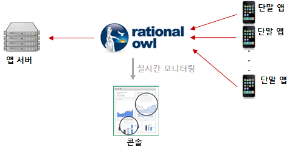

단말앱은 sendUpstreamMsg() API를 통해 업스트림 메시지를 발신한다.

```java
MinervaManager minMgr = MinervaManager.getInstance(this);
String requestId = minMgr.sendUpstreamMsg(msg, serverId);
```

#### 업스트림 메시지 수신

앱서버가 업스트림 메시지 수신시 앱서버는 업스트림 메시지 수신 콜백이 호출된다.
앱서버는 콜백 내에서 다음의 값들을 전달받아 처리한다.

- 발신한 단말의 단말 등록 아이디
- 메시지 발신 시간
- 발신 데이터

메시지 전달 현황은 관리자 콘솔의 '서비스 > 메시지 현황'에서 실시간 모니터링이 가능하다.

### P2P 메시지

래셔널아울 서비스는 P2P 메시지를 지원한다.
래셔널아울 관리자 콘솔을 통해 실시간 메시지 전달을 모니터링할 수 있다. 이는 고객 서비스 개발시에는 개발의 용이함을 제공하고 서비스 운영시에는 서비스 대응력을 높이고 예측 가능성을 향상시킨다.

래셔널아울에서 지원하는 P2P 메시지의 특성은 다음과 같다.

- 0.5초 이내 실시간 데이터 전달을 보장한다.
- 한대 이상의 단말앱에 메시지를 발신한다.
- 한번에 보낼 수 있는 최대 대상 단말 수는 2000대이다.
- 지원하는 데이터 포맷은 스트링으로 일반 스트링문자나 json 포맷등 고객 서비스 특성에 맞게 설정하면 된다.
- 메시지 전달 대상 단말앱이 네트워크에 연결되지 않을 경우 큐잉 후 단말이 네트워크 접속시 전달하는 큐잉을 지원한다.
- 기본 큐잉 기간은 3일이고 엔터프라이즈 에디션에서는 최대 30일까지 설정 가능하다.
- 큐잉 기능을 이용할지 말지는 단말앱 라이브러리에서 제공하는 P2P API 인자로 결정한다.
- P2P API에서 대상 단말앱이 네트워크에 연결되지 않은 경우 전달 데이터외에 알림 타이틀과 알림 문자를 별도로 지정할 수 있다.
- 래셔널아울 콘솔은 데이터 전달 현황에 대해 실시간 모니터링을 제공한다.

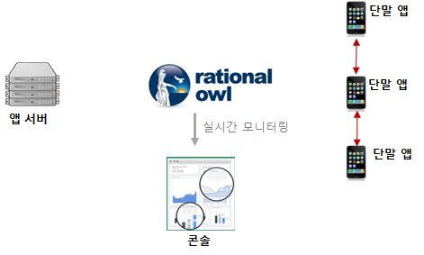

단말앱은 sendP2PMsg() API를 통해 P2P 메시지를 발신한다.

```java
MinervaManager minMgr = MinervaManager.getInstance();
minMgr.sendP2PMsg(msg, destDevices);
```

#### P2P 메시지 수신

단말앱이 P2P 메시지 수신시 단말앱은 P2P 메시지 수신 콜백이 호출된다.
단말앱은 콜백 내에서 다음의 값들을 전달받아 처리한다.

- P2P 메시지 갯수
- P2P 메시지 목록

메시지 목록의 각 메시지는 다음의 값들을 포함한다.

- 메시지 발신한 단말앱의 단말등록아이디
- 메시지 데이터
- 메시지 발신시간
- 단말앱이 백그라운드시 표시할 알림 타이틀
- 단말앱이 백그라운드시 표시할 알림 본문

메시지 전달 현황은 관리자 콘솔의 '서비스 > 메시지 현황'에서 실시간 모니터링이 가능하다.

### 단말그룹 관리

단말그룹은 그룹 메시지를 지원하기 위한 논리적인 단말앱의 묶음이다. 래셔널아울 서비스의 그룹 메시지는 전통적인 데이터 통신 방식인 멀티캐스트와 기능적으로 동일하지만 내부적으로 pub/sub 메시지 패턴이 적용되어 효율성, 확장성, 전송속도 모두 우수하다.

래셔널아울 서비스의 단말그룹의 특징은 다음과 같다.

- 단말그룹은 메시지를 보낼 대상 단말앱을 논리적으로 묶는 개념이다. 
- 단말그룹 관리 주체는 앱서버다.
- 단말그룹 관리는 4가지이다.
  - 단말그룹 생성
  - 단말그룹에 단말앱 추가
  - 단말그룹에서 단말앱 제거
  - 단말그룹 삭제
- 그룹메시지는 다운스트림 메시지만 지원한다. 
- 단말그룹에 추가할 수 있는 최대 단말앱 수는 100만대이다.
- 단말그룹에 한번에 추가할 수 있는 최대 단말앱 수는 2000대이다.
- 실시간 데이터 전달용 단말그룹은 단말앱수가 2000대를 넘기지 말 것을 권고한다.

### 단말그룹 생성

단말그룹 생성은 앱서버만 할 수 있다. 앱서버 라이브러리에서 제공하는 createDeviceGroup() API를 통해 수행한다.

```java
AppServerManager serverMgr = AppServerManager.getInstance();
serverMgr.createDeviceGroup(groupName, desc, regIds);
```

createDeviceGroup() API의 파라미터는 다음과 같다.

- groupName
  - 생성할 단말그룹명이다.
- desc
  - 생성할 단말그룹에 대한 설명이다.
  - 관리자콘솔의 '서비스 > 단말현황'에 디스플레이된다.
- regIds
  - 단말그룹 생성시 단말그룹에 추가될 단말앱 아이디 목록
  - 최대 2000대까지 추가 가능

#### 단말그룹 생성 결과

단말그룹 생성결과 단말앱에 onDeviceGroupCreateResult() 콜백함수가 호출되고 콜백함수에서 단말그룹 아이디를 전달받는다.
앱서버는 전달받은 단말그룹 아이디를 저장/관리해야 하고 이후 해당 단말그룹 아이디로 그룹메시지를 발신할 수 있다.

단말그룹 등록 결과는 관리자 콘솔의 '서비스 > 단말 현황'에서 실시간으로 확인할 수 있다.

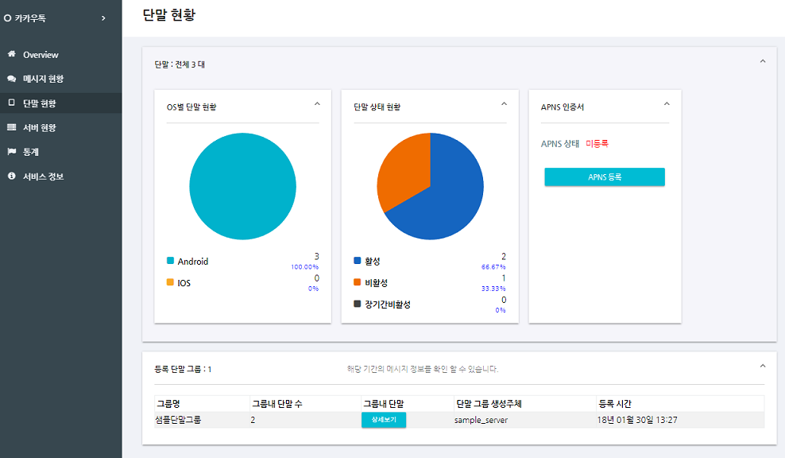

### 단말그룹에 단말앱 추가

단말그룹에 단말앱 추가는 앱서버만 할 수 있다. 앱서버 라이브러리에서 제공하는 addDeviceGroup() API를 통해 수행한다.

- 1회의 API호출로 추가 가능한 단말앱 수는 2000대까지이다.
- 여러 번의 API호출로 최대 100만대까지 추가 가능하다.
- 동일한 단말 그룹에 연속 addDeviceGroup() API호출 시 API 결과 콜백 이후 다음 API호출이 가능하다.

```java
serverMgr.addDeviceGroup(grpId, regIds);
```

addDeviceGroup() API의 파라미터는 다음과 같다.

- grpId
  - 단말앱을 추가할 대상 단말 그룹의 단말그룹 아이디
- regIds
  - 단말그룹에 추가될 단말앱 아이디 목록
  - 최대 2000대까지 추가 가능

#### 단말그룹에 단말앱 추가 결과

단말그룹에 단말앱 추가 결과 단말앱에 onDeviceGroupAddResult() 콜백함수가 호출된다.

단말그룹에 단말앱 추가 결과는 관리자 콘솔의 '서비스 > 단말 현황'에서 실시간으로 확인할 수 있다.

### 단말그룹에서 단말앱 제거

단말그룹에서 단말앱 제거는 앱서버만 할 수 있다. 앱서버 라이브러리에서 제공하는 subtractDeviceGroup() API를 통해 수행한다.

- 1회의 API호출로 제거 가능한 단말앱 수는 2000대까지이다.
- 여러 번의 API호출이 가능하다.
- 동일한 단말 그룹에 연속 subtractDeviceGroup() API호출 시 API 결과 콜백 이후 다음 API호출이 가능하다.

```java
serverMgr.subtractDeviceGroup(grpId, regIds);
```

subtractDeviceGroup() API의 파라미터는 다음과 같다.

- grpId
  - 단말앱을 제거할 대상 단말 그룹의 단말그룹 아이디
- regIds
  - 단말그룹에서 제거하고자 하는 단말앱 아이디 목록
  - 최대 2000대까지 제거 가능

#### 단말그룹에서 단말앱 제거 결과

단말그룹에 단말앱 제거 결과 단말앱에 onDeviceGroupSubtractResult() 콜백함수가 호출된다.

단말그룹에 단말앱 제거 결과는 관리자 콘솔의 '서비스 > 단말 현황'에서 실시간으로 확인할 수 있다.

### 단말그룹 삭제

더 이상 사용하지 않는 단말그룹은 삭제해야 한다. 단말그룹 삭제는 앱서버만 할 수 있다. 앱서버 라이브러리에서 제공하는 deleteDeviceGroup() API를 통해 수행한다.

```java
AppServerManager serverMgr = AppServerManager.getInstance();
serverMgr.deleteDeviceGroup(grpId);
```

deleteDeviceGroup() API의 파라미터는 다음과 같다.

- grpId
  - 제거할 대상 단말 그룹의 단말그룹 아이디

#### 단말그룹 삭제 결과

단말그룹 삭제 결과 단말앱에 onDeviceGroupDeleteResult() 콜백함수가 호출된다.

단말그룹 삭제 결과는 관리자 콘솔의 '서비스 > 단말 현황'에서 실시간으로 확인할 수 있다.